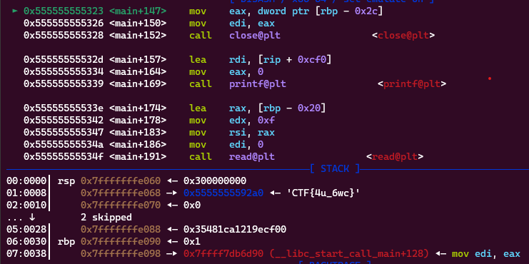

**1. Tìm lỗi**

Dùng lệnh ```file``` để kiểm tra:

```
fmtstr2: ELF 64-bit LSB pie executable, x86-64, version 1 (SYSV), dynamically linked, interpreter /lib64/ld-linux-x86-64.so.2, BuildID[sha1]=64652877fdf341fe9e7a7d5faafaea2e716e22b9, for GNU/Linux 3.2.0, not stripped
```

---> Mở bằng IDA64 ta có:

```
int __cdecl main(int argc, const char **argv, const char **envp)
{
  int fd; // [rsp+4h] [rbp-2Ch]
  void *buf; // [rsp+8h] [rbp-28h]
  char format[8]; // [rsp+10h] [rbp-20h] BYREF
  __int64 v7; // [rsp+18h] [rbp-18h]
  unsigned __int64 v8; // [rsp+28h] [rbp-8h]

  v8 = __readfsqword(0x28u);
  buf = malloc(0x100uLL);
  *(_QWORD *)format = 0LL;
  v7 = 0LL;
  init(256LL, argv);
  fd = open("./flag.txt", 0, 0LL);
  if ( fd < 0 )
  {
    puts("Cannot open flag.txt");
    exit(0);
  }
  read(fd, buf, 0x100uLL);
  close(fd);
  printf("Say something: ");
  read(0, format, 0xFuLL);
  printf("You said: ");
  printf(format);
  puts("Bye bye!");
  return 0;
}
```

Biến buf để lưu giá trị file flag được khởi tạo bằng malloc

Ta thấy có lỗi format string ở câu lệnh ```printf(format);```

**2. Ý tưởng**

Vì biến buf được khởi tạo bằng malloc nên giá trị của nó không lưu trên stack nhưng con trỏ tới giá trị đó được lưu ở stack nên có thể leak bằng %s.

**3. Khai thác**

Đặt breakpoint sau lệnh đọc giá trị file xem con trỏ tới giá trị flag ở vị trí nào trên stack.



Con trỏ đang ở vị trí thứ 2 trên stack tức là vị trí 7. Thử xem có in ra đúng giá trị flag không.


Như vậy đã in ra luôn flag.